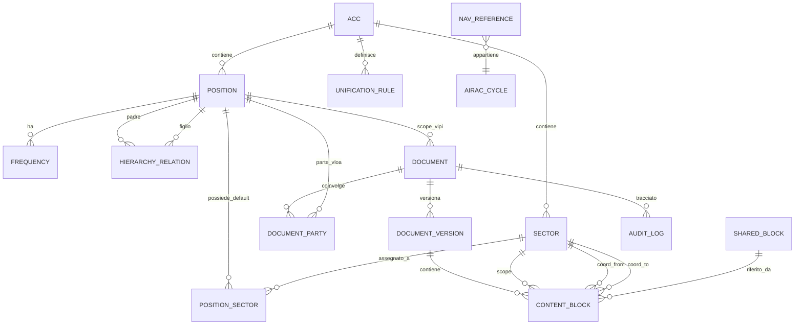

# Specifica del Modello Dati — vIPI/vLOA Interactive

> ℹ️ **Documento di design.** Schema EF Core implementato (vedi `Vipi.Domain/Entities` + migrazioni). **Aggiunte rispetto a questa spec:** entità `Transfer` (+enum `TransferPhase`, catena handler = array JSON) e `EditGrant` (permessi per-ACC); campi **lock** su `Document` (`LockedByVid/At/Expires`); `RowVersion` su `ContentBlock`/`DocumentSection` (concorrenza ottimistica). Stato codice in `README.md`/`HANDOFF.md`.

> 🔀 **Round 5 — Fusione Settore/Posizione (sostituisce §3.2/§3.3/§3.5/§3.6 e parte del §3.9/§3.10).** `Position` e `Sector` sono ora **un'unica entità `Sector`**: ogni settore è un callsign apribile (campi ex-`Position`: `Callsign` univoco, `Type`/`SectorType`, `Kind`/`SectorKind`, `ApproachKind?`, `DefaultFrequency`, `CoverageOrder`, `IsActive`) **e** un volume di spazio aereo. Il contenimento top-down è un **albero a padre singolo** `Sector.ParentSectorId` (self-FK) che **sostituisce** `HierarchyRelation` e `PositionSector` (eliminate). I settori d'aeroporto portano `AirportIcao`. Lo **scope dei documenti** è ora **uno-a-molti** `Document` 1 ──< N `Sector` (FK `Sector.DocumentId`, un settore con `IsPrimary`): `Document.ScopePositionId` è rimosso. `Frequency.PositionId`→`SectorId`; `DocumentParty.PositionId`→`SectorId`. Le `UnificationRule` restano (riassegnazioni arbitrarie); le loro chiavi JSON sono ora **callsign**. Enum rinominati: `PositionType`→`SectorType`, `PositionKind`→`SectorKind`. La vecchia `Sector.Key` è eliminata: l'identificatore è il `Callsign`.

**Documento:** Specifica tecnica del modello dati (sorgente per lo schema EF Core)
**Versione:** 0.1
**Data:** 13 giugno 2026
**Riferimento:** `PIANO_vIPI_Tool.md` (§4, §17, §20)

---

## 1. Scopo e principi

Questo documento definisce le entità persistite, i campi, i tipi, le enumerazioni, le relazioni e i vincoli. È la sorgente da cui derivare le entità di dominio (`vIPI.Domain`) e le configurazioni EF Core (`vIPI.Infrastructure`).

Principi:

- **Anagrafica importata vs struttura manuale.** Le posizioni e i settori di base si importano dalle API IVAO (anagrafica piatta + ACC + shape). La **gerarchia operativa**, l'**ownership dei settori** e le **regole di unificazione** sono dato manuale curato dagli editor.
- **Versionamento dei documenti.** Ogni documento ha versioni immutabili (audit + diff). I `ContentBlock` appartengono a una **versione**, non al documento direttamente.
- **Concorrenza ottimistica.** Le entità editabili portano un token `RowVersion`.
- **Soft delete** dove serve conservare lo storico (`IsArchived`), niente hard delete dai flussi normali.

---

## 2. Diagramma ER (Mermaid)



---

## 3. Entità

> Convenzioni: PK = chiave primaria; FK = chiave esterna; `?` = nullable; tutti i timestamp sono UTC.

### 3.1 `Acc`
Regione di informazioni di volo (es. Roma `LIRR`, Milano `LIMM`, Brindisi `LIBB`).

| Campo | Tipo | Note |
|---|---|---|
| `Id` | int PK | |
| `Code` | string(8) | univoco (es. `LIRR`) |
| `Name` | string(120) | |
| `CountryPrefix` | string(2) | `LI` per l'Italia |

### 3.2 `Position`
Anagrafica piatta delle posizioni (callsign apribili). **Importata** dalle API IVAO.

| Campo | Tipo | Note |
|---|---|---|
| `Id` | int PK | |
| `Callsign` | string(16) | **univoco** (es. `LIRR_NE_CTR`) |
| `AccId` | int FK→Acc | ACC di appartenenza (dall'API) |
| `Type` | enum `PositionType` | DEL/GND/TWR/APP/CTR |
| `Kind` | enum `PositionKind` | Airport \| Acc (determina quale API: ATCPositions vs subcenters) |
| `FacilityId` | int? | id facility IVAO |
| `Name` | string(120) | nome leggibile (es. "Roma Radar NE") |
| `DefaultFrequency` | string(8)? | frequenza primaria (MHz) |
| `GeometryRef` | string(256)? | riferimento/handle alla shape (vedi `SectorGeometry`) |
| `CoverageOrder` | int | priorità top-down (più basso = più alto in gerarchia) |
| `ImportedAtUtc` | datetime? | quando importata dall'API |
| `IsActive` | bool | default true |

### 3.3 `Sector`
Volume di spazio aereo atomico. Unità minima di ownership e di tag dei contenuti.

| Campo | Tipo | Note |
|---|---|---|
| `Id` | int PK | |
| `Key` | string(24) | univoco per ACC (es. `LIRR-NE-01`) |
| `Name` | string(120) | |
| `AccId` | int FK→Acc | |
| `Description` | string(400)? | |
| `GeometryId` | int? FK→SectorGeometry | shape per la mappa AoR |

### 3.4 `SectorGeometry`
Shape geografica (per la vista mappa AoR). Separata dal `Sector` per non appesantire le query testuali.

| Campo | Tipo | Note |
|---|---|---|
| `Id` | int PK | |
| `Format` | enum `GeometryFormat` | GeoJson \| Wkt |
| `Data` | text | poligono/i |
| `SourceCallsign` | string(16)? | callsign da cui è stata importata |
| `ImportedAtUtc` | datetime? | |

### 3.5 `PositionSector` (associazione)
Settori che una posizione possiede **di default** (configurazione "da sola"). La risoluzione runtime applica poi le `UnificationRule`.

| Campo | Tipo | Note |
|---|---|---|
| `PositionId` | int FK→Position | PK composta |
| `SectorId` | int FK→Sector | PK composta |

### 3.6 `HierarchyRelation`
Relazione top-down **manuale** padre→figlio tra posizioni (es. `LIRR_NE_CTR` → `LIRP_APP` → `LIRP_TWR`).

| Campo | Tipo | Note |
|---|---|---|
| `Id` | int PK | |
| `ParentPositionId` | int FK→Position | |
| `ChildPositionId` | int FK→Position | |
| `AccId` | int FK→Acc | |

Vincoli: coppia (Parent, Child) univoca; nessun ciclo (validato a livello applicativo).

### 3.7 `UnificationRule`
Regola dichiarativa **editabile** che riassegna l'ownership dei settori in base a quali callsign sono online (§20.5 del piano).

| Campo | Tipo | Note |
|---|---|---|
| `Id` | int PK | |
| `AccId` | int FK→Acc | |
| `Name` | string(120) | es. "Split WS2/WS5" |
| `Priority` | int | ordine di applicazione |
| `ConditionJson` | text | predicato su callsign online (es. `{"online":["LIMM_WS5_CTR"]}`) |
| `AssignmentJson` | text | mappa sector→ownerPosition risultante |
| `IsActive` | bool | |
| `RowVersion` | rowversion | concorrenza |

### 3.8 `Frequency`
Frequenze associate a una posizione (per la vista ridotta e gli handoff).

| Campo | Tipo | Note |
|---|---|---|
| `Id` | int PK | |
| `PositionId` | int FK→Position | |
| `Label` | string(80) | es. "Roma Tower" |
| `Callsign` | string(16) | |
| `FrequencyMhz` | string(8) | es. `118.450` |
| `IsPrimary` | bool | (grassetto nelle tabelle) |

### 3.9 `Document`
Un documento vIPI o vLOA. I contenuti vivono nelle **versioni**.

| Campo | Tipo | Note |
|---|---|---|
| `Id` | int PK | |
| `Type` | enum `DocumentType` | Vipi \| Vloa |
| `ScopePositionId` | int? FK→Position | per vIPI: la posizione/aeroporto di riferimento |
| `Title` | string(200) | |
| `Language` | enum `Language` | It (vIPI) \| En (vLOA) — fisso per documento |
| `Status` | enum `DocumentStatus` | Draft \| Published \| Archived |
| `CurrentVersionId` | int? FK→DocumentVersion | versione pubblicata corrente |
| `LastUpdatedUtc` | datetime | |
| `LastUpdatedAiracCycle` | string(6) | calcolato da `AiracService` (es. `2606`) |
| `RowVersion` | rowversion | |

### 3.10 `DocumentParty` (per le vLOA)
Le parti di una vLOA (bilaterale). Per le vIPI non si usa.

| Campo | Tipo | Note |
|---|---|---|
| `Id` | int PK | |
| `DocumentId` | int FK→Document | |
| `PositionId` | int FK→Position | una delle due unità |
| `Role` | enum `PartyRole` | Home (IT) \| Neighbour |

> Edit-right vLOA: solo CH/AOD italiano sulla parte `Home` (vedi §20.7 del piano).

### 3.11 `DocumentVersion`
Versione immutabile (audit + diff).

| Campo | Tipo | Note |
|---|---|---|
| `Id` | int PK | |
| `DocumentId` | int FK→Document | |
| `VersionNumber` | int | progressivo per documento |
| `Status` | enum `DocumentStatus` | Draft \| Published \| Archived |
| `CreatedByVid` | int | autore (VID IVAO) |
| `CreatedUtc` | datetime | |
| `AiracCycle` | string(6) | ciclo al momento della creazione |
| `Note` | string(400)? | changelog |

### 3.12 `ContentBlock`
Unità minima di documentazione. **Cuore** del modello di visibilità (§20 del piano).

| Campo | Tipo | Note |
|---|---|---|
| `Id` | int PK | |
| `DocumentVersionId` | int FK→DocumentVersion | |
| `Section` | enum `BlockSection` | vedi §4 |
| `Order` | int | ordinamento nella sezione |
| `Tier` | enum `BlockTier` | Reduced \| Extended |
| `Format` | enum `BlockFormat` | Table \| Prose \| Image \| List |
| `Visibility` | enum `BlockVisibility` | Operational \| Handoff \| Always |
| `ScopeSectorId` | int? FK→Sector | settore a cui il blocco si riferisce |
| `FromSectorId` | int? FK→Sector | solo per coordinamenti (Handoff relazionale) |
| `ToSectorId` | int? FK→Sector | solo per coordinamenti |
| `SharedBlockId` | int? FK→SharedBlock | se il contenuto è riusato per riferimento |
| `Body` | text? | Markdown (prosa) — null se usa SharedBlock |
| `BodyJson` | text? | struttura tabellare (Format=Table) |

Vincoli: se `Visibility = Handoff` e il blocco è un coordinamento, `FromSectorId`/`ToSectorId` valorizzati. Se `SharedBlockId` valorizzato, `Body`/`BodyJson` nulli.

### 3.13 `SharedBlock`
Contenuto condiviso per **riferimento** (modifica una volta, aggiorna ovunque). La duplicazione, invece, è una semplice copia in `ContentBlock` senza `SharedBlockId`.

| Campo | Tipo | Note |
|---|---|---|
| `Id` | int PK | |
| `Key` | string(64) | univoco (es. `minime-separazione-generali`) |
| `Title` | string(160) | |
| `Format` | enum `BlockFormat` | |
| `Body` | text? | |
| `BodyJson` | text? | |
| `RowVersion` | rowversion | |

### 3.14 `AuditLog`
Tracciamento delle modifiche (chi, quando, cosa).

| Campo | Tipo | Note |
|---|---|---|
| `Id` | long PK | |
| `Vid` | int | utente IVAO |
| `Action` | enum `AuditAction` | Create \| Update \| Publish \| Archive \| HierarchyChange |
| `EntityType` | string(60) | es. `Document`, `UnificationRule` |
| `EntityId` | string(40) | |
| `TimestampUtc` | datetime | |
| `DetailsJson` | text? | diff/contesto |

### 3.15 `NavReference` (validazione semantica)
Dataset di riferimento per la validazione dei riferimenti nav (FIX/aerovie) legato all'AIRAC (§17.2 del piano).

| Campo | Tipo | Note |
|---|---|---|
| `Id` | int PK | |
| `Type` | enum `NavRefType` | Fix \| Airway \| Navaid |
| `Ident` | string(16) | es. `BAVOM` |
| `AiracCycle` | string(6) | ciclo di validità |

### 3.16 (Non persistito) `AtcSnapshot`
Stato live in **cache memoria**, non in DB: lista ATC online normalizzata dal polling (callsign, vid, frequenza, posizione). Aggiornata ogni 60 s. Documentata qui per completezza; non genera tabella.

---

## 4. Enumerazioni

```csharp
enum PositionType   { Del, Gnd, Twr, ITwr, App, Ctr }   // ITwr = torre informativa (AFIS); round 6
enum PositionKind   { Airport, Acc }
enum GeometryFormat { GeoJson, Wkt }
enum DocumentType   { Vipi, Vloa }
enum DocumentStatus { Draft, Published, Archived }
enum Language       { It, En }
enum PartyRole      { Home, Neighbour }
enum BlockTier      { Reduced, Extended }
enum BlockFormat    { Table, Prose, Image, List }
enum BlockVisibility{ Operational, Handoff, Always }
enum AuditAction    { Create, Update, Publish, Archive, HierarchyChange }
enum NavRefType     { Fix, Airway, Navaid }

// Sezioni logiche dei documenti (derivate dagli esempi vIPI/vLOA)
enum BlockSection {
    Aor, Frequencies, OperationalSettings, Atis, Airport,
    TrafficManagement, Coordination, OperationalTechnique,
    Separations, AreasCorridors, BestPractice, Purpose, Validity, Other
}

// Stato runtime del settore — NON persistito, calcolato dall'AorService
enum SectorState { Covered, Online }
```

---

## 5. Indici e vincoli principali

- `Position.Callsign` UNIQUE; indice su `AccId`.
- `Sector.Key` UNIQUE per `AccId`.
- `HierarchyRelation` UNIQUE su (`ParentPositionId`,`ChildPositionId`); validazione anti-ciclo applicativa.
- `Document` indice su (`Type`,`ScopePositionId`,`Status`).
- `ContentBlock` indice su (`DocumentVersionId`,`Section`,`Order`); indice su `ScopeSectorId`.
- `SharedBlock.Key` UNIQUE.
- `NavReference` indice su (`Type`,`Ident`,`AiracCycle`).
- `RowVersion` su `Document`, `UnificationRule`, `SharedBlock` per concorrenza ottimistica.

---

## 6. Note di derivazione EF Core

- Owned types per `BodyJson` se si preferisce, altrimenti `text` semplice (più leggero per SQLite).
- `RowVersion` mappato a `BLOB` con `IsRowVersion()` (SQLite usa trigger/`xmin`-like via `rowversion` shim o concorrenza su timestamp — valutare `ConcurrencyToken` su `LastUpdatedUtc` se rowversion nativo non disponibile in SQLite).
- Enum salvati come **stringa** (più leggibili e stabili nel DB) via `HasConversion<string>()`.
- Cascade: eliminazione `Document` → `DocumentVersion` → `ContentBlock` (cascade); `Sector`/`Position` mai cancellati a cascata (restrict) per integrità storica.

---

*Documento collegato:* `SPEC_Logica_AoR.md` — usa `Position`, `Sector`, `PositionSector`, `HierarchyRelation`, `UnificationRule`, `ContentBlock.Visibility/ScopeSectorId`.

---

## 7. Aggiornamenti round 4 (16 giugno 2026)

Queste modifiche recepiscono il flusso e le decisioni in `REVIEW_Flusso_e_Gap.md`. Dove indicato, **sostituiscono** quanto sopra.

### 7.1 `DocumentSection` (nuova entità ad albero) — sezioni annidate fino a 3 livelli

Sostituisce l'uso di `ContentBlock.Section` come enum piatto. Le sezioni diventano un albero per versione di documento; la TOC dinamica si genera percorrendolo.

| Campo | Tipo | Note |
|---|---|---|
| `Id` | int PK | |
| `DocumentVersionId` | int FK→DocumentVersion | |
| `ParentSectionId` | int? FK→DocumentSection | null = sezione radice |
| `Title` | string(200) | |
| `Order` | int | ordine tra fratelli |
| `Depth` | int | 0 = radice … max **3** (vincolo applicativo) |
| `SectionKind` | enum `BlockSection` | semantica della sezione (Aor, Coordination, …) |

Vincoli: `Depth ≤ 3`; nessun ciclo; `(DocumentVersionId, ParentSectionId, Order)` ordinato.

### 7.2 `ContentBlock` — modifiche

- **`Section` (enum) → `SectionId` (int FK→DocumentSection)**: il blocco appartiene a un nodo dell'albero, non più a un enum.
- **`CollapsedByDefault: bool`** (nuovo): se il blocco (tipicamente una tabella) è compresso di default nella **vista ridotta**. Indipendente dalla logica live/AoR.
- **`CalloutKind: enum? CalloutKind`** (nuovo): valorizzato solo se `Format = Callout`.

### 7.3 `Position` — attributo remotizzazione

- **`ApproachKind: enum? ApproachKind { Remotized, Standalone }`** (nuovo, solo per `Type = App`): se `Remotized`, la documentazione dell'APP vive **dentro la vIPI dell'ACC**; se `Standalone`, ha un **documento proprio** (caso del punto 3.2 del flusso).

### 7.4 Nuovi formati di blocco

- **`Format = AorMap`**: blocco mappa AoR. `BodyJson` contiene la lista dei settori/geometrie da disegnare e le opzioni di resa (overlap, stati Covered/Online). Permette **N sezioni AoR per documento** (una ACC + una per ogni APP remotizzato).
- **`Format = Callout`**: riquadro informativo colorato, piazzabile in qualsiasi sezione/profondità. Variante in `CalloutKind`.

### 7.5 `VectoringMinima` / `VectoringMinimaSet` — **implementazione FUTURE**

> ⚠️ Documentato ora, **non** nella prima release.

Le minime di vettoramento si importano dal **sectorfile della divisione su GitHub** (file EuroScope/Aurora), non dalle API IVAO né a mano.

`VectoringMinimaSet`:

| Campo | Tipo | Note |
|---|---|---|
| `Id` | int PK | |
| `ScopeSectorId` | int? FK→Sector | settore/area di riferimento |
| `Source` | enum | `SectorfileGitHub` |
| `SourceAiracCycle` | string(6) | AIRAC del sectorfile (mostrato per verificare l'allineamento col documento) |
| `SourceCommit` | string(40)? | commit del repo |
| `ImportedAtUtc` | datetime? | |

`VectoringMinimaRow`: `{ Id, SetId FK, AreaName, MinimaFt, Note }`.

Servizio `SectorfileImportService` (Infrastructure): legge il file dal repo GitHub, lo parsa, popola minime; ri-eseguibile a ogni cambio AIRAC (lega `AiracService`). **Stessa fonte** alimenta la whitelist fix per la validazione CoP (§7.6).

### 7.6 `CoordinationPoint` (whitelist per validazione CoP)

Per la validazione dei trasferimenti (QoL-7): i CoP non sono tutti fix reali — esistono punti convenzionali tipo `Jx` (`J1`, `J2`…) assenti dal nav-data.

| Campo | Tipo | Note |
|---|---|---|
| `Id` | int PK | |
| `Ident` | string(16) | es. `BAVOM`, `J1` |
| `Kind` | enum `CopKind` | `Fix` (da sectorfile/nav-data) \| `Conventional` (whitelist editabile) |
| `AiracCycle` | string(6)? | per i `Fix` |

Il validatore semantico accetta `Fix` ∪ `Conventional`; segnala (warning) solo ciò che non rientra in nessuna delle due.

### 7.7 Enumerazioni aggiuntive

```csharp
enum ApproachKind { Remotized, Standalone }      // solo Position.Type = App
enum CalloutKind  { Info, Success, Warning, Danger }
enum CopKind      { Fix, Conventional }

// BlockFormat esteso:
enum BlockFormat  { Table, Prose, Image, List, AorMap, Callout }
```

> `BlockSection` resta come elenco di valori semantici, ma ora vive su `DocumentSection.SectionKind` invece che su `ContentBlock.Section`. Valutare l'aggiunta di `VectoringMinima` come valore quando si implementeranno le minime.

---

## 8. Aggiornamenti round 10/11 (27 giugno 2026)

### 8.1 `SectorType` — torre informativa (round 10)
Aggiunto **`ITwr`** (torre informativa / AFIS) dopo `Twr`: `enum SectorType { Del, Gnd, Twr, ITwr, App, Ctr }`. Stesso livello operativo della TWR (frequenza primaria, etichetta), ma servizio informazioni. Enum salvati come stringa ⇒ nessuna migrazione. Invariante applicativo: **ogni `Airport` ha almeno un settore `Twr` o `ITwr`** (badge in gestione aeroporti; blocco eliminazione dell'unica torre in `EfStructureEditingRepository.DeleteSectorAsync`).

### 8.2 `Vid` → `UserId` (round 11)
Rinominati **tutti** i campi VID a `UserId` (codice + colonne DB, migrazione `Rename_Vid_To_UserId` con `RENAME COLUMN` nativo, incl. PK `StaffMembers`):

| Entità | Campo |
|---|---|
| `AuditLog` | `Vid` → `UserId` |
| `Document` | `LockedByVid` → `LockedByUserId` |
| `DocumentVersion` | `CreatedByVid` → `CreatedByUserId` |
| `EditGrant` | `Vid` → `UserId`, `GrantedByVid` → `GrantedByUserId` |
| `StaffMember` | `Vid` (PK) → `UserId` |

Anche `CurrentUser.Vid` → `UserId` e `HostIdentityOptions.VidClaim` → `UserIdClaim` (valore default `"id"`). Le **label a video** restano "VID" (termine d'uso): solo gli identificatori di codice cambiano.

### 8.3 `ImportPolicy` (round 11) — provenienza dei dati
Nuova entità **riga singola** (`Id = 1`) che governa quali categorie di dati arrivano dalla sorgente esterna (sola lettura) o restano manuali. Semantica **opt-out**: default tutto importato.

| Campo | Tipo | Note |
|---|---|---|
| `Id` | int PK | riga singola |
| `ImportTransitionAltitude` | bool | default true → `Airport.TransitionAltitudeFt` di sorgente |
| `ImportAtis` | bool | default true → `Airport.AtisFrequency` |
| `ImportRunways` | bool | default true → `AirportRunway.Ident/LengthM/Bearing` |
| `ImportSectors` | bool | default true → settori d'aeroporto (callsign/tipo/frequenza) |
| `UpdatedUtc` | datetime | |
| `UpdatedByUserId` | int | |

Enum `ImportCategory { TransitionAltitude, Atis, Runways, Sectors }`. Migrazione `AddImportPolicy`. Accesso via `IImportPolicyStore` (snapshot `ImportPolicySnapshot`) + servizio admin `IImportPolicyService`. Enforcement: editor read-only + guard nei service + import che salta le categorie escluse. I campi editoriali (regole pista, SID, livelli TL, link, gerarchia settori) non sono categorie.

### 8.4 Interfacce dati **sorgente-neutre** (round 11)
L'anagrafica/dettagli/utenti esterni passano per porte neutre in `Application/Abstractions`: `IAirportDirectory` (DTO `SourceAirport`), `IAirportDetailProvider` (`SourceAtcPosition`/`SourceRunway`), `IUserDirectory` (`SourceUserStaff`), più `IOnlineAtcProvider`. L'adapter IVAO concreto vive in `Infrastructure/Ivao/*` ed è selezionato da `DataSource:Provider` (vedi `docs/CONFIG.md` §1b). Non rientra nello schema persistito ma vincola da dove si popolano `Airport`/`Sector`/runway.
