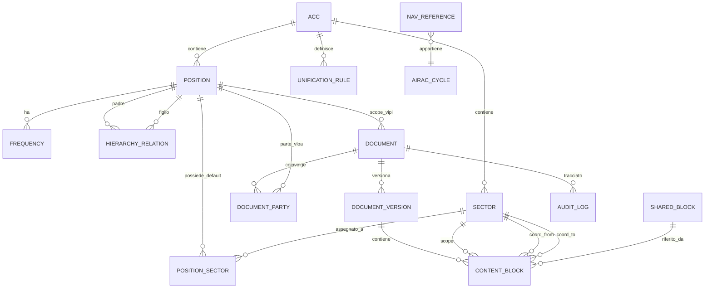

# Specifica del Modello Dati — vIPI/vLOA Interactive

> 🧭 **Come leggere questo documento (stato delle sezioni).** Il modello è cresciuto per round; le sezioni **non** hanno tutte lo stesso peso:
> - **§1–§2** principi e diagramma — di contesto.
> - **§3–§5** entità/enum/indici della **versione originale (pre-Round 5/13)** — **storiche**: alcune sono dichiarate superate (vedi banner Round 5 qui sotto e §9).
> - **§9 (round 13–20) è la parte AUTOREVOLE corrente** e **prevale** dove in conflitto con §3–§5: cataloghi `AccSector`/`AirportSector`, frequenza = attributo del settore, `Fir`→`Acc`, e (§9.12) fonte unica + gerarchia per callsign. **§9.8** è la lista migrazioni autoritativa.
> Per lo stato del codice vedi `../../HANDOFF.md`; per la storia `../history/rounds.md`.

> ℹ️ **Documento di design.** Schema EF Core implementato (vedi `Vipi.Domain/Entities` + migrazioni). **Aggiunte rispetto a questa spec:** entità `Transfer` (+enum `TransferPhase`, catena handler = array JSON) e `EditGrant` (permessi per-ACC); campi **lock** su `Document` (`LockedByVid/At/Expires`); `RowVersion` su `ContentBlock`/`DocumentSection` (concorrenza ottimistica). Stato codice in `../../README.md`/`../../HANDOFF.md`.

> 🔀 **Round 5 — Fusione Settore/Posizione (sostituisce §3.2/§3.3/§3.5/§3.6 e parte del §3.9/§3.10).** `Position` e `Sector` sono ora **un'unica entità `Sector`**: ogni settore è un callsign apribile (campi ex-`Position`: `Callsign` univoco, `Type`/`SectorType`, `Kind`/`SectorKind`, `ApproachKind?`, `DefaultFrequency`, `CoverageOrder`, `IsActive`) **e** un volume di spazio aereo. Il contenimento top-down è un **albero a padre singolo** `Sector.ParentSectorId` (self-FK) che **sostituisce** `HierarchyRelation` e `PositionSector` (eliminate). I settori d'aeroporto portano `AirportIcao`. Lo **scope dei documenti** è ora **uno-a-molti** `Document` 1 ──< N `Sector` (FK `Sector.DocumentId`, un settore con `IsPrimary`): `Document.ScopePositionId` è rimosso. `Frequency.PositionId`→`SectorId`; `DocumentParty.PositionId`→`SectorId`. Le `UnificationRule` restano (riassegnazioni arbitrarie); le loro chiavi JSON sono ora **callsign**. Enum rinominati: `PositionType`→`SectorType`, `PositionKind`→`SectorKind`. La vecchia `Sector.Key` è eliminata: l'identificatore è il `Callsign`.

**Documento:** Specifica tecnica del modello dati (sorgente per lo schema EF Core)
**Versione:** 0.1
**Data:** 13 giugno 2026
**Riferimento:** `../design/piano-vipi-tool.md` (§4, §17, §20)

---

## 1. Scopo e principi

Questo documento definisce le entità persistite, i campi, i tipi, le enumerazioni, le relazioni e i vincoli. È la sorgente da cui derivare le entità di dominio (`vIPI.Domain`) e le configurazioni EF Core (`vIPI.Infrastructure`).

Principi:

- **Gerarchia delle posizioni d'aeroporto (2026-07-31).** Il padre si imposta sul nodo **Aeroporto** in
  `/services/vsop/admin/sector-structure` → `Airport.ParentCallsign`, e vale per tutte le sue posizioni. La proiezione
  (`EfSectorProjectionService`) lo applica a chi non ha un `AirportSector.ParentCallsign` proprio, salendo la
  scaletta **DEL → GND → TWR → APP** e uscendo in cima sul padre dell'aeroporto. Fra pari grado sceglie la radice
  del sottoalbero (gerarchia scritta, es. le APP di LIRF) poi il callsign senza infisso; se resta ambiguo sale.
  Un `ParentCallsign` esplicito del catalogo vince sempre, e **tutte** le posizioni sono modificabili in
  `/services/vsop/admin/sector-structure`. Regola pura in `Vipi.Domain.Services.AirportPositionLadder`, condivisa fra
  proiezione ed editor. Vedi `refactor/12-vista-live-unificata.md` §7-8.
- **Anagrafica importata vs struttura manuale.** Le posizioni e i settori di base si importano dalle API IVAO (anagrafica piatta + ACC + shape). La **gerarchia operativa**, l'**ownership dei settori** e le **regole di unificazione** sono dato manuale curato dagli editor.
- **Versionamento dei documenti.** Ogni documento ha versioni immutabili (audit + diff). I `ContentBlock` appartengono a una **versione**, non al documento direttamente.
- **Concorrenza ottimistica.** Le entità editabili portano un token `RowVersion`.
- **Soft delete** dove serve conservare lo storico (`IsArchived`), niente hard delete dai flussi normali.

---

## 2. Diagramma ER (Mermaid)



---

## 3. Entità

> 🛑 **[SUPERATO — non implementare da qui].** Le §3.2/§3.3/§3.5/§3.6 (`Position`, `Sector` pre-fusione,
> `PositionSector`, `HierarchyRelation`) e la §3.9 (`Document.ScopePositionId`) descrivono il modello
> **pre-Round 5/13** e **non riflettono lo schema attuale** (vedi banner Round 5 in testa e §9, autorevole).
> Restano per contesto storico. **Per implementare, usa §9** (cataloghi `AccSector`/`AirportSector`, `Sector`
> come proiezione, gerarchia per callsign) e le entità reali in `Vipi.Domain/Entities`.

> Convenzioni: PK = chiave primaria; FK = chiave esterna; `?` = nullable; tutti i timestamp sono UTC.

### 3.1 `Acc`
Regione di informazioni di volo (es. Roma `LIRR`, Milano `LIMM`, Brindisi `LIBB`).

| Campo | Tipo | Note |
|---|---|---|
| `Id` | int PK | |
| `Code` | string(8) | univoco (es. `LIRR`) |
| `Name` | string(120) | |
| `CountryPrefix` | string(2) | `LI` per l'Italia |

### 3.2 `Position`
Anagrafica piatta delle posizioni (callsign apribili). **Importata** dalle API IVAO.

| Campo | Tipo | Note |
|---|---|---|
| `Id` | int PK | |
| `Callsign` | string(16) | **univoco** (es. `LIRR_NE_CTR`) |
| `AccId` | int FK→Acc | ACC di appartenenza (dall'API) |
| `Type` | enum `PositionType` | DEL/GND/TWR/APP/CTR |
| `Kind` | enum `PositionKind` | Airport \| Acc (determina quale API: ATCPositions vs subcenters) |
| `FacilityId` | int? | id facility IVAO |
| `Name` | string(120) | nome leggibile (es. "Roma Radar NE") |
| `DefaultFrequency` | string(8)? | frequenza primaria (MHz) |
| `GeometryRef` | string(256)? | riferimento/handle alla shape (vedi `SectorGeometry`) |
| `CoverageOrder` | int | priorità top-down (più basso = più alto in gerarchia) |
| `ImportedAtUtc` | datetime? | quando importata dall'API |
| `IsActive` | bool | default true |

### 3.3 `Sector`
Volume di spazio aereo atomico. Unità minima di ownership e di tag dei contenuti.

| Campo | Tipo | Note |
|---|---|---|
| `Id` | int PK | |
| `Key` | string(24) | univoco per ACC (es. `LIRR-NE-01`) |
| `Name` | string(120) | |
| `AccId` | int FK→Acc | |
| `Description` | string(400)? | |
| `GeometryId` | int? FK→SectorGeometry | shape per la mappa AoR |

### 3.4 `SectorGeometry`
Shape geografica (per la vista mappa AoR). Separata dal `Sector` per non appesantire le query testuali.

| Campo | Tipo | Note |
|---|---|---|
| `Id` | int PK | |
| `Format` | enum `GeometryFormat` | GeoJson \| Wkt |
| `Data` | text | poligono/i |
| `SourceCallsign` | string(16)? | callsign da cui è stata importata |
| `ImportedAtUtc` | datetime? | |

### 3.5 `PositionSector` (associazione)
Settori che una posizione possiede **di default** (configurazione "da sola"). La risoluzione runtime applica poi le `UnificationRule`.

| Campo | Tipo | Note |
|---|---|---|
| `PositionId` | int FK→Position | PK composta |
| `SectorId` | int FK→Sector | PK composta |

### 3.6 `HierarchyRelation`
Relazione top-down **manuale** padre→figlio tra posizioni (es. `LIRR_NE_CTR` → `LIRP_APP` → `LIRP_TWR`).

| Campo | Tipo | Note |
|---|---|---|
| `Id` | int PK | |
| `ParentPositionId` | int FK→Position | |
| `ChildPositionId` | int FK→Position | |
| `AccId` | int FK→Acc | |

Vincoli: coppia (Parent, Child) univoca; nessun ciclo (validato a livello applicativo).

### 3.7 `UnificationRule`
Regola dichiarativa **editabile** che riassegna l'ownership dei settori in base a quali callsign sono online (§20.5 del piano).

| Campo | Tipo | Note |
|---|---|---|
| `Id` | int PK | |
| `AccId` | int FK→Acc | |
| `Name` | string(120) | es. "Split WS2/WS5" |
| `Priority` | int | ordine di applicazione |
| `ConditionJson` | text | predicato su callsign online (es. `{"online":["LIMM_WS5_CTR"]}`) |
| `AssignmentJson` | text | mappa sector→ownerPosition risultante |
| `IsActive` | bool | |
| `RowVersion` | rowversion | concorrenza |

### 3.8 `Frequency`
Frequenze associate a una posizione (per la vista ridotta e gli handoff).

| Campo | Tipo | Note |
|---|---|---|
| `Id` | int PK | |
| `PositionId` | int FK→Position | |
| `Label` | string(80) | es. "Roma Tower" |
| `Callsign` | string(16) | |
| `FrequencyMhz` | string(8) | es. `118.450` |
| `IsPrimary` | bool | (grassetto nelle tabelle) |

### 3.9 `Document`
Un documento vIPI o vLOA. I contenuti vivono nelle **versioni**.

| Campo | Tipo | Note |
|---|---|---|
| `Id` | int PK | |
| `Type` | enum `DocumentType` | Vipi \| Vloa |
| `ScopePositionId` | int? FK→Position | per vIPI: la posizione/aeroporto di riferimento |
| `Title` | string(200) | |
| `Language` | enum `Language` | It (vIPI) \| En (vLOA) — fisso per documento |
| `Status` | enum `DocumentStatus` | Draft \| Published \| Archived |
| `CurrentVersionId` | int? FK→DocumentVersion | versione pubblicata corrente |
| `LastUpdatedUtc` | datetime | |
| `LastUpdatedAiracCycle` | string(6) | calcolato da `AiracService` (es. `2606`) |
| `IsHidden` | bool | nascosto dai loader pubblici (reversibile) |
| `NeedsReviewUtc` | datetime? | revisione pendente: valorizzato quando un evento a monte (es. settore nascosto) può aver reso stantii FREQUENZE/AoR/CONFIGURAZIONI. Banner nell'editor (`DocReviewBar`); sciolto da `IDocumentReviewService.ClearReviewAsync`. Migrazione **`AddDocumentReviewSignal`** |
| `ReviewReason` | string? | motivo leggibile della revisione pendente (mostrato in banner) |
| `RowVersion` | rowversion | |

### 3.10 `DocumentParty` (per le vLOA)
Le parti di una vLOA (bilaterale). Per le vIPI non si usa.

| Campo | Tipo | Note |
|---|---|---|
| `Id` | int PK | |
| `DocumentId` | int FK→Document | |
| `PositionId` | int FK→Position | una delle due unità |
| `Role` | enum `PartyRole` | Home (IT) \| Neighbour |

> Edit-right vLOA: solo CH/AOD italiano sulla parte `Home` (vedi §20.7 del piano).

### 3.11 `DocumentVersion`
Versione immutabile (audit + diff).

| Campo | Tipo | Note |
|---|---|---|
| `Id` | int PK | |
| `DocumentId` | int FK→Document | |
| `VersionNumber` | int | progressivo per documento |
| `Status` | enum `DocumentStatus` | Draft \| Published \| Archived |
| `CreatedByVid` | int | autore (VID IVAO) |
| `CreatedUtc` | datetime | |
| `AiracCycle` | string(6) | ciclo al momento della creazione |
| `Note` | string(400)? | changelog |

### 3.12 `ContentBlock`
Unità minima di documentazione. **Cuore** del modello di visibilità (§20 del piano).

| Campo | Tipo | Note |
|---|---|---|
| `Id` | int PK | |
| `DocumentVersionId` | int FK→DocumentVersion | |
| `Section` | enum `BlockSection` | vedi §4 |
| `Order` | int | ordinamento nella sezione |
| `Tier` | enum `BlockTier` | Reduced \| Extended |
| `Format` | enum `BlockFormat` | Table \| Prose \| Image \| List |
| `Visibility` | enum `BlockVisibility` | Operational \| Handoff \| Always |
| `ScopeSectorId` | int? FK→Sector | settore a cui il blocco si riferisce |
| `FromSectorId` | int? FK→Sector | solo per coordinamenti (Handoff relazionale) |
| `ToSectorId` | int? FK→Sector | solo per coordinamenti |
| `SharedBlockId` | int? FK→SharedBlock | se il contenuto è riusato per riferimento |
| `Body` | text? | Markdown (prosa) — null se usa SharedBlock |
| `BodyJson` | text? | struttura tabellare (Format=Table) |

Vincoli: se `Visibility = Handoff` e il blocco è un coordinamento, `FromSectorId`/`ToSectorId` valorizzati. Se `SharedBlockId` valorizzato, `Body`/`BodyJson` nulli.

### 3.13 `SharedBlock`
Contenuto condiviso per **riferimento** (modifica una volta, aggiorna ovunque). La duplicazione, invece, è una semplice copia in `ContentBlock` senza `SharedBlockId`.

| Campo | Tipo | Note |
|---|---|---|
| `Id` | int PK | |
| `Key` | string(64) | univoco (es. `minime-separazione-generali`) |
| `Title` | string(160) | |
| `Format` | enum `BlockFormat` | |
| `Body` | text? | |
| `BodyJson` | text? | |
| `RowVersion` | rowversion | |

### 3.14 `AuditLog`
Tracciamento delle modifiche (chi, quando, cosa).

| Campo | Tipo | Note |
|---|---|---|
| `Id` | long PK | |
| `Vid` | int | utente IVAO |
| `Action` | enum `AuditAction` | Create \| Update \| Publish \| Archive \| HierarchyChange |
| `EntityType` | string(60) | es. `Document`, `UnificationRule` |
| `EntityId` | string(40) | |
| `TimestampUtc` | datetime | |
| `DetailsJson` | text? | diff/contesto |

### 3.15 `NavReference` (validazione semantica)
Dataset di riferimento per la validazione dei riferimenti nav (FIX/aerovie) legato all'AIRAC (§17.2 del piano).

| Campo | Tipo | Note |
|---|---|---|
| `Id` | int PK | |
| `Type` | enum `NavRefType` | Fix \| Airway \| Navaid |
| `Ident` | string(16) | es. `BAVOM` |
| `AiracCycle` | string(6) | ciclo di validità |

### 3.16 (Non persistito) `AtcSnapshot`
Stato live in **cache memoria**, non in DB: lista ATC online normalizzata dal polling (callsign, vid, frequenza, posizione). Aggiornata ogni 60 s. Documentata qui per completezza; non genera tabella.

---

## 4. Enumerazioni

```csharp
enum PositionType   { Del, Gnd, Twr, ITwr, App, Ctr }   // ITwr = torre informativa (AFIS); round 6
enum PositionKind   { Airport, Acc }
enum GeometryFormat { GeoJson, Wkt }
enum DocumentType   { Vipi, Vloa }
enum DocumentStatus { Draft, Published, Archived }
enum Language       { It, En }
enum PartyRole      { Home, Neighbour }
enum BlockTier      { Reduced, Extended }
enum BlockFormat    { Table, Prose, Image, List }
enum BlockVisibility{ Operational, Handoff, Always }
enum AuditAction    { Create, Update, Publish, Archive, HierarchyChange }
enum NavRefType     { Fix, Airway, Navaid }

// Sezioni logiche dei documenti (derivate dagli esempi vIPI/vLOA)
enum BlockSection {
    Aor, Frequencies, OperationalSettings, Atis, Airport,
    TrafficManagement, Coordination, OperationalTechnique,
    Separations, AreasCorridors, BestPractice, Purpose, Validity, Other
}

// Stato runtime del settore — NON persistito, calcolato dall'AorService
enum SectorState { Covered, Online }
```

---

## 5. Indici e vincoli principali

- `Position.Callsign` UNIQUE; indice su `AccId`.
- `Sector.Key` UNIQUE per `AccId`.
- `HierarchyRelation` UNIQUE su (`ParentPositionId`,`ChildPositionId`); validazione anti-ciclo applicativa.
- `Document` indice su (`Type`,`ScopePositionId`,`Status`).
- `ContentBlock` indice su (`DocumentVersionId`,`Section`,`Order`); indice su `ScopeSectorId`.
- `SharedBlock.Key` UNIQUE.
- `NavReference` indice su (`Type`,`Ident`,`AiracCycle`).
- `RowVersion` su `Document`, `UnificationRule`, `SharedBlock` per concorrenza ottimistica.

---

## 6. Note di derivazione EF Core

- Owned types per `BodyJson` se si preferisce, altrimenti `text` semplice (più leggero per SQLite).
- `RowVersion` mappato a `BLOB` con `IsRowVersion()` (SQLite usa trigger/`xmin`-like via `rowversion` shim o concorrenza su timestamp — valutare `ConcurrencyToken` su `LastUpdatedUtc` se rowversion nativo non disponibile in SQLite).
- Enum salvati come **stringa** (più leggibili e stabili nel DB) via `HasConversion<string>()`.
- Cascade: eliminazione `Document` → `DocumentVersion` → `ContentBlock` (cascade); `Sector`/`Position` mai cancellati a cascata (restrict) per integrità storica.

---

*Documento collegato:* `logica-aor.md` — usa `Position`, `Sector`, `PositionSector`, `HierarchyRelation`, `UnificationRule`, `ContentBlock.Visibility/ScopeSectorId`.

---

## 7. Aggiornamenti round 4 (16 giugno 2026)

Queste modifiche recepiscono il flusso e le decisioni in `../history/review-flusso-gap.md`. Dove indicato, **sostituiscono** quanto sopra.

### 7.1 `DocumentSection` (nuova entità ad albero) — sezioni annidate fino a 3 livelli

Sostituisce l'uso di `ContentBlock.Section` come enum piatto. Le sezioni diventano un albero per versione di documento; la TOC dinamica si genera percorrendolo.

| Campo | Tipo | Note |
|---|---|---|
| `Id` | int PK | |
| `DocumentVersionId` | int FK→DocumentVersion | |
| `ParentSectionId` | int? FK→DocumentSection | null = sezione radice |
| `Title` | string(200) | |
| `Order` | int | ordine tra fratelli |
| `Depth` | int | 0 = radice … max **3** (vincolo applicativo) |
| `SectionKind` | enum `BlockSection` | semantica della sezione (Aor, Coordination, …) |

Vincoli: `Depth ≤ 3`; nessun ciclo; `(DocumentVersionId, ParentSectionId, Order)` ordinato.

### 7.2 `ContentBlock` — modifiche

- **`Section` (enum) → `SectionId` (int FK→DocumentSection)**: il blocco appartiene a un nodo dell'albero, non più a un enum.
- **`CollapsedByDefault: bool`** (nuovo): se il blocco (tipicamente una tabella) è compresso di default nella **vista ridotta**. Indipendente dalla logica live/AoR.
- **`CalloutKind: enum? CalloutKind`** (nuovo): valorizzato solo se `Format = Callout`.

### 7.3 `Position` — attributo remotizzazione

- **`ApproachKind: enum? ApproachKind { Remotized, Standalone }`** (nuovo, solo per `Type = App`): se `Remotized`, la documentazione dell'APP vive **dentro la vIPI dell'ACC**; se `Standalone`, ha un **documento proprio** (caso del punto 3.2 del flusso).

### 7.4 Nuovi formati di blocco

- **`Format = AorMap`**: blocco mappa AoR. `BodyJson` contiene la lista dei settori/geometrie da disegnare e le opzioni di resa (overlap, stati Covered/Online). Permette **N sezioni AoR per documento** (una ACC + una per ogni APP remotizzato).
- **`Format = Callout`**: riquadro informativo colorato, piazzabile in qualsiasi sezione/profondità. Variante in `CalloutKind`.

### 7.5 Minime di vettoramento (MRVA) — **nessuna entità**

Le minime di vettoramento **non hanno tabelle**. `VectoringMinimaSet` e `VectoringMinimaRow`, documentate qui
come «implementazione FUTURE» e mai popolate, sono state **droppate il 22 agosto 2026** insieme al giro che ha
implementato la sezione davvero.

Descrivevano la strada sbagliata: una tabella `area → MinimaFt` legata a un `ScopeSectorId`. Il formato `.mva`
del sectorfile **non permette di ricostruirla**. L'etichetta di quota è un testo piazzato a una coordinata sua,
indipendente dai poligoni (in `liph.mva` le dieci `L;` stanno tutte in cima al file, prima di qualsiasi vertice);
il legame etichetta↔area non è dichiarato e va indovinato geometricamente, con 70 casi ambigui su 345; il testo
non è un numero (`TRL`, `NO MINIMA`, `80/TRL`, `*30/40`) e nessun campo dice le unità (`110` sono centinaia di
piedi, `1500` sono piedi); e 92 tracciati su 315 sono **aperti**, quindi non sono aree.

Quello che il formato dichiara è un'altra cosa, e basta: **il proprietario del file**. `ENRMVA/{acc}.mva` è
l'enroute di un ACC, `{icao}.mva` è un aeroporto. Perciò la sezione `minima` è **derivata e non memorizzata**:
si legge dal sectorfile a view-time (`IVectoringMinimaSource` → `AuroraMvaProvider`), si compone come **una
carta per file** (`MinimaCharts`) e si disegna verbatim, tracciati aperti compresi. Il congelamento avviene come
per le altre derivate, nello **snapshot di release** (doc 10), non in una tabella propria.

### 7.6 `CoordinationPoint` (whitelist per validazione CoP)

Per la validazione dei trasferimenti (QoL-7): i CoP non sono tutti fix reali — esistono punti convenzionali tipo `Jx` (`J1`, `J2`…) assenti dal nav-data.

| Campo | Tipo | Note |
|---|---|---|
| `Id` | int PK | |
| `Ident` | string(16) | es. `BAVOM`, `J1` |
| `Kind` | enum `CopKind` | `Fix` (da sectorfile/nav-data) \| `Conventional` (whitelist editabile) |
| `AiracCycle` | string(6)? | per i `Fix` |

Il validatore semantico accetta `Fix` ∪ `Conventional`; segnala (warning) solo ciò che non rientra in nessuna delle due.

### 7.7 Enumerazioni aggiuntive

```csharp
enum ApproachKind { Remotized, Standalone }      // solo Position.Type = App
enum CalloutKind  { Info, Success, Warning, Danger }
enum CopKind      { Fix, Conventional }

// BlockFormat esteso:
enum BlockFormat  { Table, Prose, Image, List, AorMap, Callout }
```

> `BlockSection` resta come elenco di valori semantici, ma ora vive su `DocumentSection.SectionKind` invece che su `ContentBlock.Section`. Le minime non vi aggiungono nulla: sono una sezione derivata senza storage (§7.5).

---

## 8. Aggiornamenti round 10/11 (27 giugno 2026)

### 8.1 `SectorType` — torre informativa (round 10)
Aggiunto **`ITwr`** (torre informativa / AFIS) dopo `Twr`: `enum SectorType { Del, Gnd, Twr, ITwr, App, Ctr }`. Stesso livello operativo della TWR (frequenza primaria, etichetta), ma servizio informazioni. Enum salvati come stringa ⇒ nessuna migrazione. Invariante applicativo: **ogni `Airport` ha almeno un settore `Twr` o `ITwr`** (badge in gestione aeroporti; blocco eliminazione dell'unica torre in `EfStructureEditingRepository.DeleteSectorAsync`).

### 8.2 `Vid` → `UserId` (round 11)
Rinominati **tutti** i campi VID a `UserId` (codice + colonne DB, migrazione `Rename_Vid_To_UserId` con `RENAME COLUMN` nativo, incl. PK `StaffMembers`):

| Entità | Campo |
|---|---|
| `AuditLog` | `Vid` → `UserId` |
| `Document` | `LockedByVid` → `LockedByUserId` |
| `DocumentVersion` | `CreatedByVid` → `CreatedByUserId` |
| `EditGrant` | `Vid` → `UserId`, `GrantedByVid` → `GrantedByUserId` |
| `StaffMember` | `Vid` (PK) → `UserId` |

Anche `CurrentUser.Vid` → `UserId` e `HostIdentityOptions.VidClaim` → `UserIdClaim` (valore default `"id"`). Le **label a video** restano "VID" (termine d'uso): solo gli identificatori di codice cambiano.

### 8.3 `ImportPolicy` (round 11) — provenienza dei dati
Nuova entità **riga singola** (`Id = 1`) che governa quali categorie di dati arrivano dalla sorgente esterna (sola lettura) o restano manuali. Semantica **opt-out**: default tutto importato.

| Campo | Tipo | Note |
|---|---|---|
| `Id` | int PK | riga singola |
| `ImportTransitionAltitude` | bool | default true → `Airport.TransitionAltitudeFt` di sorgente |
| `ImportAtis` | bool | default true → `Airport.AtisFrequency` |
| `ImportRunways` | bool | default true → `AirportRunway.Ident/LengthM/Bearing` |
| `ImportSectors` | bool | default true → settori d'aeroporto (callsign/tipo/frequenza) |
| `UpdatedUtc` | datetime | |
| `UpdatedByUserId` | int | |

Enum `ImportCategory { TransitionAltitude, Atis, Runways, Sectors }`. Migrazione `AddImportPolicy`. Accesso via `IImportPolicyStore` (snapshot `ImportPolicySnapshot`) + servizio admin `IImportPolicyService`. Enforcement: editor read-only + guard nei service + import che salta le categorie escluse. I campi editoriali (regole pista, SID, livelli TL, link, gerarchia settori) non sono categorie.

### 8.4 Interfacce dati **sorgente-neutre** (round 11)
L'anagrafica/dettagli/utenti esterni passano per porte neutre in `Application/Abstractions`: `IAirportDirectory` (DTO `SourceAirport`), `IAirportDetailProvider` (`SourceAtcPosition`/`SourceRunway`), `IUserDirectory` (`SourceUserStaff`), più `IOnlineAtcProvider`. L'adapter IVAO concreto vive in `Infrastructure/Ivao/*` ed è selezionato da `DataSource:Provider` (vedi `../guide/config.md` §1b). Non rientra nello schema persistito ma vincola da dove si popolano `Airport`/`Sector`/runway.

---

## 9. Aggiornamenti round 13–17 (28 giugno 2026) — **stato attuale del modello**

> ⭐ Questa sezione **prevale** sulle §3/§4 dove in conflitto. Sorgente autorevole = `Vipi.Domain/Entities/Anagrafica.cs` + `Enums.cs` + `ImportPolicy.cs`.

### 9.1 `Fir` → `Acc` (round 13)
L'entità FIR è stata rinominata **`Acc`** in tutto il progetto (proprietà `AccId`/`AccCode`, claim `AccClaim`, tabella `Accs`; migrazione **`RenameFirToAcc`** non distruttiva). Campi aggiunti su `Acc`: **`IsMilitary`**, **`IsHidden`** (escluso dalla navigazione pubblica), **`ImportedAtUtc`**. Gli ACC **non si creano a mano**: si **importano dalla sorgente** (`/v2/centers`) in `/services/vsop/admin/acc`.

### 9.2 Cataloghi importati `AccSector` e `AirportSector` (round 13/14)
Due cataloghi **separati** dai `Sector` operativi (che restano la base di documenti/AoR). Chiave naturale = `ComposePosition` (callsign) univoco. Campi di origine read-only; **limiti quota** e **`IsHidden`** impostati dall'admin.

**`AccSector`** (subcenter di un ACC, da `/v2/centers/{icao}/subcenters` + `/v2/subcenters/{compose}`):
| Campo | Tipo | Note |
|---|---|---|
| `Id` | int PK | |
| `ComposePosition` | string | univoco (es. `LIBB_ES_CTR`) |
| `CenterId` | string FK→`Acc.Code` | alt key `AK_Accs_Code` |
| `Position`/`MiddleIdentifier`/`Frequency` | string? | da sorgente |
| `RegionMapPolygon` | text? | shape JSON grezzo (non ancora su mappa) |
| `LowerLimit`/`UpperLimit` | int? | admin; default GND→UNL, FSS GND→19000 |
| `IsHidden` | bool | derivato effettivo = `IsHidden \|\| Acc.IsHidden` |
| `ImportedAtUtc` | datetime? | |

**`AirportSector`** (postazioni d'aeroporto DEL/GND/TWR/APP, da `/v2/airports/{ICAO}/ATCPositions` + `/v2/ATCPositions/{compose}`):
| Campo | Tipo | Note |
|---|---|---|
| `Id` | int PK | |
| `ComposePosition` | string | univoco (es. `LIRN_TWR`) |
| `AirportIcao` | string FK→`Airport.Icao` | alt key `AK_Airports_Icao` |
| `AccCode` | string FK→`Acc.Code` | ACC di competenza (ereditato) |
| `Position`/`MiddleIdentifier`/`Frequency`/`RegionMapPolygon` | — | da sorgente |
| `LowerLimit`/`UpperLimit` | int? | admin; default inf=GND(0), sup=19500 |
| `IsHidden` | bool | admin |
| `IsPrimary` | bool | frequenza principale (★), unica per aeroporto (round 15) |
| `IsAccApp` | bool | **solo APP**: «di ACC» (remotizzato) sì/no. Editabile dall'editor aeroporto (colonna «ACC?»). Default all'import dal n° di pezzi del callsign (`LIRN_UN0_APP` 3 pezzi → true; `LIRP_APP` 2 pezzi → false), **eccetto** lettera di mezzo `G` (`LIRN_G_APP` = precision/PAR militare → false). Guida `Sector.ApproachKind` nella proiezione. Migrazione `AddAirportSectorIsAccApp` (backfill dei 3-pezzi esistenti) |
| `IsShapeSynthetic` | bool | `RegionMapPolygon` è una shape **sintetica** generata da vIPI (cerchio 5 NM di fallback per le TWR), non reale. Permette al futuro fallback GitHub di rimpiazzarla senza toccare le shape reali. Default false; vedi §9.14. Migrazione `AddAirportCoordsAndTwrSyntheticShape` |
| `ImportedAtUtc` | datetime? | |

Import **manuale + automatico giornaliero** (`AccImportHostedService`, `AirportSectorImportHostedService`); upsert idempotente che **preserva** `IsHidden`, i limiti admin e `IsAccApp` (default solo alla creazione). Import **additivo** (non cancella: nasconde).

### 9.3 `Airport` — campi aggiunti (round 8/12/15 + sessione hide)
Oltre a `Id`/`Icao`/`Name`/`AccId` (round 6): **`TransitionAltitudeFt`** (int?, di sorgente), **`FeaturedRank`** (int?, "3 in evidenza" landing), **`IsHidden`** (bool, migrazione **`AddAirportHidden`**: pagina pubblica inaccessibile + escluso dagli elenchi), **`Latitude`/`Longitude`** (double?, gradi decimali; round 22, §9.14: popolate all'import dal blocco `airport` del dettaglio postazione IVAO, centro della shape tonda TWR). Visibilità pubblica effettiva = `!IsHidden && haAlmenoUnSettore` (gli aeroporti **senza settori** sono nascosti di default). Collezioni profilo strutturato: `TransitionLevels`/`Runways`/`RunwayRules`/`Sids`/`FrequencyLinks`/`ExtraSections` (§9.11) + catalogo `AirportSectors`. **`ParentCallsign`** (§9.12, round 20; sostituisce `ParentSectorId` di round 19): padre per callsign nella gerarchia di copertura (aeroporto‑foglia, cross-ACC).

**Anagrafica militare e campi di sorgente (2026-08-25, migrazione `AeroportiMilitari`).** Cinque colonne nuove,
tutte additive: **`HasMilitaryPresence`** (bool, default false), **`IsMilitaryOnly`** (bool, default false),
**`Iata`** (string? max 4), **`ElevationFt`** (int?), **`MagneticVariation`** (double?).

⚠️ **I due flag militari non sono lo stesso dato con due nomi.** `HasMilitaryPresence` è il campo `military`
della sorgente e vuol dire «c'è una base militare sul sedime»: misurato il 25 agosto, **34 aeroporti italiani su
221**, fra cui **Linate, Pisa, Ciampino, Catania Fontanarossa, Cagliari Elmas, Lamezia e Rimini** — scali civili.
Chi lo rende a schermo deve scrivere «presenza militare», non «militare». `IsMilitaryOnly` è invece un giudizio
editoriale (nessun traffico civile) che la sorgente non esprime: lo dà un amministratore dalla pagina Aeroporti,
solo dove c'è presenza militare, e **l'import non lo tocca mai** — l'unica eccezione è la coerenza, perché tolta
la presenza militare «solo militare» viene azzerato con essa.

`Iata` normalizzato: la sorgente manda **stringa vuota**, non null, per i 73 aeroporti che non ne hanno uno.

**La vIPI d'aeroporto è dell'AEROPORTO (2026-08-25, migrazione `DocumentoDellAeroporto`).** Colonna
**`Airport.DocumentId`** (int?, FK→`Documents`, `SetNull`, **indice UNICO**) e navigazione uno-a-uno
`Document.Airport`.

⚠️ **Perché.** Il documento d'aeroporto si trovava passando dai suoi settori (una TWR/GND/DEL con `DocumentId`).
Regge finché lo scalo ha una torre — e **LIBG (Taranto Grottaglie) su IVAO ha solo `LIBG_APP`, non remotizzato**,
che ha un documento suo e per regola non può portare quello dell'aeroporto. Misurato: il documento nasceva
legato a nessuno, alla riapertura nessuno lo ritrovava e ne nasceva un altro — **quattro bozze orfane in un
minuto** — e la pubblicazione rispondeva «Nessun contenuto da pubblicare: crea prima il documento» a chi
l'aveva appena creato quattro volte. APP e vLOA restano legati ai **settori**, che è ciò che descrivono davvero.

L'indice è **unico** apposta: due scali che puntano allo stesso documento sarebbero un difetto visibile solo
mesi dopo, come un aeroporto che mostra le piste di un altro. I NULL restano molti (gli scali senza documento) e
tutti e tre i provider ne ammettono più d'uno in un indice unico.

I settori d'aeroporto **restano** legati allo stesso documento (`Sector.DocumentId`): serve a chi parte da un
callsign (vista live, ricerca). È una **proiezione** del legame di sopra, non una seconda verità — il rebuild li
riallinea, compresi quelli comparsi dopo la prima generazione.

⚠️ **I documenti già scritti** arrivano al legame nuovo con `IDocumentMaintenance.LinkAirportDocumentsAsync`,
che gira **a ogni avvio prima delle altre riconciliazioni** ed è idempotente. Legge dove il dato viveva prima —
i settori, con il filtro di `SectorDocumentRules`, che sopravvive **solo** per questo. Misurato sul `vipi.db` di
sviluppo: **5 aeroporti collegati**, e LIBA è andato al proprio documento (18) e non a «Amendola Approach» (3),
che è la trappola che il filtro evita.


`MagneticVariation` è `double` e non `int` perché la sorgente manda entrambi nella stessa pagina.

⚠️ **Chi riempie i campi negli aeroporti già in archivio.** `AutoAssignAirportsAsync` è additiva — salta gli ICAO
già presenti — quindi da sola avrebbe lasciato le cinque colonne al loro default su tutto l'archivio per sempre
(la trappola dei bool nuovi, §8.3). Dal 25 agosto lo stesso giro dell'anagrafica chiama
**`SyncAirportSourceFieldsAsync`** su TUTTO l'elenco della sorgente, e conta a parte gli aggiornati
(`AirportImportResult.Refreshed`). Restano fuori nome e ACC di competenza: sono scelte di una persona.

### 9.4 Frequenza = **attributo del settore** (round 16/17) — `Frequency` ELIMINATA
La tabella **`Frequency`** (§3.8) è stata **rimossa** (migrazione **`DropFrequencyTable`**). La frequenza è ora **un solo attributo del settore**: **`Sector.DefaultFrequency`** (una per settore). Conseguenze:
- **`AirportFrequencyLink`** (link "vivo") ora punta a un **`Sector`** via **`SourceSectorId`** (era `SourceFrequencyId`): risolve `Sector.DefaultFrequency` + callsign. Campo `LabelOverride` opzionale.
- Le **frequenze del documento aeroporto** si leggono dal catalogo **`AirportSector`** non nascosto (ordine ATIS·DEL·GND·TWR·APP, ★ per il primario).
- **`Airport.AtisFrequency` ELIMINATA** (round 16): l'ATIS è un `AirportSector` come gli altri.

### 9.5 Geometria — `SectorGeometry` ELIMINATA (round 16)
Rimossi `SectorGeometry` (§3.4), `Sector.GeometryId/Geometry`, enum `GeometryFormat`: mai usati. La geometria futura vive come `RegionMapPolygon` sui cataloghi `AccSector`/`AirportSector` (oggi JSON grezzo, non ancora su mappa). `VectoringMinima` (§7.5) è stata **droppata** il 22 agosto 2026: le minime sono derivate dal sectorfile, senza storage.

### 9.6 `ImportPolicy` — categoria **ATIS rimossa** (round 16)
`enum ImportCategory { TransitionAltitude, Runways, Sectors }` (niente più `Atis`). L'entità `ImportPolicy` ha quindi `ImportTransitionAltitude`/`ImportRunways`/`ImportSectors` (+ `UpdatedUtc`/`UpdatedByUserId`); rimosso `ImportAtis`. Migrazione `SimplifyDataModel`. Vedi §8.3 (superata su questo punto).

### 9.7 Enumerazioni — stato attuale
`SectorType { Del, Gnd, Twr, ITwr, App, Ctr }` · `SectorKind { Airport, Acc }` · `ApproachKind { Remotized, Standalone }` · `DateParity { Any, Even, Odd }` (regole pista, round 9) · `LevelParity { Any, Even, Odd }` (parità livello di crociera su `TransferPoint`, regola semicircolare) · `TransferHandoffKind { Unspecified, Point, AorBoundary, Custom }` (dove passa il controllo/le comunicazioni quando NON coincide col punto d'ingresso, §9.20-bis) · `SpeedConstraint { Unspecified, AtOrBelow, AtOrAbove, Exact }` (restrizione di velocità al trasferimento; enum dedicato e non riuso di `LevelConstraint`, che porta uno `Special` senza senso su una velocità) · `TransferVerticalState { Unspecified, Level, Descending, Climbing }` (stato verticale su `TransferPoint`, indipendente dal `LevelConstraint`; guida la parola «in discesa/salita/stabile» della frase — §7.3 refactor) · `ImportCategory { TransitionAltitude, Runways, Sectors }`. Rimossi `GeometryFormat`, `TransferConditionKind` (la condizione trasferimento è ora tre colonne indipendenti pista/area/personalizzata, §9.20).

### 9.8 Migrazioni (ordine attuale)
`InitialCreate` → `AddAirport` → `AddAirportParentSector` → `RemoveAirportParentSector` → `AddAirportProfile` → `AddRunwayRuleSchedule` → `Rename_Vid_To_UserId` → `AddImportPolicy` → `AddFeaturedRank` → `AddVloaFeaturedRank` → `RenameFirToAcc` → `AddAccSector` → `AddAirportSector` → `AddAirportSectorPrimary` → `SimplifyDataModel` → `DropFrequencyTable` → `AddAirportHidden` → `RunwayRuleThresholds` → `AddRunwayRuleDateWindow` → `RenameRunwayRuleTimeToLocal` → `AddAirportExtraSection` → **`AddHierarchyParentCallsign`** (round 20; la `AddAirportHierarchy` di round 19 è stata rimossa prima dell'applicazione) → **`AddAirportSectorIsAccApp`** (flag «APP di ACC» + backfill dei callsign a 3 pezzi) → **`ReworkTransfers`** (sostituisce `Transfer` ACC↔ACC con `TransferFlow` settore-proprio + `TransferPoint` CoP/livello strutturato/Next) → **`SimplifyTransferResolution`** (drop `TransferPoint.Fallback` + `ManualChainJson`: la risoluzione live del ricevente/mittente risale la **gerarchia di copertura globale** `ParentCallsign`/`ParentSectorId`, terminale fisso **UNICOM**; rimosso l'enum `TransferFallback`) → **`AddAppProfile`** (profilo APP standalone, §9.13) → **`AddAppCustomSections`** (colonna `CustomSectionsJson`) → **`AddAppHiddenSections`** (colonna `HiddenSectionsJson`) → **`AddAirportCoordsAndTwrSyntheticShape`** (round 22: `Airport.Latitude/Longitude` + `AirportSector.IsShapeSynthetic`, §9.14) → **`AddAccProfile`** (round 23: vIPI ACC data-driven, tabella `AccProfiles` 1:1 con `Acc`, `BlocksJson`, §9.15) → *(round 27–33: `AddNeighbourCandidate`, `AddVloaProfile`, `AddDocRelease`, `AddEditorTask`, `AddDocumentHideFlags` e affini — vedi changelog)* → **`AddSidImport`** (round 34: `AirportSid` +`IsImported`/`Priority`/`StableKey`/`SourceAiracCycle`/`ForcePublished`/`NeedsFixReview`, entità `SidFixAlias`, `ImportPolicy.ImportSids`; import SID dal sectorfile Aurora GitHub) → **`AddImportState`** (round 34: tabella `ImportStates` per il gating degli import periodici, chiave `Category` + `LastSuccessUtc`) → **`AddTransferPointParity`** (colonna `TransferPoint.Parity` enum `LevelParity`, default `Any`; parità del livello di crociera per la regola semicircolare, resa nel `LevelText` come «(pari)»/«(dispari)») → *(round 29→33: `AddTransferFlowAirportName`, `AddDocumentReviewSignal`, `AddSectionRenderMode`, `AddDocumentProfile`/`Drop*Profile`, `SectionKeyCatalog`, `DropCoordinationSentenceTemplate` — vedi changelog)* → **`AddTransferPointCondition`** (2026-07-22: colonne `TransferPoint.ConditionKind` enum `TransferConditionKind` default `None` + `ConditionLabel` max 80 + `ConditionRefId`; condizione operativa pista/area, §9.20) → *(2026-07-22: `AddTransferPointConditionArea`, `SplitTransferConditionColumns` — condizione a tre colonne indipendenti, §9.20)* → **`AddImportStateLastError`** (2026-07-22, audit Fase 1: colonne `ImportState.LastAttemptUtc` + `LastError` per l'osservabilità dei fallimenti degli import periodici; report read-only in `/services/vsop/admin/sources`). → *(2026-07-24/29: `AddTransferPointVerticalState`, `AddSidInitialClimbByApp` — vedi changelog)* → **`AddSectionIsHidden`** (2026-07-30, doc 11 §3c: colonna `DocumentSections.IsHidden`, default 0 — «sezione nascosta dal documento pubblicato» diventa stato **versionato** sulla sezione, gemello di `RenderMode`; prima viveva in `AccBlockMeta.HiddenSections` per la vIPI ACC e in `DocumentProfiles.HiddenSectionsJson` per APP e vLOA, quindi non versionato. Migrazione dati one-shot idempotente al boot, `IDocumentMaintenance`, che azzera le sorgenti; nello stesso giro le sezioni libere passano dalla chiave costante `"custom"` a `custom:{guid8}` univoca) → **`AddSectionBeforeParentBody`** (2026-07-30, doc 11 §3g: colonna `DocumentSections.BeforeParentBody`, default 0 — una **sotto-sezione** può precedere il corpo della sezione padre, es. una premessa sopra le mappe delle aree regolamentate; terzo flag per-sezione con `RenderMode` e `IsHidden`, nessuna migrazione dati perché il default riproduce il comportamento storico) → **`AddTransferHandoffSpeedAndVariants`** (2026-08-11, §9.20-bis: faccetta trasferimento su `TransferPoint` — `HandoffKind`/`HandoffLabel`/`HandoffLevel*`, `CommsHandoff*` — più `SpeedValue`/`SpeedConstraint` e il gruppo di varianti `VariantGroup`/`IsOtherwise`, con indice `(FlowId, VariantGroup)`. Additiva e senza backfill: i default riproducono il comportamento storico. ⚠️ I default degli enum-stringa sono **dichiarati nel modello** con `HasDefaultValue`, non solo in migrazione, perché lo scaffolding proporrebbe `""` — un valore che nessuno di quegli enum sa rileggere — e perché lo stesso vale per il `PostgresSchemaReconciler`). → **`ReworkVariantsAsOutline`** (2026-08-12, §9.20-ter: **droppa `IsOtherwise`**, aggiunge `VariantDepth` (int) + `IsGroupWide` (bool) e porta l'indice a `(FlowId, VariantGroup, Order)`. Il gruppo di varianti diventa un outline con alternative pari-grado ed eccezioni annidate a profondità libera. Nessun backfill: la colonna droppata non era mai stata scritta. ⚠️ Lo scaffolding proponeva un `RenameColumn`, **diverso nei due provider** — SQLite verso `VariantDepth`, MySQL verso `IsGroupWide`: due inferenze incompatibili dalla stessa modifica, che è la prova che il rename è una supposizione sui tipi e non un'intenzione. Riscritte entrambe come drop + add). → **`AddCoordinationAgreements`** (2026-08-16, §9.25: quattro tabelle nuove — `CoordinationAgreements`, `AgreementParties`, `AgreementAirports`, `AgreementClauses` — che prendono il posto di `TransferFlows`/`TransferPoints`. Sola `CreateTable`: nessun rename e nessun dato toccato, perché il travaso e il passaggio dell'editor avvengono in un secondo momento e in un colpo solo — due scrittori sugli stessi dati sarebbero due verità). → **`AddSectionLeadSentence`** (2026-08-16, §9.26: colonna `DocumentSections.LeadSentence`, default 0 — quarto flag per-sezione, sceglie fra prosa distesa e capofila nei coordinamenti; opt-in, quindi il default riproduce il comportamento storico)) → **`DropLegacyTransferTables`** (2026-08-17, §9.25: droppa `TransferPoints` **poi** `TransferFlows` — figlio prima del padre, o è errno 150 su MariaDB. Chiude la sostituzione: il travaso è stato eseguito sul `vipi.db` di sviluppo (37 flussi / 78 punti → 41 accordi / 63 clausole) e poi **rimosso col suo macchinario**, perché le migrazioni girano *prima* della manutenzione d'avvio e quindi non avrebbe più potuto leggere niente — su un DB non ancora travasato avrebbe fatto crashare l'avvio. Possibile solo perché il DB di produzione viene sostituito con quello di sviluppo, già convertito. ⚠️ Il `Down` ricrea le tabelle **vuote**: fa tornare lo schema, non l'archivio, e la conversione non è invertibile riga per riga. L'ultima copia di quei dati nella forma originale è `tests/Vipi.Application.Tests/Fixtures/real-flows.tsv`). → **`AgreementSectionsAdditive`** + **`AgreementSectionsFinalize`** (2026-08-18, §9.25-bis: l'accordo diventa la COPPIA — `SideASectorId`/`SideBSectorId` in forma canonica con indice **unico** — e il traffico scende nella tabella nuova `AgreementSections`, che porta `Kind` e `Direction`. Spariscono `AgreementParties`, `CoordinationAgreements.TrafficKind`/`Description` e `AgreementClauses.Direction`. ⚠️ **Due migrazioni e non una**, con in mezzo il comando `tools/Vipi.AgreementsToSections`: la fusione di 40 accordi in 16 coppie è logica — canonizzazione, ribaltamento dei versi, unione delle gemelle — e lo scaffolding proponeva invece un `RenameColumn` di `AgreementId` in `SectionId` che avrebbe lasciato **id di accordi** spacciati per id di sezioni, senza un errore. Il `NOT NULL` e l'indice unico del secondo passo **sono la guardia**: su un archivio non convertito falliscono, ed è il modo giusto di accorgersene). → **`AeroportiMilitari`** (2026-08-25, §9.3: cinque colonne additive su `Airports` — `HasMilitaryPresence`, `IsMilitaryOnly`, `Iata`, `ElevationFt`, `MagneticVariation`. Nessun backfill in migrazione: i campi di sorgente li riempie il giro dell'anagrafica al primo passaggio, che ora ripassa anche gli aeroporti già in archivio). → **`DocumentoDellAeroporto`** (2026-08-25, §9.3: colonna `Airports.DocumentId` + indice UNICO + FK `SetNull`. Il backfill NON sta in migrazione ma in `LinkAirportDocumentsAsync` all'avvio, per la ragione di sempre: le migrazioni del repo sono SQLite-flavored e il deploy hostato crea lo schema col `PostgresSchemaReconciler`).

### 9.9 `AirportRunwayRule` — regole pista a soglie operative (sessione 28 giu)
Le condizioni vento-arco/velocità/pioggia-neve sono state sostituite da **soglie operative per-regola**. Su `AirportRunwayRule`: **rimossi** `WindDirFrom/WindDirTo/WindSpeedMin/WindSpeedMax/Rain/Snow`; **aggiunti** `Name` (etichetta), **`MaxTailwindKt`** (int, default 5), **`MaxCrosswindKt`** (int?, null = nessun vincolo), **`Surface`** (enum **`RunwaySurface { Any, Dry, Wet }`**, Wet = pioggia/neve nel METAR). `Order` = priorità (prima regola applicabile vince); `DepRunways/ArrRunways/Note` invariati; i filtri temporali (orario/giorni/parità + finestra stagionale §9.10) restano come **filtro di eleggibilità opzionale** (avanzate, caso Malpensa). Tailwind/crosswind sono **calcolati dal vento** (non più inseriti come direzione). Su `Airport` **nessuna soglia** (sono per-regola). Selezione in `Application/Weather/RunwaySuggestion.EvaluateRules(rules, windDir, windKt, wet, now)`; se nessuna regola si applica → fallback `Suggest()`. Migrazione **`RunwayRuleThresholds`** (drop 6 colonne, add `Name`/`MaxTailwindKt`/`MaxCrosswindKt`/`Surface`, svuota le vecchie righe).

### 9.10 `AirportRunwayRule` — orari in **ora locale (LT)** + finestra di validità **stagionale** (round 18, sessione 29 giu)
Due rifiniture al filtro di eleggibilità avanzato delle regole pista:
- **Orari in ora locale (LT), non più UTC/Z.** Gli orari AIP sono in ora locale: i campi `TimeFromUtcMin/TimeToUtcMin` sono stati **rinominati** in **`TimeFromLocalMin/TimeToLocalMin`** (minuti da mezzanotte **locale**, 0..1439). `EvaluateRules` converte l'istante UTC in **ora locale italiana** (CET/CEST con DST, `TimeZoneInfo` `Europe/Rome`→`W. Europe Standard Time`→UTC come fallback) **prima** di valutare orario, giorni, parità e stagione. UI: etichette «da/a (LT)»; documento: «08:00–20:00 LT». Migrazione **`RenameRunwayRuleTimeToLocal`** (`RenameColumn`, preserva i valori).
- **Finestra di validità stagionale ricorrente.** Nuovi `int?` **`DateFromMonthDay`/`DateToMonthDay`** in codifica **MMDD** (mese×100+giorno, es. `101`=1 gen, `331`=31 mar), estremi inclusi, **anno ignorato** (si ripete ogni anno) e **wrap di fine anno** gestito (es. `1101`→`0228`). Entrambi null = nessun vincolo. Editor: selettori giorno+mese (no anno); un estremo conta solo se **giorno e mese** sono entrambi valorizzati. Logica in `RunwaySuggestion.DateInWindow`. Migrazione **`AddRunwayRuleDateWindow`** (2 colonne INTEGER nullable).

### 9.11 `AirportExtraSection` — sezioni editoriali libere (round 18, sessione 29 giu)
Nuova entità del **profilo strutturato** aeroporto: sezioni di testo libero indipendenti dalle sezioni standard. Campi: `Id`, `AirportId` (FK→`Airport`, cascade), `Order` (priorità di visualizzazione), **`Title`** (obbligatorio), **`Body`** (testo libero nullable, a capo preservati). Collezione `Airport.ExtraSections`. Editate dal pannello **«Sezioni extra»** dell'editor aeroporto (add/rimuovi/riordina); nel **viewer** sono rese **direttamente dal profilo** (come Piste/Frequenze, non dal documento pubblicato): **colonna libera di destra** (`aside.doc-rail`, desktop ≥1500px) e **copia inline sotto le SID** su schermi stretti (`.extra-inline`, nascosta da CSS ≥1500px). Salvataggio ACC-gated (`SaveExtraSectionsAsync`, titolo obbligatorio). Migrazione **`AddAirportExtraSection`** (nuova tabella + indice `(AirportId, Order)`). **Non** scritte in `RebuildDocumentAsync` (il viewer le compone dal profilo) — eventuale inclusione nel documento pubblicato è un follow-up.

### 9.12 Fonte unica + gerarchia di copertura per **callsign** (round 20, sessione 29 giu) — sostituisce round 19
**Decisione:** i **cataloghi importati** (`AccSector` + `AirportSector`) sono la **fonte autoritativa unica** dei settori. I `Sector` operativi **non si editano più a mano**: sono una **proiezione** rigenerata dai cataloghi che porta solo i legami documento + l'albero AoR.

**Gerarchia per callsign (cross-ACC).** L'albero di copertura/fallback **Aeroporto → APP → settore ACC alto** è a **padre unico** (ogni nodo un solo padre = il fallback immediato), profondità/ramificazione **libere**, ed è **unico per tutta la divisione** (cross-ACC; caso Crotone = aeroporto di un ACC sotto APP/CTR di Roma). I nodi si legano **per callsign** (`ComposePosition`), come il motore AoR. Nuovi campi:
- **`AccSector.ParentCallsign`** (string?), **`AirportSector.ParentCallsign`** (string?, valorizzato solo per le posizioni **APP**; DEL/GND/TWR non sono nodi), **`Airport.ParentCallsign`** (string?, l'aeroporto è la **foglia**). **Sostituisce** `Airport.ParentSectorId` (round 19, rimosso). Nessuna FK (callsign cross-tabella); indici su `ParentCallsign`. Migrazione **`AddHierarchyParentCallsign`** (additiva: 3 colonne TEXT + indici + `Sectors.IsProjected`; la `AddAirportHierarchy` di round 19 è stata rimossa, mai applicata).

**`Sector` = proiezione** (`ISectorProjectionService.SyncFromCatalogsAsync`, `EfSectorProjectionService`). Idempotente, di sistema (no authz), invocata al termine degli import (ACC/settori aeroporto) e dopo ogni modifica alla gerarchia:
- **Upsert per `Callsign`** (= `ComposePosition`): preserva `Sector.Id` e i **legami editoriali** (`DocumentId`/`IsPrimary`/`FeaturedRank`) → le FK documento (`ContentBlock.ScopeSector`, `DocumentParty.Sector`, `AirportFrequencyLink.SourceSectorId`) restano intatte.
- Deriva `Type` (da `Position`: DEL/GND/TWR/APP/CTR…), `Kind` (Acc dal subcenter, Airport dalla posizione aeroporto), `AccId`, `DefaultFrequency`, `AirportId`, e **`ParentSectorId` dal `ParentCallsign`** del catalogo. Per gli **APP** deriva `ApproachKind` da `AirportSector.IsAccApp` (true → `Remotized`, false → `Standalone`; gli APP da subcenter ACC sono sempre `Remotized`).
- Nuovo flag **`Sector.IsProjected`**: i settori proiettati spariti o **nascosti** nel catalogo vengono **disattivati** (`IsActive=false`), non cancellati; i settori **non** proiettati (seed/manuali, `IsProjected=false`) **non vengono mai toccati** → i test AoR S1–S10 (Topology in-memory) restano intatti.
- **Orfani → legami editoriali recisi** (audit 14 lug): quando un settore proiettato diventa orfano (`IsActive=false`), la sync azzera anche `DocumentId`/`IsPrimary`/`FeaturedRank`. Un settore che non esiste più in sorgente non deve restare agganciato a un `Document` (FK dangling → artefatti doppio-documento in rigenerazione, "primario" fantasma). Se il callsign riappare, il re-upsert riparte pulito.
- **Frequenza dei proiettati = sola lettura** (audit 14 lug): `IStructureEditingRepository.SetSectorFrequencyAsync` **rifiuta** un `Sector.IsProjected` con `Vipi.Application.Aor.ValidationException`. Su un proiettato `DefaultFrequency` è attributo di **sorgente** (la sync la riscrive dal catalogo): editarla darebbe l'illusione d'una modifica cancellata al sync successivo. Solo i settori seed/manuali sono editabili.
- **Reparent al primo antenato visibile** (occultamento singolo settore): se il `ParentCallsign` d'un figlio punta a un settore **nascosto** (non nel set desiderato), il figlio risale la catena dei `ParentCallsign` fino al primo antenato **visibile** (nonno, bisnonno…), invece di restare agganciato a un padre disattivato. Un solo code-path (`NearestVisibleAncestor`, guard anti-ciclo) che copre settore nascosto, ACC nascosto e orfano. Se non c'è alcun antenato visibile (radice nascosta) il figlio diventa radice. La **Regola 1** (in `AccAdminService.SetSubcenterHiddenAsync`) vieta però di nascondere una **radice** con figli visibili (nessun nonno a cui riappenderli): `ValidationException`.
- `TopologyBuilder` **invariato**: legge ancora `Sector` per `AccId`; ora il `ParentSectorId` arriva dalla proiezione. AoR ACC e test S1–S10 inalterati.
- **Cache confinanti invalidata al choke point** (audit 14 lug): `SyncFromCatalogsAsync` è il punto comune di ogni mutazione catalogo (import ACC/aeroporti, hide, import confinanti), quindi a fine sync invalida la cache del set confinanti di `EfHierarchyEditingService` (`internal static InvalidateConfiningCache()`, TTL 5 min). Prima era invalidata solo da `SetParentAsync` → dopo un import/hide il set restava stantio fino al TTL (vicini/AoR/vLOA su confini vecchi).
- **Import confinanti atomico** (audit 14 lug): `NeighbourImportService` avvolge *persist catalogo estero + riproiezione* in un'unica transazione via la porta `IUnitOfWork` (impl `EfUnitOfWork`, transazione sul `VipiDbContext` scoped). Evita lo stato incoerente "ACC esteri persistiti ma senza settori proiettati" se la riproiezione fallisce a metà.

**Editor** `IHierarchyEditingService` (`EfHierarchyEditingService`): `/services/vsop/admin/sector-structure` (`StrutturaPage`) è **solo** l'editor della gerarchia di copertura **globale** (cross-ACC, senza alcun selettore ACC). La creazione documenti è stata spostata nella pagina dedicata `/services/vsop/editor/new-document` (`NewDocumentPage`, vedi MAPPA_PAGINE). `LoadTreeAsync()` → nodi `Acc` (AccSector) + `App` (AirportSector con Position=APP) + `Airport` (foglie); DEL/GND/TWR esclusi. `SetParentAsync(kind, nodeId, parentCallsign?)` valida padre = nodo interno ACC/APP, **anti-ciclo** per i nodi interni, cross-ACC ammesso, ACC-gated sul figlio; poi riproietta.
- **UI a card per ACC** (non più albero unico indentato): una card per ogni ACC che contiene **tutti gli alberi la cui radice è un suo settore** (i discendenti cross-ACC restano nell'albero, con tag ACC). Comprimi/espandi a due livelli (card e singolo ramo) + `⊞ espandi`/`⊟ comprimi`. **Ricerca** che mostra l'intera gerarchia del CS (match + antenati + discendenti, anche cross-ACC). Pannello **Dettaglio sticky** con catena di fallback, picker padre ricercabile e bottone **Applica** (la modifica del padre si conferma esplicitamente, poi riproietta).

**Doppia rappresentazione residua / fuori ambito (follow-up):** documenti e AoR girano ancora sui `Sector` (ora proiezione), non direttamente sui cataloghi. L'eliminazione totale di `Sector` (doc+AoR sui cataloghi) e la **risoluzione live** "chi controlla l'aeroporto adesso" restano alla fase live.

### 9.13 `AppProfile` / `AppFrequencyLink` — APP non remotizzati (round 21, sessione 29 giu)
Profilo editoriale dell'**APP standalone** (non remotizzato), ancorato **1:1 al `Sector` APP** via `SectorId` (indice univoco; `Type=App`, `ApproachKind=Standalone`). Solo le parti **editoriali** sono persistite; **Frequenze/Coordinamenti/AOR** si **derivano live**. Migrazioni additive **`AddAppProfile`** (+`AppFrequencyLink`), **`AddAppCustomSections`**, **`AddAppHiddenSections`**.
- **`AppProfile`**: `Id`, `SectorId` (FK→`Sector`, cascade, unique), `SeparationsJson` (righe `Vertical`/`Lateral`/`Applicability?` — colonne fisse; l'applicabilità free-text dalla 2ª riga), `VfrJson` (prosa+tabella), `SectionOrderJson` (ordine delle 6 sezioni fisse del registry `AppSections` + custom), `FreqOrderJson` (override d'ordine per callsign), `HiddenSectionsJson` (sezioni nascoste dal viewer, visibili in editor), `CustomSectionsJson` (sezioni libere: titolo + blocchi prosa/tabella). Collezione `FrequencyLinks`.
- **`AppFrequencyLink`** (mirror di `AirportFrequencyLink`): `Id`, `AppProfileId` (FK cascade), `Order`, `SourceSectorId` (FK→`Sector`, cascade), `LabelOverride?` — frequenze extra linkate.
- **Derivazioni (service `IAppProfileService`)**: **Frequenze** = posizioni del catalogo `AirportSector` degli aeroporti con `Airport.ParentCallsign ∈ Topology.DomainOf(appCallsign)` (ATIS·DEL·GND·TWR·APP★), seguite dai **genitori** di copertura (`Topology.Ancestors`, CTR superiori). **Coordinamenti** = `ITransferService.ListFlowsByAccAsync` filtrati su settore APP, Next classificato ACC (Ctr) vs torre (Twr/ITwr). **AOR** = `AorPolygonProjector` (puro) su `AirportSector.RegionMapPolygon` (formato IVAO **`[lng, lat]`**). Registry sezioni `AppSections.All` (6 fisse) + riconciliazione pura dell'ordine.
- **Instradamento**: `DocumentSummary.IsStandaloneApp` (settore primario `App`+`Standalone`) ha precedenza su `IsAirport`; gli editor generico/hub/versioni reindirizzano a `/services/vsop/{acc}/apps/editor?app={callsign}` (vedi MAPPA_PAGINE).

### 9.14 Shape tonda TWR + coord aeroporto + rifiniture trasferimenti/AOR (round 22, sessione 30 giu)
Quattro interventi indipendenti.
- **Shape tonda 5 NM di fallback per le TWR.** La sorgente IVAO espone le TWR con `regionMapPolygon = "[]"` (array vuoto), quindi non disegnabili. Un servizio di sistema (`ITowerShapeFallbackService`/`TowerShapeFallbackService`, Application) genera per ogni TWR **vuota/degenere** un poligono circolare di 5 NM (`CircleShapeBuilder`, puro, formato `[[lng, lat], …]`) e lo salva in `RegionMapPolygon` con `IsShapeSynthetic=true`. **Mai sovrascrive** una shape reale; il «vuoto» si decide **provando a proiettare** (`AorPolygonProjector.Project(raw) is null`), così becca `null`, `"[]"` e poligoni <3 punti. Invocato in `AirportSectorImportHostedService` **dopo** l'import (l'import è isolato in un proprio try: se le credenziali IVAO mancano, il fallback gira comunque sul catalogo già in DB). Idempotente: una volta scritto il cerchio (poligono valido) non viene rigenerato; un re-import che riscrive `RegionMapPolygon` resetta `IsShapeSynthetic=false` → il fallback rigenera.
- **Centro del cerchio = coord aeroporto.** Popolate all'**import** dal blocco **`airport.latitude/longitude`** del dettaglio postazione IVAO **`/v2/ATCPositions/{compose}`** (presente su **ogni** postazione dell'aeroporto, risponde 200 con scope `tracker`). `SourceAtcPosition` porta `AirportLatitude/Longitude`; `ImportForAirportAsync` le scrive su `Airport.Latitude/Longitude`. Ripiego se le coord non sono ancora note: **centro (bounding-box) del poligono di un settore fratello** (es. APP) via `ListNonSyntheticPolygonsAsync` + `AorPolygonProjector`. **Futuro fallback GitHub** per le shape reali TWR: registra un altro provider via `DataSource:Provider`; rimpiazza solo le sintetiche (`IsShapeSynthetic=true`).
- **AOR APP — overlay shape torre.** Il componente `AppAor` (viewer `AppnPage` + editor) ora mostra anche le shape delle TWR dello stesso aeroporto (`IAppProfileService.GetTowerPolygonsAsync` → `EfAppProfileRepository.GetTowerPolygonsRawAsync`, TWR visibili dell'ICAO dell'APP), come overlay Leaflet arancione tratteggiato con **control layer** «Shape torre» per mostrare/nascondere (lato client, `vipi-aor.js`). Nessuna persistenza.
- **Trasferimenti editabili** (`AdminTrasferimentiPage`): edit in-place di flusso (tipo/aeroporto/descrizione) e punto (CoP/vincolo+valore+unità/Next) via `ITransferService.UpdateFlowAsync`/`UpdatePointAsync` (già esistenti). **Coordinamenti APP — verso ACC**: la sezione «Trasferimenti verso ACC» di `AppCoordinationView` è suddivisa in due sottosezioni **Partenze**/**Arrivi** (split per `TransferFlowKind` lato view, colonne CoP·Livello·Next); «verso le torri» invariata.

### 9.15 `AccProfile` — vIPI ACC data-driven a blocchi (round 23, sessione 2 lug 2026)

> 🛑 **[SUPERATO — non implementare da qui].** Lo **storage** `AccProfile` è stato eliminato dal doc refactor 08
> (migrazione `DropAccProfile`): lo stato editoriale ACC vive su `Document`+`DocumentSection`. Il **modello a
> blocchi** descritto sotto (`AccBlock`, `AccConfiguration`, derivazioni) resta valido come forma del payload,
> ma va letto in quel contesto. Nota di dettaglio: `RegulatedAreas`/`AccRegulatedArea` erano già stati sostituiti
> da `Regulated` (`RegulatedSelection`) e sono stati **rimossi dal codice** nel cleanup del 2026-07-30.

La vIPI a livello **ACC** diventa **data-driven**, specchio dell'editor APP (§9.13). Documento a **blocchi** ancorato **1:1 all'`Acc`**; solo lo **stato editoriale a blocchi** è persistito (serializzato JSON), le derivate (AoR per configurazione, frequenze dei membri, coordinamenti) si calcolano **live**. Migrazione additiva **`AddAccProfile`**.
- **`AccProfile`** (entità): `Id`, `AccId` (FK→`Acc`, cascade, **unique** — 1:1), `BlocksJson` (TEXT). Repository `EfAccProfileRepository`, profilo creato **on-demand** al primo salvataggio.
- **Blocchi** (`AccBlock`, in `BlocksJson`): due tipi (`AccBlockKind`) — **Aerovia** (settori CTR dell'ACC, pool implicito = tutti i CTR se `MemberCallsigns` vuoto) e **gruppo-APP** (settori APP scelti). Il blocco Aerovia è **obbligatorio** e sempre primo (garantito in load e save). Ogni blocco porta: `MemberCallsigns`, `SectionOrder`/`HiddenSections`/`CustomSections` (registry `AccSections`, riconciliazione pura), `Separations`, `VfrJson`, `RegulatedAreas` (`AccRegulatedArea`: nome + dettaglio markdown, es. «R-64 · CUNEO»), `FreqOrder` (override d'ordine per callsign), **`FreqLinkCallsigns`** (link freq extra per callsign, riferimento vivo), `Configurations`.
- **`AccConfiguration`**: un insieme di **settori aperti** del blocco; guida l'**AoR** = unione dei poligoni dei suoi settori (`DeriveConfigAorsAsync` → `AorPolygonProjector`). Senza configurazioni esplicite → una config implicita «Tutti i settori».
- **Derivazioni (service `IAccProfileService`)**: **Frequenze** = `DeriveFrequenciesForMembersAsync(members, FreqLinkCallsigns)` — settori membri con freq propria + espansione catalogo `AirportSector` degli aeroporti APP + link extra, dedup+ordine ATIS·DEL·GND·TWR·APP·CTR. **Coordinamenti** (`AccCoordination`: verso ACC/APP/torri) = `ITransferService.ListFlowsByAccAsync`, flussi **posseduti** dai membri classificati per tipo del Next, + flussi **entranti** (arrivo che un CTR vicino consegna a un membro → verso ACC). **AoR** per configurazione.
- **Salvataggio monolitico**: `SaveBlocksAsync` sostituisce l'**intera** struttura a blocchi (validata: Aerovia obbligatorio, titoli gruppi/custom/config non vuoti). A differenza dell'APP (save granulare) l'editor ACC salva sempre tutto il documento; **niente lock/RowVersion** (scelta coerente col data-driven). Authz sempre server-side (`EnsureCanEditAccAsync`).
- **Pagine**: viewer `AccVipiPage` (`/services/vsop/{acc}/vipi`), editor `AccEditorPage` (`/services/vsop/{acc}/editor`), componenti `AccAor`/`AccCoordinationView`. Il **freq-link editor** (`FreqLinkEditor` in `AccEditorPage`, sotto la tabella frequenze in modifica) gestisce `FreqLinkCallsigns` per **callsign** (chip rimovibili + picker cerca callsign/ICAO su `ListLinkableFrequenciesAsync`). La vecchia vIPI Estesa a prosa resta su `/services/vsop/{acc}/vipi-doc` (editor generico `/services/vsop/{acc}/editor-doc`).

### 9.16 vLOA data-driven + ACC esteri confinanti (round 27-28, sessione 3-4 lug 2026)
Le **vLOA** passano da skeleton statico a **data-driven** unendo il lato italiano (Home) e quello estero (Neighbour), e gli **ACC esteri confinanti** vengono persistiti per alimentarle.
- **Coppie confinanti** (round 27): import ACC esteri IVAO dei paesi vicini (`Neighbours:CountryIds`), **adiacenza geometrica** dei settori (`PolygonGeometry.AreAdjacent`, min-edge distance, soglia `AdjacencyThresholdNm`=8), staging `NeighbourCandidate` (chiave `(HomeAccCode,ForeignAccCode)`; stato Pending/Confirmed/Rejected; migrazione `AddNeighbourCandidate`). Alla conferma → materializza ACC/settore esteri e genera **1 vLOA per coppia** (`EfNeighbourRepository`). Pagina `/services/vsop/admin/neighbours`. Editor vLOA documentale `VloaEditor.razor` (host `VloaEditorPage` su `/services/vsop/{acc}/vloa/editor?acc=<estero>`; round 31), struttura obbligatoria a 7 sezioni (`VloaSections`/`VloaStructureSeeder`).
- **Subcenter esteri persistiti** (round 28): l'import confinanti scrive i subcenter esteri **confinanti** come `AccSector` (flag **`Acc.IsForeign`**), proiettati in `Sector`; adiacenza salvata su `NeighbourCandidate.AdjacentHome/ForeignCallsigns` (migrazione `AddForeignSubcentersAndAdjacency`). Abilita **gerarchie estere** editabili (`/services/vsop/admin/sector-structure`, gate admin; padri ristretti alla stessa nazione; mostra solo i settori realmente confinanti) e **trasferimenti da/verso esteri** (mittente estero nell'editor trasferimenti). ACC esteri esclusi da home/header (`EfStationDirectory.ListAccs` filtra `!IsForeign` + prefisso divisione).
- **Settori esteri aggiunti a mano** (2026-07-21): per un handoff diretto a un settore estero non catturato dall'import (es. `LGKR_APP`), sulle righe **confermate** di `/services/vsop/admin/neighbours` si aggiunge un callsign verificato sulla sorgente. `INeighbourImportService.AddForeignSectorAsync` lo materializza come `AccSector` sotto l'ACC estero della coppia (`CenterId = ForeignAccCode`) **riusando `PersistForeignCatalogAsync`** (solo-upsert) + riproiezione atomica; nessun modello nuovo, nessun cambio schema. Verifica sorgente in `ForeignSectorResolver` (dispatch APP/… → `IAirportDetailProvider`; CTR/FSS → `IAccDirectory`), parsing in `ForeignSectorCallsign`. Guard `INeighbourRepository.FindSectorOwnerAsync`: stesso ACC → idempotente; altro ACC → rifiuto (no hijack). Vedi rounds «aggiunta manuale di settori esteri».
- **[Nota doc 11]** Le **sezioni nascoste** non stanno più in `HiddenSectionsJson` (né nel blockmeta ACC): sono il flag versionato `DocumentSection.IsHidden` (migrazione `AddSectionIsHidden`), gemello di `RenderMode`. La colonna `DocumentProfiles.HiddenSectionsJson` sopravvive solo come sorgente della riconciliazione al boot, che la azzera. `DocumentProfile` conserva `HiddenAorSectorsJson`/`HiddenFrequenciesJson` (settori e frequenze, non sezioni) e gli override d'ordine/link frequenze.
- **Viste derivate vLOA** (round 28): **`VloaProfile`** (1:1 col `Document`, migrazioni `AddVloaProfile`/`AddVloaHiddenSections`) tiene lo stato editoriale (settori AoR/frequenze/sezioni nascosti). `VloaProfileService` deriva: **AoR** (settori IT+estero effettivamente confinanti, calcolo geometrico al volo; blu IT/rosso estero, toggle persistiti), **Frequenze** (due tabelle `IT-{ACC}` e `{nazione}-{ACC}`), **Coordinamenti** (due direzioni dai trasferimenti). Editor `VloaEditor` e viewer `VloaDocumentView` fanno dispatch per `SectionKind`. I dati derivati usano sempre i cataloghi correnti.

### 9.17 Versioning AIRAC (release schedulate) + task editor (round 29, sessione 4 lug 2026)
- **`DocRelease`** — release AIRAC di un documento, modello **unico** per tutti i tipi (`ReleaseTargetType`: Vloa/AccVipi/App/Airport). Campi: `TargetKey` (Vloa=docId; AccVipi=`{acc}|{root}`; App=callsign; Airport=ICAO), `VersionNumber` (progressivo per target), `ReleaseAiracCycle` ("YYNN"), **`ReleaseEffectiveUtc`** (chiave di selezione **ordinabile**, data efficace del ciclo), `Status` (Scheduled/Effective/Superseded), `PayloadJson` (snapshot delle **sole scelte editoriali**), `CreatedByUserId`/`CreatedUtc`/`Note`. Migrazione `AddDocRelease`. **Nessuna FK** verso `Document` (link via stringa `TargetKey`).
- **Modello «working live = bozza, pubblica snapshot»**: l'editor lavora sullo stato live (bozza sempre aperta); `IReleaseService.PublishAsync(ciclo)`/`PublishNowAsync` scattano uno snapshot. Il pubblico vede la release con `ReleaseEffectiveUtc <= adesso` più recente (fallback allo stato live se nessuna). I **dati derivati** (poligoni/frequenze/gerarchia/**trasferimenti**) NON sono nello snapshot: restano live. `AiracService` esteso: `EffectiveUtcForCycle(cycle)`, `NextCycles(from,n)`. Snapshot: Vloa/Airport = albero `RawDocument` (+ overlay `VloaProfile`); ACC = `BlocksJson`; APP = 6 blob + freq-link per callsign. Viewer (`EfContentRepository`, `AccProfileService`, `AppProfileService`) intercettano la release effettiva. Editor ACC/APP col pannello `ReleasePanel.razor`. **[Superato — doc 10]:** post-08 tutti i tipi sono su `Document` (un solo `DocReleasePayload`); il **doc 10** ha reso lo snapshot **totale** (`Doc` + `FrozenSections`, output derivato congelato per sezione `Frozen`) e **rimosso l'overlay di visibilità separato** (`VloaOverlaySnapshot`/`payload.Vloa`, §S5): la visibilità è dentro la fotografia. Le sezioni `Live` (default `sids`) si derivano al view.
- **Retention (anti-bloat, 2026-07-20)**: il publish non pota di suo → il DB cresce senza limite (release `Superseded` mai cancellate; `DocumentVersion` `Archived` tenute per sempre, ridondanti rispetto allo snapshot di release). `ReleaseRetentionOptions` (`ReleaseRetention` in appsettings): tieni le `Superseded` entro `KeepSupersededWithinCycles` cicli AIRAC (default 13) e le `Archived` più recenti `KeepArchivedVersionsPerDocument` per documento (default 3). Potatura: `IReleaseRepository.PruneReleasesAsync` (release oltre soglia) + `IEditingRepository.PruneArchivedVersionsAsync` (versioni oltre N, cancellazione ordinata per i FK `Restrict`), orchestrate in `ReleaseService` (per-publish + `PruneAllAsync`), sweep al boot `PruneVipiReleases`. `Effective`/`Scheduled` e `Current`/`Draft` non si toccano mai. Nessun cambio schema. Vedi round «retention pubblicazione».
- **`EditorTask`** — incarico editoriale (migrazione `AddEditorTask`): `Title`/`Description`, `AssigneeUserId`, `Status` (Todo/InProgress/InReview/Done/Blocked), `Priority`, `DueAiracCycle?`, `TargetType?`+`TargetKey?` (link doc opzionale → **task liberi** ammessi). `IEditorTaskService`: admin gestisce tutto; editor vedono i propri, ne cambiano lo stato e auto-assegnano (su doc editabili o task liberi). Pagine `/services/vsop/tasks` (kanban-lite) e `/services/vsop/admin/tasks` (dashboard + avanzamento/ritardi).

### 9.18 QoL pagina Bozze & versioni (round 30, sessione 4 lug 2026)
Rework di `/services/vsop/versions` (`VersioniPage.razor`) su un **elenco unificato** dei documenti gestibili.
- **`ManagedDoc`** (DTO) + `IDocumentAdminService`/`EfDocumentAdminRepository`: unisce `Document` (vLOA/aeroporto) + `AccProfile` (vIPI ACC, per albero) + `AppProfile` (APP standalone) con **una query per fonte** (no N+1); versioni/release caricate lazy all'espansione. **Ricerca** (titolo/scope/ACC) + **filtri** per tipo e stato (pubblici/bozza/nascosti).
- **Nascondi reversibile**: flag **`IsHidden`** su `Document`, `AccProfile`, `AppProfile` (migrazione `AddDocumentHideFlags`); i loader pubblici (`EfContentRepository.LoadVloa*/LoadAirportVipi`) e i profile-service (`LoadForViewAsync` via `IsHiddenAsync`) escludono i nascosti; l'editor resta accessibile. **Elimina definitivo** (admin, con conferma): rimuove Document (cascade) o profilo + **pulisce le release orfane** (DocRelease non ha FK).
- **Annulla release** (`ReleaseService.CancelReleaseAsync`/`IReleaseRepository.CancelAsync`): rimuove la release e **ricalcola gli stati** delle rimanenti (promuove la precedente). **Riepilogo differenze** (`ReleaseService.DiffAsync`: firma editoriale per conteggi sezioni/blocchi vs release in vigore → sezioni aggiunte/rimosse/modificate). *(L'anteprima release, prima su `/services/vsop/release/{id}`, è stata unificata nei viewer al round 33 — vedi §9.19.)*

### 9.19 Anteprime documenti unificate (round 33, sessioni 5–6 lug 2026)
Un solo schema di anteprima per i 4 tipi di documento, reso **dentro il viewer tipizzato** di ciascuno (non più una pagina release separata che rendeva solo i tipi doc-based).
- **Parametro `?as=`** uniforme sui viewer (`AccVipiPage`, `AeroportoPage`, `AppnPage`, `VloaListPage`): assente → **pubblica**; `as=draft` → **bozza live**; `as=rel:{releaseId}` → **snapshot congelato**. Parser `Vipi.Ui/Shared/PreviewMode.cs` (`PreviewKind` Public/Draft/Release; alias legacy `?live=1`→draft). Banner condiviso `Vipi.Ui/Components/PreviewBanner.razor`; titoli `[Bozza]`/`[Anteprima]`.
- **Caricamento per tipo**: ACC/APP (profile-based) → `LoadForReleaseAsync` restituisce dati + ciclo (`AccReleaseView`/`AppReleaseView`; ACC riusa il privato `LoadAsync(... overrideBlocks)`). Aeroporto/vLOA (RawDocument) → `IReleaseService.GetPreviewAsync` (già authz-gated, `Doc` popolato per Vloa/Airport) + `IVipiViewService.BuildFromRawAsync`. `ReleaseService.GetLocationAsync`+`ReleaseLocation` risolvono tipo/chiave/ACC per il **redirect** di `/services/vsop/release/{id}`.
- **Bozza (working) coerente coi due modelli**: flag `ignoreRelease` (bypassa lo swap release in `EfContentRepository.LoadVipiAsync`) + flag `preferWorking` **solo vLOA** (usa la versione di lavorazione più recente, bozza inclusa anche se il doc non è mai stato pubblicato) propagati `IContentRepository`→`IVipiViewService`. Aeroporto bozza: TA/TL dal **profilo strutturato live** (`AeroportoPage.ApplyProfileTransition`), non dall'ultimo rebuild. Aeroporto **release**: `_profile=null` → piste/TA/TL dal DocumentView congelato del ciclo. Sezioni nascoste ACC/APP: mostrate in `as=draft` con pill «nascosta».
- **Gating fail-safe**: bozza/release **gated** al permesso di modifica dell'ACC; per non autorizzato, identità release non corrispondente (verifica `TargetType`/`TargetKey`) o URL forgiato → **degrada a pubblica** senza banner. Ciclo del banner dalla release (`ReleaseAiracCycle`), non da `now`.
- **Limite noto**: le sezioni **testuali "altre"** del documento aeroporto, in bozza, restano dall'ultima pubblicazione (il DocumentView si rigenera solo al rebuild persistente). Le parti editabili (piste/TA/TL/frequenze) sono fedeli.

### 9.20 `TransferPoint` — condizione operativa (pista · area · personalizzata, sessione 22 lug 2026)
> ⚠️ **STORIA — le tabelle NON ESISTONO PIÙ (droppate il 17 agosto 2026).** Questo paragrafo descrive `TransferPoint`, che dal
> **§9.25** non è più l'unità di scrittura dei coordinamenti: il suo posto è preso da `AgreementClause`. I campi
> qui descritti esistono ancora, **con lo stesso nome e lo stesso significato**, sull'entità nuova — quindi il
> paragrafo resta utile per capire *cosa* significano, non *dove* stanno.

Il livello di un trasferimento può variare per **pista in uso**, **area attiva** o una condizione **personalizzata**. Modello **editoriale** (non calcolato live): le varianti sono più righe con la **stessa CoP** e livelli diversi, ognuna etichettata dalla/e condizione/i; il controllore legge quella attiva. **Tre dimensioni INDIPENDENTI e additive** su `TransferPoint` (una riga può averle tutte; tutte vuote = sempre valida). Verità **denormalizzata** per il display (sopravvive a rename/rimozione della config e agli snapshot pubblicati):
- `ConditionLabel : string?` (max 80) — **pista/e in uso**; può **elencare più piste** («16R / 16L»): stessa condizione valida per più piste in una sola riga.
- `ConditionRefId : int?` — **soft-ref** opzionale a `AirportRunwayRule.Id`/`RunwayRow.Id` (**solo pista singola**); **nessun FK**. Tenuto solo se c'è una pista.
- `ConditionAreaLabel : string?` (max 80) — **area attiva** (`SpecialArea.Name`).
- `ConditionCustomLabel : string?` (max 80) — **condizione personalizzata** (testo libero).

Migrazioni: `AddTransferPointCondition` (impianto iniziale, poi rimosso `ConditionKind`), `AddTransferPointConditionArea` (colonna area), **`SplitTransferConditionColumns`** (22 lug 2026: **droppa `ConditionKind`**, aggiunge `ConditionCustomLabel`, backfilla Area/Custom nelle rispettive colonne). L'enum `TransferConditionKind` è **rimosso**.

Frase (`CoordinationSentenceComposer`): compone la clausola di ciascuna dimensione presente e le unisce con `Condition.Join` («e»/EN «and»). Pista+area insieme usano la forma dedicata `Condition.RunwayAndArea` («con pista X in uso e Y attiva»); poi eventuale «e in condizione Z». Template IT/EN.

Propagazione: `TransferPointRow` (+ prop calcolata `ConditionDisplay` = «pista · area · personalizzata», in `TransferConditionText`)/`TransferPointInput` + `EfTransferRepository` (ogni campo trim→null; il ref pista è tenuto solo se c'è una pista); `AppCoordRow.ConditionLabel` = `ConditionDisplay` (colonna nelle sezioni coordinamento ACC/APP/vLOA + pill Ridotta). Editor `AdminTrasferimentiPage`: **tre colonne indipendenti** — Pista = multi-select delle **piste reali** (`AirportRunways`, non le config) del flusso; Area = **picker con ricerca a digitazione** (`SpecialArea` dell'ACC); Personalizzata = testo libero. Nessuna validazione (tutte opzionali).

### 9.20-bis `TransferPoint` — faccetta **trasferimento**, velocità e gruppo di **varianti** (sessione 11 ago 2026)

> ⚠️ **STORIA — le tabelle NON ESISTONO PIÙ (droppate il 17 agosto 2026).** Questo paragrafo descrive `TransferPoint`, che dal
> **§9.25** non è più l'unità di scrittura dei coordinamenti: il suo posto è preso da `AgreementClause`. I campi
> qui descritti esistono ancora, **con lo stesso nome e lo stesso significato**, sull'entità nuova — quindi il
> paragrafo resta utile per capire *cosa* significano, non *dove* stanno.

Il modello descriveva **un evento con un livello**: bastava per un accordo ACC↔ACC (al CoP il traffico entra e lì
passa il controllo) e non bastava per un ACC→APP, dove **autorizzazione e trasferimento sono due eventi**
(«autorizza via CHI a FL160 o superiore, trasferisce al confine dell'AoR passando FL110 in discesa»).

**Semantica dei campi esistenti, chiarita** (nessun cambio di tipo): `Cop` è il punto/rotta d'**ingresso**; il
blocco `Level*` è il livello **autorizzato**. Su un ACC↔ACC restano anche il punto e il livello del
trasferimento, perché i due eventi coincidono.

**Campi nuovi, tutti opzionali.** `HandoffKind = Unspecified` ⇒ il trasferimento coincide con l'ingresso e la
riga si comporta **esattamente come prima** (frase identica parola per parola, colonne assenti). È l'invariante
che ha reso la migrazione un no-op sulle 73 righe in archivio.

| Campo | Tipo | Note |
|---|---|---|
| `HandoffKind` | `TransferHandoffKind` | `Unspecified` \| `Point` \| `AorBoundary` \| `Custom` |
| `HandoffLabel` | string? (80) | il fix o il testo libero; vuoto per il confine |
| `HandoffLevelValue/Unit/Constraint` | int?/`LevelUnit`/`LevelConstraint` | livello **al trasferimento**; `Exact` ⇒ «passando FL110» |
| `CommsHandoffKind` / `CommsHandoffLabel` | `TransferHandoffKind` / string? (80) | passaggio **comunicazioni**, se altrove rispetto al controllo |
| `SpeedValue` / `SpeedConstraint` | int? / `SpeedConstraint` | nodi IAS; `SpeedConstraint { Unspecified, AtOrBelow, AtOrAbove, Exact }` |
| `VariantGroup` | int? | gruppo di varianti, progressivo **per flusso**; null = riga singola |
| `VariantDepth` | int | rientro nell'outline: 0 = alternativa, 1 = sua eccezione, 2 = eccezione dell'eccezione, … (§9.20-ter) |
| `IsGroupWide` | bool | la riga scavalca le alternative: vale per tutto il gruppo (§9.20-ter) |

Lo **stato verticale** al trasferimento è già `VerticalState` e non si duplica.

**Varianti = chiave sulla riga, non tabella figlia.** Le righe dello stesso accordo condividono flusso, `Cop` e
`NextSectorId`; l'ordine è l'`Order` esistente (nessun secondo ordinamento che possa contraddirlo). I dati
restano **piatti e completi**: nessuna eredità di campo, che con `LevelValue` nullable sarebbe ambigua («null =
eredita» contro «null = non specificato»). L'eredità sta nell'editor (la riga nuova nasce copiata tranne la
condizione), il delta nel rendering (`rowspan` su CoP e ricevente). La tabella figlia `TransferPointVariant` è
stata valutata e **scartata**: più pura, ma avrebbe spostato ogni campo esistente nello stesso giro in cui se ne
aggiungono nove — vedi la carta.

> ⚠️ La **forma** del gruppo è cambiata il 12 agosto, prima del merge: da «una capofila + subordinate» a un
> **outline** con alternative pari-grado ed eccezioni annidate. Vedi **§9.20-ter**, che supera questo paragrafo
> per quanto riguarda struttura, ordinamento e resa.

Invarianti applicati in `EfTransferRepository`: aggiornare `Cop`/`NextSectorId` su una riga li **propaga** al
gruppo (sono l'identità dell'accordo); un gruppo rimasto con una riga sola viene **sciolto** (dopo
`DetachVariantAsync` e dopo `DeletePointAsync`).

⚠️ **Default degli enum dichiarati nel MODELLO** (`VipiDbContext`, `HasDefaultValue`), non solo in migrazione:
questi enum stanno su colonna testuale e lo scaffolding proponeva `defaultValue: ""`, che nessuno di essi sa
rileggere. Dichiararlo nel modello copre anche `PostgresSchemaReconciler`, che ha lo stesso problema. Vale
**solo** perché ogni default è lo zero del proprio enum: con un default diverso EF ometterebbe la colonna in
INSERT sul valore CLR di default e la riga tornerebbe indietro cambiata (per questo `HandoffLevelConstraint`
sta a `AtOrAbove` nel modello e la forma di riferimento «passando» la propone l'editor). Le cinque colonne sono
in `MySqlStringLengths.Map`: su MySQL una stringa con DEFAULT nasce `longtext`, e `longtext` un default non può
averlo.

Migrazione unica **`AddTransferHandoffSpeedAndVariants`** (SQLite e MySQL), additiva, senza backfill.

Frase (`CoordinationSentenceComposer`): con la faccetta la frase cambia struttura, quindi cambia template —
`TemplateCleared` accanto a `Template`, con i placeholder `{handoff}` e `{handoffLevel}`. ⚠️ **Dal 24 agosto
2026 non cambia più il VERBO** della principale: la testa è quella della forma breve («{owner} trasferisce a
{target} …») e l'autorizzazione la dice il participio («… autorizzato via {point} {fl}, {handoff} …»). Vedi
**§9.27**. Velocità e
comunicazioni sono code separate da virgola. Chiavi IT **e** EN (vLOA). Le parole del trasferimento stanno in
`TransferHandoffText`, condiviso con la derivazione — le colonne della tabella arrivano alla vista **già a
parole**, perché la lingua vive nel template.

Propagazione: `TransferPointRow`/`TransferPointInput` (entrambi ora `record`), `EfTransferRepository`,
`CoordinationDerivation.ToRow` (unico costruttore di riga, usato anche dalla vLOA), `AppCoordRow`,
`CoordTable.razor` (tabella condivisa da ACC/APP/vLOA: colonne **per presenza di dati**, mai per tipo di ente),
`AdminTrasferimentiPage`, `TransfersLive`, `TransferMatcher` + `CandidateLevel` (l'etichetta quota di Aurora
porta il livello **al trasferimento** quando c'è).

### 9.20-ter `TransferPoint` — il gruppo di varianti è un **outline** (sessione 12 ago 2026)

> ⚠️ **STORIA — le tabelle NON ESISTONO PIÙ (droppate il 17 agosto 2026).** Questo paragrafo descrive `TransferPoint`, che dal
> **§9.25** non è più l'unità di scrittura dei coordinamenti: il suo posto è preso da `AgreementClause`. I campi
> qui descritti esistono ancora, **con lo stesso nome e lo stesso significato**, sull'entità nuova — quindi il
> paragrafo resta utile per capire *cosa* significano, non *dove* stanno.

Supera §9.20-bis su struttura, ordinamento e resa del gruppo. Carta ed esito:
[`feature/2026-08-12-varianti-a-livelli.md`](../feature/2026-08-12-varianti-a-livelli.md).

Il gruppo aveva **una forma sola** — una capofila più righe subordinate, con «negli altri casi» in fondo — e
non regge il dato reale: pista 07 e pista 25 sono **pari-grado** (nessuna è lo standard dell'altra) e ognuna
può avere le proprie eccezioni, che a loro volta possono averne («area attiva» e, dentro, «area attiva **e di
notte**»). Serve un annidamento a profondità libera.

```
VariantDepth  int    // 0 = alternativa · 1 = sua eccezione · 2 = eccezione dell'eccezione · …
IsGroupWide   bool   // la riga scavalca le alternative: vale per tutto il gruppo
```

**`IsOtherwise` è RIMOSSO** (migrazione `ReworkVariantsAsOutline`, SQLite e MySQL). Nessun backfill: la colonna
non è mai stata scritta da nessuno — quella che l'aveva introdotta non è stata applicata né alla produzione né
al DB di sviluppo. Il concetto «negli altri casi» sparisce: la condizione operativa standard è la **capofila**,
in testa, e se non ha condizioni proprie non scrive nulla.

**L'ordine è la struttura.** Una riga di profondità `N` appartiene all'ultima di profondità `N-1` che la
precede — come una lista puntata. Nessun puntatore al padre; in cambio, tutto ciò che sposta una riga deve
spostare il suo **sottoalbero** (`EfTransferRepository.Subtree`), perché una capofila che si muove lasciando
indietro le eccezioni le riassegna a un'altra alternativa **senza nessun errore**. L'indice diventa
`(FlowId, VariantGroup, Order)`: il gruppo si legge sempre ordinato.

Invarianti: `IsGroupWide` solo a profondità 0 (una riga che scavalca le alternative non può stare dentro una) e
solo dentro un gruppo; una riga trasversale deve dire **a quali condizioni** vale, o sarebbe indistinguibile da
un'alternativa in più. Avviso non bloccante: un'alternativa con eccezioni ma senza un caso normale lascia
scoperto chi non ricade in nessuna — è il buco che il dato reale aveva già (riga 77: «pista 25 + area R403B»,
senza una «pista 25, normalmente»).

**Frase e tabella dicono cose diverse, apposta.** In tabella la riga mostra il proprio **delta**, perché il
rientro dà il contesto; la frase **cumula la catena degli antenati**, perché viaggia da sola nella prosa del
documento. La catena si **fonde in una clausola sola** prima di diventare parole (`ConditionClause` +
`Merge`): comporre un pezzo per livello ripeteva la preposizione — «con pista 07 in uso **e con** R403B
attiva» — mentre la condizione cumulata è un AND unico, che la fraseologia approvata sa già dire. La riga
trasversale premette il marcatore `GroupWide` (IT «in ogni caso», EN «in any case»), con la virgola.

Editor: due azioni distinte — **«+ alternativa»** (pari-grado, dopo tutto il sottoalbero della sorgente) e
**«+ eccezione»** (un livello più dentro, subito sotto) — più una spunta per la trasversale.

### 9.21 `ImportPolicy` — categoria **Aree regolamentate** (sessione 3 ago 2026)

`enum ImportCategory { TransitionAltitude, Runways, Sectors, Sids, SpecialAreas }`; `ImportPolicy` guadagna **`ImportSpecialAreas`** (bool, default `true`). Migrazione **`AddImportPolicySpecialAreas`**, che dà il **default `true` anche a `ImportSids`** (prima la colonna nasceva `false`: su un DB con la riga di policy già creata la categoria si spegneva da sola).

- Semantica particolare: le aree regolamentate **non sono editabili** da nessuna pagina, quindi `false` non vuol dire «manuali» ma **congelate** — l'import non le aggiorna e, soprattutto, non le **pota**. Serve a fermare la sorgente quando restituisce dati sbagliati.
- **Enforcement** in `SpecialAreaImportUseCase.RunAsync` (corpo condiviso auto/manual): esce prima della fetch e prima del prune. Non nell'hosted service, che coprirebbe solo il giro automatico.
- I **default dei flag stanno anche nel modello** (`VipiDbContext`, `HasDefaultValue(true)`) e non solo nella migration: su Postgres lo schema si allinea con `PostgresSchemaReconciler`, che ora legge il default dichiarato (`BackfillLiteral`) invece di backfillare ogni bool NOT NULL nuovo a `false`.

Supera §8.3 e §9.6 sull'elenco delle categorie.

### 9.22 Aree speciali — import incrementale della shape + riferimenti dangling (sessione 3 ago 2026)

Nessun cambio di schema; due comportamenti sui dati di `SpecialArea`.

- **Dettaglio saltato quando la shape c'è già.** L'elenco paginato `/v2/centers/{ACC}/specialAreas` porta tutti i metadati; `/v2/specialAreas/{id}` serve solo per `RegionMapPolygon`. `IAccDirectory.GetSpecialAreasAsync` riceve ora `skipDetailIds` e per quegli id non chiama il dettaglio (shape `null` → l'upsert preserva quella salvata, comportamento già esistente). Il set arriva da `IAccAdminRepository.ListAreasWithFreshShapeAsync` (shape presente **e** `ImportedAtUtc` entro 30 giorni): il client resta senza dipendenze dalla persistenza.
- **Riferimenti dangling.** La selezione di aree di un documento (`RegulatedSelection` nel `BodyJson` della sezione `regulated`) è un **soft-ref per IvaoId, senza FK**: il prune per-ACC può cancellare un'area ancora citata. Nuovo check di consistenza **«Area regolamentata dangling»** (Warning) su `ConsistencyDataset.RegulatedRefs`/`SpecialAreaIds`, letti dalla sola **versione di lavoro** di ogni documento (bozza > pubblicata corrente > ultima). L'editor marca le aree non più risolvibili con «⚠ non più disponibile».
- **`RegulatedSelectionJson`** è l'unico lettore di quel `BodyJson` (formato nativo + array legacy `["id",…]`), condiviso da `AccDocumentAssembler`, `AppDocumentService` e diagnostica.

### 9.23 `SpecialAreaCenter` — un'area appartiene a **più ACC** (sessione 3 ago 2026)

L'appartenenza area→ACC esce dalla riga dell'area: **`SpecialArea.CenterId` RIMOSSA**, nuova entità di legame. Migrazione **`SpecialAreaCenters`**.

| Campo | Tipo | Note |
|---|---|---|
| `IvaoId` | string | PK composta; FK → `SpecialArea.IvaoId` (chiave alternata `AK_SpecialAreas_IvaoId`), cascade |
| `CenterId` | string | PK composta; FK → `Acc.Code`, cascade; indice |
| `ImportedAtUtc` | datetime? | ultimo import che ha visto l'area in quell'elenco |

**Perché.** La sorgente espone la stessa area sotto più centri: la R49 «Zita» (`IvaoId` 8870) sta nell'elenco di LIRR **e** in quello del militare LIZZ. Con un `CenterId` singolo ogni ACC che la elencava riscriveva l'appartenenza e vinceva l'**ultimo in ordine alfabetico** (`ListAccsAsync` → `ORDER BY Code`): Zita risultava solo di LIZZ — ente per giunta `IsHidden` — e spariva dalle «aree proprie» di Roma. Stabile ma arbitrario, e invisibile a posteriori.

- **Import additivo**: `ImportSpecialAreasAsync` fa upsert del legame dell'ACC interrogato senza toccare quelli degli altri. Il dedup `handled` resta per-batch, e un batch = un ACC.
- **Prune per legame**: `PruneSpecialAreasNotInAsync` toglie i legami di quell'ACC (ritorna quanti); l'area si cancella **solo** quando resta senza alcun ente.
- **Picker**: «proprie» = aree con un legame verso l'ACC (una condivisa è propria per **entrambi**), «altri ACC» = quelle senza. `SpecialAreaPick.Centers` è una lista (`CentersText` per la riga).
- **Backfill doppio**: nella migration per SQLite (`INSERT … SELECT` **prima** del drop della colonna), e al boot in `ISpecialAreaMaintenance.BackfillAreaCentersAsync` per Postgres, dove lo schema lo allinea `PostgresSchemaReconciler` e le migration del repo non girano. Su Postgres la manutenzione **droppa** anche la colonna storica: NOT NULL e fuori dal modello, bloccherebbe ogni inserimento. Recupera **una sola** appartenenza per area (l'unica che il vecchio modello sapeva); le altre le riporta il primo import.
- Verifica su copia del `vipi.db` reale: 993 aree → 993 legami, nessuna orfana, shape intatte.

### 9.24 `Acc.SpecialAreasEnabled` — aree estere solo su richiesta (sessione 3 ago 2026)

Nuova colonna su `Acc` (bool, **default `true`** nel modello e nella migrazione **`AccSpecialAreasEnabled`**): dice se l'import periodico scarica le aree regolamentate di quell'ACC.

**Perché.** Le aree estere erano **763 legami su 993** — gli ACC esteri li materializzano le vLOA, e ognuno si portava dietro il proprio catalogo (LFZZ 359, LYBA 145, DAAA 70…) ri-scaricato ogni 24h per servire quasi nulla.

- **Giro periodico**: `SpecialAreaImportUseCase.RunAsync` cicla solo gli ACC con flag `true`.
- **Primo scarico manuale**: `RunForAccAsync(accCode)` **ignora** il flag — è l'atto con cui l'admin accende un ente. `AccAdminService.ImportSpecialAreasAsync` (gated `EnsureAdmin`) lo abilita **solo se la fetch ha prodotto qualcosa**: un ACC acceso con la fetch fallita entrerebbe nel giro periodico senza aree.
- **Spegnere pota**: `SetSpecialAreasEnabledAsync(id, false)` toglie i legami di quell'ACC; restano le aree che un altro ente abilitato elenca.
- **UI**: colonna «Aree regolamentate» in `/services/vsop/admin/accs` (`N aree` / `non importate`) + «Importa aree» e «Escludi aree» per riga.
- **Riconciliazione one-shot** `ISpecialAreaMaintenance.OptOutForeignAreasAsync` al boot: spegne tutti gli `Acc.IsForeign` e libera le loro aree. Gira **una volta sola**, con segnaposto in `ImportState` (categoria `SpecialAreaForeignOptOut`, che non è un import periodico): senza, ogni riavvio ricancellerebbe le aree di un estero appena riabilitato a mano.
- Verifica su copia del `vipi.db` reale: **993 aree → 230** (le italiane, invariate: LIRR 99, LIBB 65, LIMM 27, LIPP 24, LIZZ 15), 763 legami liberati, nessuna orfana, seconda esecuzione a 0.

### 9.25-bis `AgreementSection` — un accordo per coppia, il traffico nelle sezioni (18 ago 2026) 🟢

> Carta: [`../feature/2026-08-18-accordi-a-sezioni.md`](../feature/2026-08-18-accordi-a-sezioni.md).
> **Supera §9.25**, che resta come storia dell'area (le quattro tabelle di ferragosto).

L'accordo smette di essere «due parti · un tipo · un gruppo di aeroporti» e diventa **la relazione fra due
enti**: uno solo per coppia, sempre bidirezionale. Il traffico scende in **sezioni**.

**Perché.** Sul `vipi.db` vero **40 accordi stavano in 16 coppie**, e la sola `LGGG_W_CTR ⇄ LIBB_ES_CTR` ne
teneva otto: per vedere «cosa ho concordato con Atene» si aprivano otto schede. Peggio, il **verso** si
esprimeva *orientando* l'accordo — 60 clausole su 60 erano `AtoB` — quindi i due sensi della stessa relazione
finivano in accordi diversi e nessuno vedeva che il reciproco esisteva già.

| Tabella | Colonne | Note |
|---|---|---|
| `CoordinationAgreements` | `Id`, `OwnerAccId` (FK `Accs`, cascade), **`SideASectorId`**, **`SideBSectorId`** (FK `Sectors`, **Restrict**), **`Note`**, `Order` | ⚠️ **un ente per lato**, in **forma canonica** (`SideA < SideB`): l'unicità di una coppia non orientata è un indice, e in SQL non esiste «insieme di due». `Restrict` e non `Cascade`: sparire un settore non deve portarsi via l'accordo con tutte le sue sezioni |
| **`AgreementSections`** | `Id`, `AgreementId` (cascade), `Kind`, **`Direction {AtoB,BtoA}`**, `Description`, `Order` | una sezione = un traffico, in un verso, per un gruppo di scali = **una tabella** di clausole |
| `AgreementAirports` | `Id`, **`SectionId`** (cascade), `Icao`, `Name?`, `Order` | scende dall'accordo alla sezione. ICAO soft-ref senza FK né indice |
| `AgreementClauses` | l'ex clausola meno **`Direction`**, con **`SectionId`** al posto di `AgreementId` | livello, parità, stato verticale, faccetta, velocità, condizione e outline: **gli stessi campi**, mai toccati dalla conversione |

- **Indici**: `(OwnerAccId, Order)`; **`(SideASectorId, SideBSectorId)` UNIQUE**; `(AgreementId, Order)`;
  `(AgreementId, Kind, Direction)` — «l'accordo ha già una sezione così?» è la domanda che l'editor fa a ogni
  render; `(SectionId, Order)` e `(SectionId, VariantGroup, Order)` — l'outline vive **dentro la sezione**.
- ⚠️ **A e B non significano più niente per chi legge**, ed è la ragione per cui il verso ha potuto lasciare la
  clausola: girare i lati è ora un'operazione **senza perdita**, perché `Direction` si ribalta con loro
  (`EfAgreementRepository.UpdateAgreementAsync`). Fino a ferragosto era vietato — il verso dipendeva
  dall'orientamento, e scambiarli capovolgeva il significato di tutto. «Noi/loro» resta una **lente**
  (`AgreementViewpoint`).
- **`MySqlStringLengths.Map`**: via `AgreementClause.Direction` e `AgreementParty.Side` (non esistono più),
  dentro `AgreementSection.Kind` e `.Direction` (32 caratteri, sono **indicizzati**). L'ha detto
  `IndexedStringLengthTests`, che infatti ha bocciato la prima stesura — su MySQL una stringa senza lunghezza è
  `longtext`, che non si indicizza.

**La conversione, in tre passi e non in uno** — migrazione **additiva** (`AgreementSectionsAdditive`, tutto
nullable, nessun drop) → **`tools/Vipi.AgreementsToSections`** → migrazione **distruttiva**
(`AgreementSectionsFinalize`, `NOT NULL` + indice unico + via il vecchio). Il tool è un **comando**, non una
passata d'avvio: le migrazioni girano prima della manutenzione, e «migrazione che droppa + passata che legge»
nella stessa release perde i dati **senza un errore**. La fusione è **logica** — canonizzazione dei lati,
ribaltamento dei versi, unione delle gemelle, rinumerazione dei gruppi di varianti — e scriverla in SQL due
volte, una per dialetto, sarebbe due volte il rischio per lo stesso risultato.

Sui dati veri: **40 accordi / 60 clausole → 16 accordi / 38 sezioni / 60 clausole**, una fusione di gemelle
(`#26`+`#27`, arrivi LIBD) e un guscio scartato (`#41`, senza ricevente e senza clausole). ⚠️ Il passo 3
**fallisce** se il passo 2 non è girato, ed è la protezione: `NOT NULL` su colonne nulle e indice unico su
coppie ancora doppie.

⚠️ **Difetto pagato eseguendo, e invisibile ai test:** fra i due passi lo schema è **misto**, e
`AgreementClauses.AgreementId` esiste ancora col suo FK in cascade. Cancellare un guscio assorbito si portava
via le sue clausole — **col `SectionId` già scritto giusto**: delle 60 ne sopravvivevano 23, in silenzio. La
conversione sposta anche il vecchio `AgreementId`, e il tool si rifiuta di girare due volte.

---

### 9.25 `CoordinationAgreement` — l'accordo prende il posto del flusso (sessione 16 ago 2026) ⚪ storia

> Carta, pre-flight e registro delle lacune:
> [`../feature/2026-08-16-accordi-di-coordinamento.md`](../feature/2026-08-16-accordi-di-coordinamento.md).
> **Supera §9.20 / -bis / -ter** (`TransferFlow`/`TransferPoint` non esistono più), ed è a sua volta
> **superata da §9.25-bis**: `AgreementParties` e `TrafficKind` sono spariti il 18 agosto 2026, e il verso è
> passato dalla clausola alla sezione. Resta qui perché le decisioni di questa sessione — l'accordo al posto
> del flusso, i punti in elenco, l'`OwnerAcc` di sola autorizzazione — sono ancora quelle in vigore.

Quattro tabelle nuove, migrazione **`AddCoordinationAgreements`** (SQLite **e** MySQL, sola `CreateTable`:
nessun rename, nessun dato toccato — le due coppie convivono finché l'editor non è portato, perché due
scrittori sugli stessi dati sarebbero due verità).

| Tabella | Colonne | Note |
|---|---|---|
| `CoordinationAgreements` | `Id`, `OwnerAccId` (FK `Accs`, cascade), `TrafficKind`, `Description`, `Order` | `OwnerAccId` serve **solo all'autorizzazione**: la visibilità nei documenti passa dalle PARTI, così un accordo di confine non è invisibile a uno dei suoi due capi |
| `AgreementParties` | `Id`, `AgreementId`, `Side {A,B}`, `SectorId` (FK `Sectors`, cascade), `Order` | più righe per lato = l'accordo vale per quei settori. Sparisce il settore, sparisce **la parte**, non l'accordo |
| `AgreementAirports` | `Id`, `AgreementId`, `Icao`, `Name?`, `Order` | ICAO soft-ref senza FK né indice, come `TransferFlow.AirportIcao`. Zero righe = accordo senza aeroporto |
| `AgreementClauses` | l'ex `TransferPoint` meno `NextSectorId`, più `Direction {AtoB,BtoA}` e `Cops` (elenco, `varchar(200)`) | livello, parità, stato verticale, faccetta trasferimento, velocità, condizione a tre dimensioni e outline varianti sono **gli stessi campi** |

- **Indici**: `(OwnerAccId, Order)`; `(AgreementId, Side, Order)`; `(AgreementId, Order)`;
  `(AgreementId, Direction, Order)` e `(AgreementId, Direction, VariantGroup, Order)` — la direzione entra
  nella chiave di lettura perché l'outline vive **dentro** una direzione: le clausole del verso opposto non
  sono alternative delle prime, sono un'altra tabella (EUROCONTROL Annex D.2 ne ha due).
- **Default degli enum dichiarati nel modello** (`HandoffKind`, `CommsHandoffKind`, `HandoffLevelUnit`,
  `HandoffLevelConstraint`, `SpeedConstraint`, `Direction`), come per `TransferPoint` e per la stessa ragione:
  coprono migrazione EF **e** `PostgresSchemaReconciler`, e valgono solo perché ognuno è lo **zero** del proprio
  enum.
- **Sette voci nuove in `MySqlStringLengths.Map`** (32 caratteri): i cinque enum con default più `Direction` e
  `Side`, che qui sono anche **indicizzati**. Su MySQL una stringa senza lunghezza è `longtext`, che non si
  indicizza e non può avere un `DEFAULT`; il presidio è `IndexedStringLengthTests`, che infatti ha bocciato la
  prima stesura.

**Il travaso** (`IAgreementMaintenance.MigrateFlowsToAgreementsAsync`, categoria `ImportStates` =
`TransferFlowsToAgreements`) converte i flussi una volta sola all'avvio: sui dati veri **37 flussi / 78 punti →
41 accordi / 63 clausole**. Non accoppia i due versi — le due liste in archivio non coincidono, e sceglierne una
sarebbe una decisione, non una migrazione — quindi ogni accordo nasce a un verso solo.

⚠️ **`TransferFlows`/`TransferPoints` esistono ancora** ma **nessuno le scrive**: resta la sola lettura
`ILegacyFlowReader`, che serve al travaso. La migrazione che le droppa va in una release **successiva** a quella
in cui il travaso ha girato in produzione — le migrazioni girano *prima* della manutenzione d'avvio, e nella
stessa release il travaso non troverebbe più niente da leggere.

### 9.26 `DocumentSection.LeadSentence` — la prosa dei coordinamenti (sessione 16 ago 2026)

Colonna `bool` su `DocumentSections`, migrazione **`AddSectionLeadSentence`** (SQLite e MySQL,
`defaultValue: false`). **Quarto flag per-sezione** con `RenderMode`, `IsHidden` e `BeforeParentBody`, e per la
stessa ragione: è una scelta editoriale, quindi **versionata** e catturata nello snapshot di release.

- `false` (default) = prosa **distesa**: una frase per clausola sopra la tabella — il comportamento storico,
  quindi nessuna sezione già scritta cambia da sola.
- `true` = prosa **capofila**: UNA frase che introduce la tabella («… secondo la tabella seguente:»), che è la
  forma dei documenti veri. Il testo vive nel template (`CoordinationSentenceTemplate.TemplateLead`, IT ed EN),
  non nella vista: le vLOA lo vogliono in inglese.
- L'interruttore compare **solo** sulla sezione `coordination`: altrove sarebbe un comando che non fa niente.

⚠️ `defaultValue: false` è corretto qui perché il flag è **opt-in**; su un flag *opt-out* la stessa riga è già
stata una trappola su questo progetto (vedi `ImportPolicy.ImportSids`).

### 9.27 `AppCoordRow.IsIncoming` — il VERSO della riga (sessione 24 ago 2026) 🟢

**Nessuna colonna e nessuna migrazione**: è un campo del DTO derivato, quindi vive solo dentro lo **snapshot di
release** serializzato. **Additivo**: una release congelata prima del 24 agosto 2026 lo deserializza `false` e
resta identica a com'era stata pubblicata.

`false` = la riga **esce** dall'ente del documento (`Next` è chi prende il traffico). `true` = la riga **entra**
(`Next` è chi **consegna**), e la frase si dice dalla parte di chi riceve.

⚠️ **Perché sta sulla RIGA e non sulla tabella.** `CoordinationDerivation.BuildAccTree` raggruppa per
`settore → ACC della controparte → aeroporto/tipo`: **la direzione non è una chiave di raggruppamento**, quindi
un nodo può contenere i due versi insieme — misurato sui flussi veri, `ES › Zagreb-LDZO › Sorvoli` porta 8 righe
entranti e 6 uscenti. Il verso esisteva già su `CoordinationEntry.IsIncoming` e si perdeva prima di arrivare
alla riga.

**Quattro forme di frase**, dalle due dimensioni indipendenti (direzione × faccetta), con la **stessa testa e la
stessa coda** — cambia solo il verbo:

| | senza faccetta | con faccetta |
|---|---|---|
| esce | `Template` | `TemplateCleared` |
| entra | `TemplateReceive` | `TemplateClearedReceive` |

Più `TemplateLead` / `TemplateLeadReceive` per la capofila (§9.26). Tutte in IT **e** EN (vLOA).

⚠️ **Gli slot non si ribaltano**: `{owner}` resta *chi cede* e `{target}` *chi riceve* anche nel verso entrante,
dove si scrive `{target} riceve da {owner} …`. Scambiare gli argomenti al chiamante cambierebbe **in silenzio**
la regola dei codici di posizione, che fra i due slot è asimmetrica (`OmitTargetCode` in
`CoordinationSentences.BuildData`).

⚠️ **«trasferito» compare solo nel verso entrante** (`TemplateClearedReceive`): là il verbo principale è
«riceve» e senza quella parola il luogo del trasferimento resterebbe appeso; nell'uscente il verbo è già
«trasferisce». È l'unica asimmetria fra le quattro forme, ed è voluta.

Propagazione: `CoordinationDerivation.ToRow`/`Build`, `CoordinationSentences.Compose`/`ComposeLead`,
`CoordinationSentenceData`, `CoordinationSentenceOptions` (binding di `TemplateReceive` e
`TemplateClearedReceive`; **non** di `TemplateLeadReceive`, perché `TemplateLead` non è sovrascrivibile da file
nemmeno nel verso uscente), `CoordTable.razor` (taglio in due sezioni sui nodi misti, intestazione dell'ultima
colonna letta dalle righe, via il parametro `LastColHeader`). La vLOA resta **tutta uscente**: costruisce due
alberi separati H2F/F2H, ognuno reso dalla parte di chi cede.

⚠️ **Le release già pubblicate non cambiano da sole**: `Sentence` e `LeadSentence` sono stringhe già scritte
dentro lo snapshot. Il testo nuovo si vede alla **prossima ripubblicazione**.

Carta: [`../feature/2026-08-24-coordinamenti-lato-ricevente.md`](../feature/2026-08-24-coordinamenti-lato-ricevente.md).

### 9.28 Statistiche ATC — `AtcSession`, `AtcSessionTraffic`, `AtcSessionRunway`, `StatsSettings` (24–25 ago 2026) 🟢

Quattro tabelle nuove, l'unica area del modello che cresce di **ordini di grandezza**: ~21 000 sessioni e
~500 000 righe di traffico l'anno, misurate sull'archivio IVAO vero (il resto del `vipi.db` sta in 4246 righe).

| tabella | chiave | note |
|---|---|---|
| `AtcSession` | `SessionId` (**id IVAO**, non generato) | lo stesso numero nel whazzup e nello storico: poller e backfill scrivono sulla stessa riga senza accoppiarsi per (callsign, ora) |
| `AtcSessionTraffic` | `(SessionId, PilotCallsign, LegOrdinal)` | **niente `Id` surrogato**: su mezzo milione di righe l'anno sarebbe una colonna e un albero d'indice in più, per niente |
| `AtcSessionRunway` | `Id` + indice `(SessionId, FromUtc)` | è una **sequenza di cambi**, non un valore: un turno normale ha una riga |
| `StatsSettings` | riga singola `Id = 1` | come `ImportPolicy`. `PublicLeaderboard` default **false**: esporre le ore altrui è una scelta politica, non un default di colonna |

⚠️ **`ShiftKey` non è un vezzo.** Misurato su 1316 sessioni italiane vere di 30 giorni, **501 (38%)**
riprendono entro un quarto d'ora dalla precedente: sono spezzoni della stessa seduta lasciati da una caduta
di linea. Contando le sessioni invece dei **turni**, due quinti dei numeri sarebbero doppioni e lo stesso
aereo comparirebbe in ogni spezzone.

⚠️ **`TrafficCount` / `MovementCount` / `TrafficMinutes` sono denormalizzati sulla riga sessione, apposta.**
Sono la condizione perché la potatura del dettaglio (12 mesi) **non azzeri le ore di un anno fa**. Non è la
«tabella dei totali» vietata dal §5.

⚠️ **`TrafficFilledUtc`**: una sessione senza traffico e senza quella data è «da riempire», una **con** la
data e zero traffico è «riempita, non c'era nessuno». Senza la marca i due casi sarebbero indistinguibili e
il riempimento a posteriori riproverebbe per sempre.

**Aggiunta del 25 agosto** (migrazione `FasiQuoteConsegne`, doppia emissione): otto colonne su
`AtcSessionTraffic` — `FirstPhase`, `LastPhase`, `SawAirborne`, `EntryAltitudeFt`, `ExitAltitudeFt`,
`MaxAltitudeFt`, `HandoffToSessionId`, `HandoffFromSessionId`. Sono ~50 B/riga in più (da ~75 a ~125), cioè
dal ~4% al ~6-7% della quota da 1 GB a regime, e comprano l'unica risposta onesta a «l'ho visto atterrare?».
La fase la calcolava **già** il recorder a ogni giro e la buttava: nessuna chiamata in più alla sorgente.

⚠️ **Le due colonne di consegna non hanno chiave esterna**, ed è voluto: la potatura del dettaglio cancellerà
righe vecchie, e una FK farebbe cadere la consegna insieme alla riga dell'altro. Un id che non risolve più si
mostra senza collegamento (c'è un test).

⚠️ **`FirstPhase`/`LastPhase` sono enum → stringa** come tutti gli altri (SPEC §6), e la lunghezza gliela
mette `MySqlStringLengths.Apply` (32 caratteri per ogni enum). Dichiararla nel modello **non** serve e
lascerebbe due misure diverse nei due provider per la stessa colonna.

Migrazioni dell'area, tutte a doppia emissione: `StatisticheAtc`, `PolicyStatisticheAtc`,
`TrafficoRiempitoAPosteriori`, `ImpostazioniStatistiche`, `PisteInUso`, `FasiQuoteConsegne`.

Carta: [`../feature/2026-08-24-servizio-statistiche-atc.md`](../feature/2026-08-24-servizio-statistiche-atc.md)
(§5 modello, §5.1 bilancio in byte, §13 la veste e le targhette).
