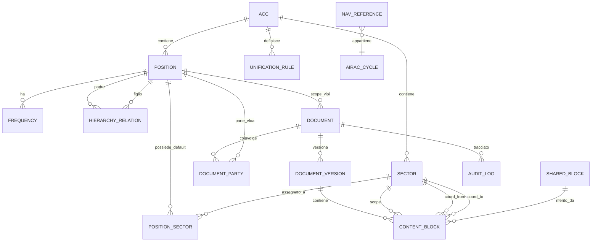

# Specifica del Modello Dati — vIPI/vLOA Interactive

> 🧭 **Come leggere questo documento (stato delle sezioni).** Il modello è cresciuto per round; le sezioni **non** hanno tutte lo stesso peso:
> - **§1–§2** principi e diagramma — di contesto.
> - **§3–§5** entità/enum/indici della **versione originale (pre-Round 5/13)** — **storiche**: alcune sono dichiarate superate (vedi banner Round 5 qui sotto e §9).
> - **§9 (round 13–20) è la parte AUTOREVOLE corrente** e **prevale** dove in conflitto con §3–§5: cataloghi `AccSector`/`AirportSector`, frequenza = attributo del settore, `Fir`→`Acc`, e (§9.12) fonte unica + gerarchia per callsign. **§9.8** è la lista migrazioni autoritativa.
> Per lo stato del codice vedi `../../HANDOFF.md`; per la storia `../history/rounds.md`.

> ℹ️ **Documento di design.** Schema EF Core implementato (vedi `Vipi.Domain/Entities` + migrazioni). **Aggiunte rispetto a questa spec:** entità `Transfer` (+enum `TransferPhase`, catena handler = array JSON) e `EditGrant` (permessi per-ACC); campi **lock** su `Document` (`LockedByVid/At/Expires`); `RowVersion` su `ContentBlock`/`DocumentSection` (concorrenza ottimistica). Stato codice in `../../README.md`/`../../HANDOFF.md`.

> 🔀 **Round 5 — Fusione Settore/Posizione (sostituisce §3.2/§3.3/§3.5/§3.6 e parte del §3.9/§3.10).** `Position` e `Sector` sono ora **un'unica entità `Sector`**: ogni settore è un callsign apribile (campi ex-`Position`: `Callsign` univoco, `Type`/`SectorType`, `Kind`/`SectorKind`, `ApproachKind?`, `DefaultFrequency`, `CoverageOrder`, `IsActive`) **e** un volume di spazio aereo. Il contenimento top-down è un **albero a padre singolo** `Sector.ParentSectorId` (self-FK) che **sostituisce** `HierarchyRelation` e `PositionSector` (eliminate). I settori d'aeroporto portano `AirportIcao`. Lo **scope dei documenti** è ora **uno-a-molti** `Document` 1 ──< N `Sector` (FK `Sector.DocumentId`, un settore con `IsPrimary`): `Document.ScopePositionId` è rimosso. `Frequency.PositionId`→`SectorId`; `DocumentParty.PositionId`→`SectorId`. Le `UnificationRule` restano (riassegnazioni arbitrarie); le loro chiavi JSON sono ora **callsign**. Enum rinominati: `PositionType`→`SectorType`, `PositionKind`→`SectorKind`. La vecchia `Sector.Key` è eliminata: l'identificatore è il `Callsign`.

**Documento:** Specifica tecnica del modello dati (sorgente per lo schema EF Core)
**Versione:** 0.1
**Data:** 13 giugno 2026
**Riferimento:** `../design/piano-vipi-tool.md` (§4, §17, §20)

---

## 1. Scopo e principi

Questo documento definisce le entità persistite, i campi, i tipi, le enumerazioni, le relazioni e i vincoli. È la sorgente da cui derivare le entità di dominio (`vIPI.Domain`) e le configurazioni EF Core (`vIPI.Infrastructure`).

Principi:

- **Anagrafica importata vs struttura manuale.** Le posizioni e i settori di base si importano dalle API IVAO (anagrafica piatta + ACC + shape). La **gerarchia operativa**, l'**ownership dei settori** e le **regole di unificazione** sono dato manuale curato dagli editor.
- **Versionamento dei documenti.** Ogni documento ha versioni immutabili (audit + diff). I `ContentBlock` appartengono a una **versione**, non al documento direttamente.
- **Concorrenza ottimistica.** Le entità editabili portano un token `RowVersion`.
- **Soft delete** dove serve conservare lo storico (`IsArchived`), niente hard delete dai flussi normali.

---

## 2. Diagramma ER (Mermaid)



---

## 3. Entità

> Convenzioni: PK = chiave primaria; FK = chiave esterna; `?` = nullable; tutti i timestamp sono UTC.

### 3.1 `Acc`
Regione di informazioni di volo (es. Roma `LIRR`, Milano `LIMM`, Brindisi `LIBB`).

| Campo | Tipo | Note |
|---|---|---|
| `Id` | int PK | |
| `Code` | string(8) | univoco (es. `LIRR`) |
| `Name` | string(120) | |
| `CountryPrefix` | string(2) | `LI` per l'Italia |

### 3.2 `Position`
Anagrafica piatta delle posizioni (callsign apribili). **Importata** dalle API IVAO.

| Campo | Tipo | Note |
|---|---|---|
| `Id` | int PK | |
| `Callsign` | string(16) | **univoco** (es. `LIRR_NE_CTR`) |
| `AccId` | int FK→Acc | ACC di appartenenza (dall'API) |
| `Type` | enum `PositionType` | DEL/GND/TWR/APP/CTR |
| `Kind` | enum `PositionKind` | Airport \| Acc (determina quale API: ATCPositions vs subcenters) |
| `FacilityId` | int? | id facility IVAO |
| `Name` | string(120) | nome leggibile (es. "Roma Radar NE") |
| `DefaultFrequency` | string(8)? | frequenza primaria (MHz) |
| `GeometryRef` | string(256)? | riferimento/handle alla shape (vedi `SectorGeometry`) |
| `CoverageOrder` | int | priorità top-down (più basso = più alto in gerarchia) |
| `ImportedAtUtc` | datetime? | quando importata dall'API |
| `IsActive` | bool | default true |

### 3.3 `Sector`
Volume di spazio aereo atomico. Unità minima di ownership e di tag dei contenuti.

| Campo | Tipo | Note |
|---|---|---|
| `Id` | int PK | |
| `Key` | string(24) | univoco per ACC (es. `LIRR-NE-01`) |
| `Name` | string(120) | |
| `AccId` | int FK→Acc | |
| `Description` | string(400)? | |
| `GeometryId` | int? FK→SectorGeometry | shape per la mappa AoR |

### 3.4 `SectorGeometry`
Shape geografica (per la vista mappa AoR). Separata dal `Sector` per non appesantire le query testuali.

| Campo | Tipo | Note |
|---|---|---|
| `Id` | int PK | |
| `Format` | enum `GeometryFormat` | GeoJson \| Wkt |
| `Data` | text | poligono/i |
| `SourceCallsign` | string(16)? | callsign da cui è stata importata |
| `ImportedAtUtc` | datetime? | |

### 3.5 `PositionSector` (associazione)
Settori che una posizione possiede **di default** (configurazione "da sola"). La risoluzione runtime applica poi le `UnificationRule`.

| Campo | Tipo | Note |
|---|---|---|
| `PositionId` | int FK→Position | PK composta |
| `SectorId` | int FK→Sector | PK composta |

### 3.6 `HierarchyRelation`
Relazione top-down **manuale** padre→figlio tra posizioni (es. `LIRR_NE_CTR` → `LIRP_APP` → `LIRP_TWR`).

| Campo | Tipo | Note |
|---|---|---|
| `Id` | int PK | |
| `ParentPositionId` | int FK→Position | |
| `ChildPositionId` | int FK→Position | |
| `AccId` | int FK→Acc | |

Vincoli: coppia (Parent, Child) univoca; nessun ciclo (validato a livello applicativo).

### 3.7 `UnificationRule`
Regola dichiarativa **editabile** che riassegna l'ownership dei settori in base a quali callsign sono online (§20.5 del piano).

| Campo | Tipo | Note |
|---|---|---|
| `Id` | int PK | |
| `AccId` | int FK→Acc | |
| `Name` | string(120) | es. "Split WS2/WS5" |
| `Priority` | int | ordine di applicazione |
| `ConditionJson` | text | predicato su callsign online (es. `{"online":["LIMM_WS5_CTR"]}`) |
| `AssignmentJson` | text | mappa sector→ownerPosition risultante |
| `IsActive` | bool | |
| `RowVersion` | rowversion | concorrenza |

### 3.8 `Frequency`
Frequenze associate a una posizione (per la vista ridotta e gli handoff).

| Campo | Tipo | Note |
|---|---|---|
| `Id` | int PK | |
| `PositionId` | int FK→Position | |
| `Label` | string(80) | es. "Roma Tower" |
| `Callsign` | string(16) | |
| `FrequencyMhz` | string(8) | es. `118.450` |
| `IsPrimary` | bool | (grassetto nelle tabelle) |

### 3.9 `Document`
Un documento vIPI o vLOA. I contenuti vivono nelle **versioni**.

| Campo | Tipo | Note |
|---|---|---|
| `Id` | int PK | |
| `Type` | enum `DocumentType` | Vipi \| Vloa |
| `ScopePositionId` | int? FK→Position | per vIPI: la posizione/aeroporto di riferimento |
| `Title` | string(200) | |
| `Language` | enum `Language` | It (vIPI) \| En (vLOA) — fisso per documento |
| `Status` | enum `DocumentStatus` | Draft \| Published \| Archived |
| `CurrentVersionId` | int? FK→DocumentVersion | versione pubblicata corrente |
| `LastUpdatedUtc` | datetime | |
| `LastUpdatedAiracCycle` | string(6) | calcolato da `AiracService` (es. `2606`) |
| `RowVersion` | rowversion | |

### 3.10 `DocumentParty` (per le vLOA)
Le parti di una vLOA (bilaterale). Per le vIPI non si usa.

| Campo | Tipo | Note |
|---|---|---|
| `Id` | int PK | |
| `DocumentId` | int FK→Document | |
| `PositionId` | int FK→Position | una delle due unità |
| `Role` | enum `PartyRole` | Home (IT) \| Neighbour |

> Edit-right vLOA: solo CH/AOD italiano sulla parte `Home` (vedi §20.7 del piano).

### 3.11 `DocumentVersion`
Versione immutabile (audit + diff).

| Campo | Tipo | Note |
|---|---|---|
| `Id` | int PK | |
| `DocumentId` | int FK→Document | |
| `VersionNumber` | int | progressivo per documento |
| `Status` | enum `DocumentStatus` | Draft \| Published \| Archived |
| `CreatedByVid` | int | autore (VID IVAO) |
| `CreatedUtc` | datetime | |
| `AiracCycle` | string(6) | ciclo al momento della creazione |
| `Note` | string(400)? | changelog |

### 3.12 `ContentBlock`
Unità minima di documentazione. **Cuore** del modello di visibilità (§20 del piano).

| Campo | Tipo | Note |
|---|---|---|
| `Id` | int PK | |
| `DocumentVersionId` | int FK→DocumentVersion | |
| `Section` | enum `BlockSection` | vedi §4 |
| `Order` | int | ordinamento nella sezione |
| `Tier` | enum `BlockTier` | Reduced \| Extended |
| `Format` | enum `BlockFormat` | Table \| Prose \| Image \| List |
| `Visibility` | enum `BlockVisibility` | Operational \| Handoff \| Always |
| `ScopeSectorId` | int? FK→Sector | settore a cui il blocco si riferisce |
| `FromSectorId` | int? FK→Sector | solo per coordinamenti (Handoff relazionale) |
| `ToSectorId` | int? FK→Sector | solo per coordinamenti |
| `SharedBlockId` | int? FK→SharedBlock | se il contenuto è riusato per riferimento |
| `Body` | text? | Markdown (prosa) — null se usa SharedBlock |
| `BodyJson` | text? | struttura tabellare (Format=Table) |

Vincoli: se `Visibility = Handoff` e il blocco è un coordinamento, `FromSectorId`/`ToSectorId` valorizzati. Se `SharedBlockId` valorizzato, `Body`/`BodyJson` nulli.

### 3.13 `SharedBlock`
Contenuto condiviso per **riferimento** (modifica una volta, aggiorna ovunque). La duplicazione, invece, è una semplice copia in `ContentBlock` senza `SharedBlockId`.

| Campo | Tipo | Note |
|---|---|---|
| `Id` | int PK | |
| `Key` | string(64) | univoco (es. `minime-separazione-generali`) |
| `Title` | string(160) | |
| `Format` | enum `BlockFormat` | |
| `Body` | text? | |
| `BodyJson` | text? | |
| `RowVersion` | rowversion | |

### 3.14 `AuditLog`
Tracciamento delle modifiche (chi, quando, cosa).

| Campo | Tipo | Note |
|---|---|---|
| `Id` | long PK | |
| `Vid` | int | utente IVAO |
| `Action` | enum `AuditAction` | Create \| Update \| Publish \| Archive \| HierarchyChange |
| `EntityType` | string(60) | es. `Document`, `UnificationRule` |
| `EntityId` | string(40) | |
| `TimestampUtc` | datetime | |
| `DetailsJson` | text? | diff/contesto |

### 3.15 `NavReference` (validazione semantica)
Dataset di riferimento per la validazione dei riferimenti nav (FIX/aerovie) legato all'AIRAC (§17.2 del piano).

| Campo | Tipo | Note |
|---|---|---|
| `Id` | int PK | |
| `Type` | enum `NavRefType` | Fix \| Airway \| Navaid |
| `Ident` | string(16) | es. `BAVOM` |
| `AiracCycle` | string(6) | ciclo di validità |

### 3.16 (Non persistito) `AtcSnapshot`
Stato live in **cache memoria**, non in DB: lista ATC online normalizzata dal polling (callsign, vid, frequenza, posizione). Aggiornata ogni 60 s. Documentata qui per completezza; non genera tabella.

---

## 4. Enumerazioni

```csharp
enum PositionType   { Del, Gnd, Twr, ITwr, App, Ctr }   // ITwr = torre informativa (AFIS); round 6
enum PositionKind   { Airport, Acc }
enum GeometryFormat { GeoJson, Wkt }
enum DocumentType   { Vipi, Vloa }
enum DocumentStatus { Draft, Published, Archived }
enum Language       { It, En }
enum PartyRole      { Home, Neighbour }
enum BlockTier      { Reduced, Extended }
enum BlockFormat    { Table, Prose, Image, List }
enum BlockVisibility{ Operational, Handoff, Always }
enum AuditAction    { Create, Update, Publish, Archive, HierarchyChange }
enum NavRefType     { Fix, Airway, Navaid }

// Sezioni logiche dei documenti (derivate dagli esempi vIPI/vLOA)
enum BlockSection {
    Aor, Frequencies, OperationalSettings, Atis, Airport,
    TrafficManagement, Coordination, OperationalTechnique,
    Separations, AreasCorridors, BestPractice, Purpose, Validity, Other
}

// Stato runtime del settore — NON persistito, calcolato dall'AorService
enum SectorState { Covered, Online }
```

---

## 5. Indici e vincoli principali

- `Position.Callsign` UNIQUE; indice su `AccId`.
- `Sector.Key` UNIQUE per `AccId`.
- `HierarchyRelation` UNIQUE su (`ParentPositionId`,`ChildPositionId`); validazione anti-ciclo applicativa.
- `Document` indice su (`Type`,`ScopePositionId`,`Status`).
- `ContentBlock` indice su (`DocumentVersionId`,`Section`,`Order`); indice su `ScopeSectorId`.
- `SharedBlock.Key` UNIQUE.
- `NavReference` indice su (`Type`,`Ident`,`AiracCycle`).
- `RowVersion` su `Document`, `UnificationRule`, `SharedBlock` per concorrenza ottimistica.

---

## 6. Note di derivazione EF Core

- Owned types per `BodyJson` se si preferisce, altrimenti `text` semplice (più leggero per SQLite).
- `RowVersion` mappato a `BLOB` con `IsRowVersion()` (SQLite usa trigger/`xmin`-like via `rowversion` shim o concorrenza su timestamp — valutare `ConcurrencyToken` su `LastUpdatedUtc` se rowversion nativo non disponibile in SQLite).
- Enum salvati come **stringa** (più leggibili e stabili nel DB) via `HasConversion<string>()`.
- Cascade: eliminazione `Document` → `DocumentVersion` → `ContentBlock` (cascade); `Sector`/`Position` mai cancellati a cascata (restrict) per integrità storica.

---

*Documento collegato:* `logica-aor.md` — usa `Position`, `Sector`, `PositionSector`, `HierarchyRelation`, `UnificationRule`, `ContentBlock.Visibility/ScopeSectorId`.

---

## 7. Aggiornamenti round 4 (16 giugno 2026)

Queste modifiche recepiscono il flusso e le decisioni in `../history/review-flusso-gap.md`. Dove indicato, **sostituiscono** quanto sopra.

### 7.1 `DocumentSection` (nuova entità ad albero) — sezioni annidate fino a 3 livelli

Sostituisce l'uso di `ContentBlock.Section` come enum piatto. Le sezioni diventano un albero per versione di documento; la TOC dinamica si genera percorrendolo.

| Campo | Tipo | Note |
|---|---|---|
| `Id` | int PK | |
| `DocumentVersionId` | int FK→DocumentVersion | |
| `ParentSectionId` | int? FK→DocumentSection | null = sezione radice |
| `Title` | string(200) | |
| `Order` | int | ordine tra fratelli |
| `Depth` | int | 0 = radice … max **3** (vincolo applicativo) |
| `SectionKind` | enum `BlockSection` | semantica della sezione (Aor, Coordination, …) |

Vincoli: `Depth ≤ 3`; nessun ciclo; `(DocumentVersionId, ParentSectionId, Order)` ordinato.

### 7.2 `ContentBlock` — modifiche

- **`Section` (enum) → `SectionId` (int FK→DocumentSection)**: il blocco appartiene a un nodo dell'albero, non più a un enum.
- **`CollapsedByDefault: bool`** (nuovo): se il blocco (tipicamente una tabella) è compresso di default nella **vista ridotta**. Indipendente dalla logica live/AoR.
- **`CalloutKind: enum? CalloutKind`** (nuovo): valorizzato solo se `Format = Callout`.

### 7.3 `Position` — attributo remotizzazione

- **`ApproachKind: enum? ApproachKind { Remotized, Standalone }`** (nuovo, solo per `Type = App`): se `Remotized`, la documentazione dell'APP vive **dentro la vIPI dell'ACC**; se `Standalone`, ha un **documento proprio** (caso del punto 3.2 del flusso).

### 7.4 Nuovi formati di blocco

- **`Format = AorMap`**: blocco mappa AoR. `BodyJson` contiene la lista dei settori/geometrie da disegnare e le opzioni di resa (overlap, stati Covered/Online). Permette **N sezioni AoR per documento** (una ACC + una per ogni APP remotizzato).
- **`Format = Callout`**: riquadro informativo colorato, piazzabile in qualsiasi sezione/profondità. Variante in `CalloutKind`.

### 7.5 `VectoringMinima` / `VectoringMinimaSet` — **implementazione FUTURE**

> ⚠️ Documentato ora, **non** nella prima release.

Le minime di vettoramento si importano dal **sectorfile della divisione su GitHub** (file EuroScope/Aurora), non dalle API IVAO né a mano.

`VectoringMinimaSet`:

| Campo | Tipo | Note |
|---|---|---|
| `Id` | int PK | |
| `ScopeSectorId` | int? FK→Sector | settore/area di riferimento |
| `Source` | enum | `SectorfileGitHub` |
| `SourceAiracCycle` | string(6) | AIRAC del sectorfile (mostrato per verificare l'allineamento col documento) |
| `SourceCommit` | string(40)? | commit del repo |
| `ImportedAtUtc` | datetime? | |

`VectoringMinimaRow`: `{ Id, SetId FK, AreaName, MinimaFt, Note }`.

Servizio `SectorfileImportService` (Infrastructure): legge il file dal repo GitHub, lo parsa, popola minime; ri-eseguibile a ogni cambio AIRAC (lega `AiracService`). **Stessa fonte** alimenta la whitelist fix per la validazione CoP (§7.6).

### 7.6 `CoordinationPoint` (whitelist per validazione CoP)

Per la validazione dei trasferimenti (QoL-7): i CoP non sono tutti fix reali — esistono punti convenzionali tipo `Jx` (`J1`, `J2`…) assenti dal nav-data.

| Campo | Tipo | Note |
|---|---|---|
| `Id` | int PK | |
| `Ident` | string(16) | es. `BAVOM`, `J1` |
| `Kind` | enum `CopKind` | `Fix` (da sectorfile/nav-data) \| `Conventional` (whitelist editabile) |
| `AiracCycle` | string(6)? | per i `Fix` |

Il validatore semantico accetta `Fix` ∪ `Conventional`; segnala (warning) solo ciò che non rientra in nessuna delle due.

### 7.7 Enumerazioni aggiuntive

```csharp
enum ApproachKind { Remotized, Standalone }      // solo Position.Type = App
enum CalloutKind  { Info, Success, Warning, Danger }
enum CopKind      { Fix, Conventional }

// BlockFormat esteso:
enum BlockFormat  { Table, Prose, Image, List, AorMap, Callout }
```

> `BlockSection` resta come elenco di valori semantici, ma ora vive su `DocumentSection.SectionKind` invece che su `ContentBlock.Section`. Valutare l'aggiunta di `VectoringMinima` come valore quando si implementeranno le minime.

---

## 8. Aggiornamenti round 10/11 (27 giugno 2026)

### 8.1 `SectorType` — torre informativa (round 10)
Aggiunto **`ITwr`** (torre informativa / AFIS) dopo `Twr`: `enum SectorType { Del, Gnd, Twr, ITwr, App, Ctr }`. Stesso livello operativo della TWR (frequenza primaria, etichetta), ma servizio informazioni. Enum salvati come stringa ⇒ nessuna migrazione. Invariante applicativo: **ogni `Airport` ha almeno un settore `Twr` o `ITwr`** (badge in gestione aeroporti; blocco eliminazione dell'unica torre in `EfStructureEditingRepository.DeleteSectorAsync`).

### 8.2 `Vid` → `UserId` (round 11)
Rinominati **tutti** i campi VID a `UserId` (codice + colonne DB, migrazione `Rename_Vid_To_UserId` con `RENAME COLUMN` nativo, incl. PK `StaffMembers`):

| Entità | Campo |
|---|---|
| `AuditLog` | `Vid` → `UserId` |
| `Document` | `LockedByVid` → `LockedByUserId` |
| `DocumentVersion` | `CreatedByVid` → `CreatedByUserId` |
| `EditGrant` | `Vid` → `UserId`, `GrantedByVid` → `GrantedByUserId` |
| `StaffMember` | `Vid` (PK) → `UserId` |

Anche `CurrentUser.Vid` → `UserId` e `HostIdentityOptions.VidClaim` → `UserIdClaim` (valore default `"id"`). Le **label a video** restano "VID" (termine d'uso): solo gli identificatori di codice cambiano.

### 8.3 `ImportPolicy` (round 11) — provenienza dei dati
Nuova entità **riga singola** (`Id = 1`) che governa quali categorie di dati arrivano dalla sorgente esterna (sola lettura) o restano manuali. Semantica **opt-out**: default tutto importato.

| Campo | Tipo | Note |
|---|---|---|
| `Id` | int PK | riga singola |
| `ImportTransitionAltitude` | bool | default true → `Airport.TransitionAltitudeFt` di sorgente |
| `ImportAtis` | bool | default true → `Airport.AtisFrequency` |
| `ImportRunways` | bool | default true → `AirportRunway.Ident/LengthM/Bearing` |
| `ImportSectors` | bool | default true → settori d'aeroporto (callsign/tipo/frequenza) |
| `UpdatedUtc` | datetime | |
| `UpdatedByUserId` | int | |

Enum `ImportCategory { TransitionAltitude, Atis, Runways, Sectors }`. Migrazione `AddImportPolicy`. Accesso via `IImportPolicyStore` (snapshot `ImportPolicySnapshot`) + servizio admin `IImportPolicyService`. Enforcement: editor read-only + guard nei service + import che salta le categorie escluse. I campi editoriali (regole pista, SID, livelli TL, link, gerarchia settori) non sono categorie.

### 8.4 Interfacce dati **sorgente-neutre** (round 11)
L'anagrafica/dettagli/utenti esterni passano per porte neutre in `Application/Abstractions`: `IAirportDirectory` (DTO `SourceAirport`), `IAirportDetailProvider` (`SourceAtcPosition`/`SourceRunway`), `IUserDirectory` (`SourceUserStaff`), più `IOnlineAtcProvider`. L'adapter IVAO concreto vive in `Infrastructure/Ivao/*` ed è selezionato da `DataSource:Provider` (vedi `../guide/config.md` §1b). Non rientra nello schema persistito ma vincola da dove si popolano `Airport`/`Sector`/runway.

---

## 9. Aggiornamenti round 13–17 (28 giugno 2026) — **stato attuale del modello**

> ⭐ Questa sezione **prevale** sulle §3/§4 dove in conflitto. Sorgente autorevole = `Vipi.Domain/Entities/Anagrafica.cs` + `Enums.cs` + `ImportPolicy.cs`.

### 9.1 `Fir` → `Acc` (round 13)
L'entità FIR è stata rinominata **`Acc`** in tutto il progetto (proprietà `AccId`/`AccCode`, claim `AccClaim`, tabella `Accs`; migrazione **`RenameFirToAcc`** non distruttiva). Campi aggiunti su `Acc`: **`IsMilitary`**, **`IsHidden`** (escluso dalla navigazione pubblica), **`ImportedAtUtc`**. Gli ACC **non si creano a mano**: si **importano dalla sorgente** (`/v2/centers`) in `/vsop/admin/acc`.

### 9.2 Cataloghi importati `AccSector` e `AirportSector` (round 13/14)
Due cataloghi **separati** dai `Sector` operativi (che restano la base di documenti/AoR). Chiave naturale = `ComposePosition` (callsign) univoco. Campi di origine read-only; **limiti quota** e **`IsHidden`** impostati dall'admin.

**`AccSector`** (subcenter di un ACC, da `/v2/centers/{icao}/subcenters` + `/v2/subcenters/{compose}`):
| Campo | Tipo | Note |
|---|---|---|
| `Id` | int PK | |
| `ComposePosition` | string | univoco (es. `LIBB_ES_CTR`) |
| `CenterId` | string FK→`Acc.Code` | alt key `AK_Accs_Code` |
| `Position`/`MiddleIdentifier`/`Frequency` | string? | da sorgente |
| `RegionMapPolygon` | text? | shape JSON grezzo (non ancora su mappa) |
| `LowerLimit`/`UpperLimit` | int? | admin; default GND→UNL, FSS GND→19000 |
| `IsHidden` | bool | derivato effettivo = `IsHidden \|\| Acc.IsHidden` |
| `ImportedAtUtc` | datetime? | |

**`AirportSector`** (postazioni d'aeroporto DEL/GND/TWR/APP, da `/v2/airports/{ICAO}/ATCPositions` + `/v2/ATCPositions/{compose}`):
| Campo | Tipo | Note |
|---|---|---|
| `Id` | int PK | |
| `ComposePosition` | string | univoco (es. `LIRN_TWR`) |
| `AirportIcao` | string FK→`Airport.Icao` | alt key `AK_Airports_Icao` |
| `AccCode` | string FK→`Acc.Code` | ACC di competenza (ereditato) |
| `Position`/`MiddleIdentifier`/`Frequency`/`RegionMapPolygon` | — | da sorgente |
| `LowerLimit`/`UpperLimit` | int? | admin; default inf=GND(0), sup=19500 |
| `IsHidden` | bool | admin |
| `IsPrimary` | bool | frequenza principale (★), unica per aeroporto (round 15) |
| `IsAccApp` | bool | **solo APP**: «di ACC» (remotizzato) sì/no. Editabile dall'editor aeroporto (colonna «ACC?»). Default all'import dal n° di pezzi del callsign (`LIRN_UN0_APP` 3 pezzi → true; `LIRP_APP` 2 pezzi → false), **eccetto** lettera di mezzo `G` (`LIRN_G_APP` = precision/PAR militare → false). Guida `Sector.ApproachKind` nella proiezione. Migrazione `AddAirportSectorIsAccApp` (backfill dei 3-pezzi esistenti) |
| `IsShapeSynthetic` | bool | `RegionMapPolygon` è una shape **sintetica** generata da vIPI (cerchio 5 NM di fallback per le TWR), non reale. Permette al futuro fallback GitHub di rimpiazzarla senza toccare le shape reali. Default false; vedi §9.14. Migrazione `AddAirportCoordsAndTwrSyntheticShape` |
| `ImportedAtUtc` | datetime? | |

Import **manuale + automatico giornaliero** (`AccImportHostedService`, `AirportSectorImportHostedService`); upsert idempotente che **preserva** `IsHidden`, i limiti admin e `IsAccApp` (default solo alla creazione). Import **additivo** (non cancella: nasconde).

### 9.3 `Airport` — campi aggiunti (round 8/12/15 + sessione hide)
Oltre a `Id`/`Icao`/`Name`/`AccId` (round 6): **`TransitionAltitudeFt`** (int?, di sorgente), **`FeaturedRank`** (int?, "3 in evidenza" landing), **`IsHidden`** (bool, migrazione **`AddAirportHidden`**: pagina pubblica inaccessibile + escluso dagli elenchi), **`Latitude`/`Longitude`** (double?, gradi decimali; round 22, §9.14: popolate all'import dal blocco `airport` del dettaglio postazione IVAO, centro della shape tonda TWR). Visibilità pubblica effettiva = `!IsHidden && haAlmenoUnSettore` (gli aeroporti **senza settori** sono nascosti di default). Collezioni profilo strutturato: `TransitionLevels`/`Runways`/`RunwayRules`/`Sids`/`FrequencyLinks`/`ExtraSections` (§9.11) + catalogo `AirportSectors`. **`ParentCallsign`** (§9.12, round 20; sostituisce `ParentSectorId` di round 19): padre per callsign nella gerarchia di copertura (aeroporto‑foglia, cross-ACC).

### 9.4 Frequenza = **attributo del settore** (round 16/17) — `Frequency` ELIMINATA
La tabella **`Frequency`** (§3.8) è stata **rimossa** (migrazione **`DropFrequencyTable`**). La frequenza è ora **un solo attributo del settore**: **`Sector.DefaultFrequency`** (una per settore). Conseguenze:
- **`AirportFrequencyLink`** (link "vivo") ora punta a un **`Sector`** via **`SourceSectorId`** (era `SourceFrequencyId`): risolve `Sector.DefaultFrequency` + callsign. Campo `LabelOverride` opzionale.
- Le **frequenze del documento aeroporto** si leggono dal catalogo **`AirportSector`** non nascosto (ordine ATIS·DEL·GND·TWR·APP, ★ per il primario).
- **`Airport.AtisFrequency` ELIMINATA** (round 16): l'ATIS è un `AirportSector` come gli altri.

### 9.5 Geometria — `SectorGeometry` ELIMINATA (round 16)
Rimossi `SectorGeometry` (§3.4), `Sector.GeometryId/Geometry`, enum `GeometryFormat`: mai usati. La geometria futura vive come `RegionMapPolygon` sui cataloghi `AccSector`/`AirportSector` (oggi JSON grezzo, non ancora su mappa). `VectoringMinima` (§7.5) resta **dormiente**.

### 9.6 `ImportPolicy` — categoria **ATIS rimossa** (round 16)
`enum ImportCategory { TransitionAltitude, Runways, Sectors }` (niente più `Atis`). L'entità `ImportPolicy` ha quindi `ImportTransitionAltitude`/`ImportRunways`/`ImportSectors` (+ `UpdatedUtc`/`UpdatedByUserId`); rimosso `ImportAtis`. Migrazione `SimplifyDataModel`. Vedi §8.3 (superata su questo punto).

### 9.7 Enumerazioni — stato attuale
`SectorType { Del, Gnd, Twr, ITwr, App, Ctr }` · `SectorKind { Airport, Acc }` · `ApproachKind { Remotized, Standalone }` · `DateParity { Any, Even, Odd }` (regole pista, round 9) · `ImportCategory { TransitionAltitude, Runways, Sectors }`. Rimosso `GeometryFormat`.

### 9.8 Migrazioni (ordine attuale)
`InitialCreate` → `AddAirport` → `AddAirportParentSector` → `RemoveAirportParentSector` → `AddAirportProfile` → `AddRunwayRuleSchedule` → `Rename_Vid_To_UserId` → `AddImportPolicy` → `AddFeaturedRank` → `AddVloaFeaturedRank` → `RenameFirToAcc` → `AddAccSector` → `AddAirportSector` → `AddAirportSectorPrimary` → `SimplifyDataModel` → `DropFrequencyTable` → `AddAirportHidden` → `RunwayRuleThresholds` → `AddRunwayRuleDateWindow` → `RenameRunwayRuleTimeToLocal` → `AddAirportExtraSection` → **`AddHierarchyParentCallsign`** (round 20; la `AddAirportHierarchy` di round 19 è stata rimossa prima dell'applicazione) → **`AddAirportSectorIsAccApp`** (flag «APP di ACC» + backfill dei callsign a 3 pezzi) → **`ReworkTransfers`** (sostituisce `Transfer` ACC↔ACC con `TransferFlow` settore-proprio + `TransferPoint` CoP/livello strutturato/Next) → **`SimplifyTransferResolution`** (drop `TransferPoint.Fallback` + `ManualChainJson`: la risoluzione live del ricevente/mittente risale la **gerarchia di copertura globale** `ParentCallsign`/`ParentSectorId`, terminale fisso **UNICOM**; rimosso l'enum `TransferFallback`) → **`AddAppProfile`** (profilo APP standalone, §9.13) → **`AddAppCustomSections`** (colonna `CustomSectionsJson`) → **`AddAppHiddenSections`** (colonna `HiddenSectionsJson`) → **`AddAirportCoordsAndTwrSyntheticShape`** (round 22: `Airport.Latitude/Longitude` + `AirportSector.IsShapeSynthetic`, §9.14) → **`AddAccProfile`** (round 23: vIPI ACC data-driven, tabella `AccProfiles` 1:1 con `Acc`, `BlocksJson`, §9.15) → *(round 27–33: `AddNeighbourCandidate`, `AddVloaProfile`, `AddDocRelease`, `AddEditorTask`, `AddDocumentHideFlags` e affini — vedi changelog)* → **`AddSidImport`** (round 34: `AirportSid` +`IsImported`/`Priority`/`StableKey`/`SourceAiracCycle`/`ForcePublished`/`NeedsFixReview`, entità `SidFixAlias`, `ImportPolicy.ImportSids`; import SID dal sectorfile Aurora GitHub) → **`AddImportState`** (round 34: tabella `ImportStates` per il gating degli import periodici, chiave `Category` + `LastSuccessUtc`).

### 9.9 `AirportRunwayRule` — regole pista a soglie operative (sessione 28 giu)
Le condizioni vento-arco/velocità/pioggia-neve sono state sostituite da **soglie operative per-regola**. Su `AirportRunwayRule`: **rimossi** `WindDirFrom/WindDirTo/WindSpeedMin/WindSpeedMax/Rain/Snow`; **aggiunti** `Name` (etichetta), **`MaxTailwindKt`** (int, default 5), **`MaxCrosswindKt`** (int?, null = nessun vincolo), **`Surface`** (enum **`RunwaySurface { Any, Dry, Wet }`**, Wet = pioggia/neve nel METAR). `Order` = priorità (prima regola applicabile vince); `DepRunways/ArrRunways/Note` invariati; i filtri temporali (orario/giorni/parità + finestra stagionale §9.10) restano come **filtro di eleggibilità opzionale** (avanzate, caso Malpensa). Tailwind/crosswind sono **calcolati dal vento** (non più inseriti come direzione). Su `Airport` **nessuna soglia** (sono per-regola). Selezione in `Application/Weather/RunwaySuggestion.EvaluateRules(rules, windDir, windKt, wet, now)`; se nessuna regola si applica → fallback `Suggest()`. Migrazione **`RunwayRuleThresholds`** (drop 6 colonne, add `Name`/`MaxTailwindKt`/`MaxCrosswindKt`/`Surface`, svuota le vecchie righe).

### 9.10 `AirportRunwayRule` — orari in **ora locale (LT)** + finestra di validità **stagionale** (round 18, sessione 29 giu)
Due rifiniture al filtro di eleggibilità avanzato delle regole pista:
- **Orari in ora locale (LT), non più UTC/Z.** Gli orari AIP sono in ora locale: i campi `TimeFromUtcMin/TimeToUtcMin` sono stati **rinominati** in **`TimeFromLocalMin/TimeToLocalMin`** (minuti da mezzanotte **locale**, 0..1439). `EvaluateRules` converte l'istante UTC in **ora locale italiana** (CET/CEST con DST, `TimeZoneInfo` `Europe/Rome`→`W. Europe Standard Time`→UTC come fallback) **prima** di valutare orario, giorni, parità e stagione. UI: etichette «da/a (LT)»; documento: «08:00–20:00 LT». Migrazione **`RenameRunwayRuleTimeToLocal`** (`RenameColumn`, preserva i valori).
- **Finestra di validità stagionale ricorrente.** Nuovi `int?` **`DateFromMonthDay`/`DateToMonthDay`** in codifica **MMDD** (mese×100+giorno, es. `101`=1 gen, `331`=31 mar), estremi inclusi, **anno ignorato** (si ripete ogni anno) e **wrap di fine anno** gestito (es. `1101`→`0228`). Entrambi null = nessun vincolo. Editor: selettori giorno+mese (no anno); un estremo conta solo se **giorno e mese** sono entrambi valorizzati. Logica in `RunwaySuggestion.DateInWindow`. Migrazione **`AddRunwayRuleDateWindow`** (2 colonne INTEGER nullable).

### 9.11 `AirportExtraSection` — sezioni editoriali libere (round 18, sessione 29 giu)
Nuova entità del **profilo strutturato** aeroporto: sezioni di testo libero indipendenti dalle sezioni standard. Campi: `Id`, `AirportId` (FK→`Airport`, cascade), `Order` (priorità di visualizzazione), **`Title`** (obbligatorio), **`Body`** (testo libero nullable, a capo preservati). Collezione `Airport.ExtraSections`. Editate dal pannello **«Sezioni extra»** dell'editor aeroporto (add/rimuovi/riordina); nel **viewer** sono rese **direttamente dal profilo** (come Piste/Frequenze, non dal documento pubblicato): **colonna libera di destra** (`aside.doc-rail`, desktop ≥1500px) e **copia inline sotto le SID** su schermi stretti (`.extra-inline`, nascosta da CSS ≥1500px). Salvataggio ACC-gated (`SaveExtraSectionsAsync`, titolo obbligatorio). Migrazione **`AddAirportExtraSection`** (nuova tabella + indice `(AirportId, Order)`). **Non** scritte in `RebuildDocumentAsync` (il viewer le compone dal profilo) — eventuale inclusione nel documento pubblicato è un follow-up.

### 9.12 Fonte unica + gerarchia di copertura per **callsign** (round 20, sessione 29 giu) — sostituisce round 19
**Decisione:** i **cataloghi importati** (`AccSector` + `AirportSector`) sono la **fonte autoritativa unica** dei settori. I `Sector` operativi **non si editano più a mano**: sono una **proiezione** rigenerata dai cataloghi che porta solo i legami documento + l'albero AoR.

**Gerarchia per callsign (cross-ACC).** L'albero di copertura/fallback **Aeroporto → APP → settore ACC alto** è a **padre unico** (ogni nodo un solo padre = il fallback immediato), profondità/ramificazione **libere**, ed è **unico per tutta la divisione** (cross-ACC; caso Crotone = aeroporto di un ACC sotto APP/CTR di Roma). I nodi si legano **per callsign** (`ComposePosition`), come il motore AoR. Nuovi campi:
- **`AccSector.ParentCallsign`** (string?), **`AirportSector.ParentCallsign`** (string?, valorizzato solo per le posizioni **APP**; DEL/GND/TWR non sono nodi), **`Airport.ParentCallsign`** (string?, l'aeroporto è la **foglia**). **Sostituisce** `Airport.ParentSectorId` (round 19, rimosso). Nessuna FK (callsign cross-tabella); indici su `ParentCallsign`. Migrazione **`AddHierarchyParentCallsign`** (additiva: 3 colonne TEXT + indici + `Sectors.IsProjected`; la `AddAirportHierarchy` di round 19 è stata rimossa, mai applicata).

**`Sector` = proiezione** (`ISectorProjectionService.SyncFromCatalogsAsync`, `EfSectorProjectionService`). Idempotente, di sistema (no authz), invocata al termine degli import (ACC/settori aeroporto) e dopo ogni modifica alla gerarchia:
- **Upsert per `Callsign`** (= `ComposePosition`): preserva `Sector.Id` e i **legami editoriali** (`DocumentId`/`IsPrimary`/`FeaturedRank`) → le FK documento (`ContentBlock.ScopeSector`, `DocumentParty.Sector`, `AirportFrequencyLink.SourceSectorId`) restano intatte.
- Deriva `Type` (da `Position`: DEL/GND/TWR/APP/CTR…), `Kind` (Acc dal subcenter, Airport dalla posizione aeroporto), `AccId`, `DefaultFrequency`, `AirportId`, e **`ParentSectorId` dal `ParentCallsign`** del catalogo. Per gli **APP** deriva `ApproachKind` da `AirportSector.IsAccApp` (true → `Remotized`, false → `Standalone`; gli APP da subcenter ACC sono sempre `Remotized`).
- Nuovo flag **`Sector.IsProjected`**: i settori proiettati spariti o **nascosti** nel catalogo vengono **disattivati** (`IsActive=false`), non cancellati; i settori **non** proiettati (seed/manuali, `IsProjected=false`) **non vengono mai toccati** → i test AoR S1–S10 (Topology in-memory) restano intatti.
- `TopologyBuilder` **invariato**: legge ancora `Sector` per `AccId`; ora il `ParentSectorId` arriva dalla proiezione. AoR ACC e test S1–S10 inalterati.

**Editor** `IHierarchyEditingService` (`EfHierarchyEditingService`): `/vsop/admin/sectorstructure` (`StrutturaPage`) è **solo** l'editor della gerarchia di copertura **globale** (cross-ACC, senza alcun selettore ACC). La creazione documenti è stata spostata nella pagina dedicata `/vsop/editor/newdoc` (`NewDocumentPage`, vedi MAPPA_PAGINE). `LoadTreeAsync()` → nodi `Acc` (AccSector) + `App` (AirportSector con Position=APP) + `Airport` (foglie); DEL/GND/TWR esclusi. `SetParentAsync(kind, nodeId, parentCallsign?)` valida padre = nodo interno ACC/APP, **anti-ciclo** per i nodi interni, cross-ACC ammesso, ACC-gated sul figlio; poi riproietta.
- **UI a card per ACC** (non più albero unico indentato): una card per ogni ACC che contiene **tutti gli alberi la cui radice è un suo settore** (i discendenti cross-ACC restano nell'albero, con tag ACC). Comprimi/espandi a due livelli (card e singolo ramo) + `⊞ espandi`/`⊟ comprimi`. **Ricerca** che mostra l'intera gerarchia del CS (match + antenati + discendenti, anche cross-ACC). Pannello **Dettaglio sticky** con catena di fallback, picker padre ricercabile e bottone **Applica** (la modifica del padre si conferma esplicitamente, poi riproietta).

**Doppia rappresentazione residua / fuori ambito (follow-up):** documenti e AoR girano ancora sui `Sector` (ora proiezione), non direttamente sui cataloghi. L'eliminazione totale di `Sector` (doc+AoR sui cataloghi) e la **risoluzione live** "chi controlla l'aeroporto adesso" restano alla fase live.

### 9.13 `AppProfile` / `AppFrequencyLink` — APP non remotizzati (round 21, sessione 29 giu)
Profilo editoriale dell'**APP standalone** (non remotizzato), ancorato **1:1 al `Sector` APP** via `SectorId` (indice univoco; `Type=App`, `ApproachKind=Standalone`). Solo le parti **editoriali** sono persistite; **Frequenze/Coordinamenti/AOR** si **derivano live**. Migrazioni additive **`AddAppProfile`** (+`AppFrequencyLink`), **`AddAppCustomSections`**, **`AddAppHiddenSections`**.
- **`AppProfile`**: `Id`, `SectorId` (FK→`Sector`, cascade, unique), `SeparationsJson` (righe `Vertical`/`Lateral`/`Applicability?` — colonne fisse; l'applicabilità free-text dalla 2ª riga), `VfrJson` (prosa+tabella), `SectionOrderJson` (ordine delle 6 sezioni fisse del registry `AppSections` + custom), `FreqOrderJson` (override d'ordine per callsign), `HiddenSectionsJson` (sezioni nascoste dal viewer, visibili in editor), `CustomSectionsJson` (sezioni libere: titolo + blocchi prosa/tabella). Collezione `FrequencyLinks`.
- **`AppFrequencyLink`** (mirror di `AirportFrequencyLink`): `Id`, `AppProfileId` (FK cascade), `Order`, `SourceSectorId` (FK→`Sector`, cascade), `LabelOverride?` — frequenze extra linkate.
- **Derivazioni (service `IAppProfileService`)**: **Frequenze** = posizioni del catalogo `AirportSector` degli aeroporti con `Airport.ParentCallsign ∈ Topology.DomainOf(appCallsign)` (ATIS·DEL·GND·TWR·APP★), seguite dai **genitori** di copertura (`Topology.Ancestors`, CTR superiori). **Coordinamenti** = `ITransferService.ListFlowsByAccAsync` filtrati su settore APP, Next classificato ACC (Ctr) vs torre (Twr/ITwr). **AOR** = `AorPolygonProjector` (puro) su `AirportSector.RegionMapPolygon` (formato IVAO **`[lng, lat]`**). Registry sezioni `AppSections.All` (6 fisse) + riconciliazione pura dell'ordine.
- **Instradamento**: `DocumentSummary.IsStandaloneApp` (settore primario `App`+`Standalone`) ha precedenza su `IsAirport`; gli editor generico/hub/versioni reindirizzano a `/vsop/{acc}/apps/editor?app={callsign}` (vedi MAPPA_PAGINE).

### 9.14 Shape tonda TWR + coord aeroporto + rifiniture trasferimenti/AOR (round 22, sessione 30 giu)
Quattro interventi indipendenti.
- **Shape tonda 5 NM di fallback per le TWR.** La sorgente IVAO espone le TWR con `regionMapPolygon = "[]"` (array vuoto), quindi non disegnabili. Un servizio di sistema (`ITowerShapeFallbackService`/`TowerShapeFallbackService`, Application) genera per ogni TWR **vuota/degenere** un poligono circolare di 5 NM (`CircleShapeBuilder`, puro, formato `[[lng, lat], …]`) e lo salva in `RegionMapPolygon` con `IsShapeSynthetic=true`. **Mai sovrascrive** una shape reale; il «vuoto» si decide **provando a proiettare** (`AorPolygonProjector.Project(raw) is null`), così becca `null`, `"[]"` e poligoni <3 punti. Invocato in `AirportSectorImportHostedService` **dopo** l'import (l'import è isolato in un proprio try: se le credenziali IVAO mancano, il fallback gira comunque sul catalogo già in DB). Idempotente: una volta scritto il cerchio (poligono valido) non viene rigenerato; un re-import che riscrive `RegionMapPolygon` resetta `IsShapeSynthetic=false` → il fallback rigenera.
- **Centro del cerchio = coord aeroporto.** Popolate all'**import** dal blocco **`airport.latitude/longitude`** del dettaglio postazione IVAO **`/v2/ATCPositions/{compose}`** (presente su **ogni** postazione dell'aeroporto, risponde 200 con scope `tracker`). `SourceAtcPosition` porta `AirportLatitude/Longitude`; `ImportForAirportAsync` le scrive su `Airport.Latitude/Longitude`. Ripiego se le coord non sono ancora note: **centro (bounding-box) del poligono di un settore fratello** (es. APP) via `ListNonSyntheticPolygonsAsync` + `AorPolygonProjector`. **Futuro fallback GitHub** per le shape reali TWR: registra un altro provider via `DataSource:Provider`; rimpiazza solo le sintetiche (`IsShapeSynthetic=true`).
- **AOR APP — overlay shape torre.** Il componente `AppAor` (viewer `AppnPage` + editor) ora mostra anche le shape delle TWR dello stesso aeroporto (`IAppProfileService.GetTowerPolygonsAsync` → `EfAppProfileRepository.GetTowerPolygonsRawAsync`, TWR visibili dell'ICAO dell'APP), come overlay Leaflet arancione tratteggiato con **control layer** «Shape torre» per mostrare/nascondere (lato client, `vipi-aor.js`). Nessuna persistenza.
- **Trasferimenti editabili** (`AdminTrasferimentiPage`): edit in-place di flusso (tipo/aeroporto/descrizione) e punto (CoP/vincolo+valore+unità/Next) via `ITransferService.UpdateFlowAsync`/`UpdatePointAsync` (già esistenti). **Coordinamenti APP — verso ACC**: la sezione «Trasferimenti verso ACC» di `AppCoordinationView` è suddivisa in due sottosezioni **Partenze**/**Arrivi** (split per `TransferFlowKind` lato view, colonne CoP·Livello·Next); «verso le torri» invariata.

### 9.15 `AccProfile` — vIPI ACC data-driven a blocchi (round 23, sessione 2 lug 2026)
La vIPI a livello **ACC** diventa **data-driven**, specchio dell'editor APP (§9.13). Documento a **blocchi** ancorato **1:1 all'`Acc`**; solo lo **stato editoriale a blocchi** è persistito (serializzato JSON), le derivate (AoR per configurazione, frequenze dei membri, coordinamenti) si calcolano **live**. Migrazione additiva **`AddAccProfile`**.
- **`AccProfile`** (entità): `Id`, `AccId` (FK→`Acc`, cascade, **unique** — 1:1), `BlocksJson` (TEXT). Repository `EfAccProfileRepository`, profilo creato **on-demand** al primo salvataggio.
- **Blocchi** (`AccBlock`, in `BlocksJson`): due tipi (`AccBlockKind`) — **Aerovia** (settori CTR dell'ACC, pool implicito = tutti i CTR se `MemberCallsigns` vuoto) e **gruppo-APP** (settori APP scelti). Il blocco Aerovia è **obbligatorio** e sempre primo (garantito in load e save). Ogni blocco porta: `MemberCallsigns`, `SectionOrder`/`HiddenSections`/`CustomSections` (registry `AccSections`, riconciliazione pura), `Separations`, `VfrJson`, `RegulatedAreas` (`AccRegulatedArea`: nome + dettaglio markdown, es. «R-64 · CUNEO»), `FreqOrder` (override d'ordine per callsign), **`FreqLinkCallsigns`** (link freq extra per callsign, riferimento vivo), `Configurations`.
- **`AccConfiguration`**: un insieme di **settori aperti** del blocco; guida l'**AoR** = unione dei poligoni dei suoi settori (`DeriveConfigAorsAsync` → `AorPolygonProjector`). Senza configurazioni esplicite → una config implicita «Tutti i settori».
- **Derivazioni (service `IAccProfileService`)**: **Frequenze** = `DeriveFrequenciesForMembersAsync(members, FreqLinkCallsigns)` — settori membri con freq propria + espansione catalogo `AirportSector` degli aeroporti APP + link extra, dedup+ordine ATIS·DEL·GND·TWR·APP·CTR. **Coordinamenti** (`AccCoordination`: verso ACC/APP/torri) = `ITransferService.ListFlowsByAccAsync`, flussi **posseduti** dai membri classificati per tipo del Next, + flussi **entranti** (arrivo che un CTR vicino consegna a un membro → verso ACC). **AoR** per configurazione.
- **Salvataggio monolitico**: `SaveBlocksAsync` sostituisce l'**intera** struttura a blocchi (validata: Aerovia obbligatorio, titoli gruppi/custom/config non vuoti). A differenza dell'APP (save granulare) l'editor ACC salva sempre tutto il documento; **niente lock/RowVersion** (scelta coerente col data-driven). Authz sempre server-side (`EnsureCanEditAccAsync`).
- **Pagine**: viewer `AccVipiPage` (`/vsop/{acc}/vipi`), editor `AccEditorPage` (`/vsop/{acc}/editor`), componenti `AccAor`/`AccCoordinationView`. Il **freq-link editor** (`FreqLinkEditor` in `AccEditorPage`, sotto la tabella frequenze in modifica) gestisce `FreqLinkCallsigns` per **callsign** (chip rimovibili + picker cerca callsign/ICAO su `ListLinkableFrequenciesAsync`). La vecchia vIPI Estesa a prosa resta su `/vsop/{acc}/vipi-doc` (editor generico `/vsop/{acc}/editor-doc`).

### 9.16 vLOA data-driven + ACC esteri confinanti (round 27-28, sessione 3-4 lug 2026)
Le **vLOA** passano da skeleton statico a **data-driven** unendo il lato italiano (Home) e quello estero (Neighbour), e gli **ACC esteri confinanti** vengono persistiti per alimentarle.
- **Coppie confinanti** (round 27): import ACC esteri IVAO dei paesi vicini (`Neighbours:CountryIds`), **adiacenza geometrica** dei settori (`PolygonGeometry.AreAdjacent`, min-edge distance, soglia `AdjacencyThresholdNm`=8), staging `NeighbourCandidate` (chiave `(HomeAccCode,ForeignAccCode)`; stato Pending/Confirmed/Rejected; migrazione `AddNeighbourCandidate`). Alla conferma → materializza ACC/settore esteri e genera **1 vLOA per coppia** (`EfNeighbourRepository`). Pagina `/vsop/admin/confinanti`. Editor vLOA documentale `VloaEditor.razor` (host `VloaEditorPage` su `/vsop/{acc}/vloa/editor?acc=<estero>`; round 31), struttura obbligatoria a 7 sezioni (`VloaSections`/`VloaStructureSeeder`).
- **Subcenter esteri persistiti** (round 28): l'import confinanti scrive i subcenter esteri **confinanti** come `AccSector` (flag **`Acc.IsForeign`**), proiettati in `Sector`; adiacenza salvata su `NeighbourCandidate.AdjacentHome/ForeignCallsigns` (migrazione `AddForeignSubcentersAndAdjacency`). Abilita **gerarchie estere** editabili (`/vsop/admin/sectorstructure`, gate admin; padri ristretti alla stessa nazione; mostra solo i settori realmente confinanti) e **trasferimenti da/verso esteri** (mittente estero nell'editor trasferimenti). ACC esteri esclusi da home/header (`EfStationDirectory.ListAccs` filtra `!IsForeign` + prefisso divisione).
- **Viste derivate vLOA** (round 28): **`VloaProfile`** (1:1 col `Document`, migrazioni `AddVloaProfile`/`AddVloaHiddenSections`) tiene lo stato editoriale (settori AoR/frequenze/sezioni nascosti). `VloaProfileService` deriva: **AoR** (settori IT+estero effettivamente confinanti, calcolo geometrico al volo; blu IT/rosso estero, toggle persistiti), **Frequenze** (due tabelle `IT-{ACC}` e `{nazione}-{ACC}`), **Coordinamenti** (due direzioni dai trasferimenti). Editor `VloaEditor` e viewer `VloaDocumentView` fanno dispatch per `SectionKind`. I dati derivati usano sempre i cataloghi correnti.

### 9.17 Versioning AIRAC (release schedulate) + task editor (round 29, sessione 4 lug 2026)
- **`DocRelease`** — release AIRAC di un documento, modello **unico** per tutti i tipi (`ReleaseTargetType`: Vloa/AccVipi/App/Airport). Campi: `TargetKey` (Vloa=docId; AccVipi=`{acc}|{root}`; App=callsign; Airport=ICAO), `VersionNumber` (progressivo per target), `ReleaseAiracCycle` ("YYNN"), **`ReleaseEffectiveUtc`** (chiave di selezione **ordinabile**, data efficace del ciclo), `Status` (Scheduled/Effective/Superseded), `PayloadJson` (snapshot delle **sole scelte editoriali**), `CreatedByUserId`/`CreatedUtc`/`Note`. Migrazione `AddDocRelease`. **Nessuna FK** verso `Document` (link via stringa `TargetKey`).
- **Modello «working live = bozza, pubblica snapshot»**: l'editor lavora sullo stato live (bozza sempre aperta); `IReleaseService.PublishAsync(ciclo)`/`PublishNowAsync` scattano uno snapshot. Il pubblico vede la release con `ReleaseEffectiveUtc <= adesso` più recente (fallback allo stato live se nessuna). I **dati derivati** (poligoni/frequenze/gerarchia/**trasferimenti**) NON sono nello snapshot: restano live. `AiracService` esteso: `EffectiveUtcForCycle(cycle)`, `NextCycles(from,n)`. Snapshot: Vloa/Airport = albero `RawDocument` (+ overlay `VloaProfile`); ACC = `BlocksJson`; APP = 6 blob + freq-link per callsign. Viewer (`EfContentRepository`, `AccProfileService`, `AppProfileService`) intercettano la release effettiva. Editor ACC/APP col pannello `ReleasePanel.razor`.
- **`EditorTask`** — incarico editoriale (migrazione `AddEditorTask`): `Title`/`Description`, `AssigneeUserId`, `Status` (Todo/InProgress/InReview/Done/Blocked), `Priority`, `DueAiracCycle?`, `TargetType?`+`TargetKey?` (link doc opzionale → **task liberi** ammessi). `IEditorTaskService`: admin gestisce tutto; editor vedono i propri, ne cambiano lo stato e auto-assegnano (su doc editabili o task liberi). Pagine `/vsop/tasks` (kanban-lite) e `/vsop/admin/tasks` (dashboard + avanzamento/ritardi).

### 9.18 QoL pagina Bozze & versioni (round 30, sessione 4 lug 2026)
Rework di `/vsop/versioni` (`VersioniPage.razor`) su un **elenco unificato** dei documenti gestibili.
- **`ManagedDoc`** (DTO) + `IDocumentAdminService`/`EfDocumentAdminRepository`: unisce `Document` (vLOA/aeroporto) + `AccProfile` (vIPI ACC, per albero) + `AppProfile` (APP standalone) con **una query per fonte** (no N+1); versioni/release caricate lazy all'espansione. **Ricerca** (titolo/scope/ACC) + **filtri** per tipo e stato (pubblici/bozza/nascosti).
- **Nascondi reversibile**: flag **`IsHidden`** su `Document`, `AccProfile`, `AppProfile` (migrazione `AddDocumentHideFlags`); i loader pubblici (`EfContentRepository.LoadVloa*/LoadAirportVipi`) e i profile-service (`LoadForViewAsync` via `IsHiddenAsync`) escludono i nascosti; l'editor resta accessibile. **Elimina definitivo** (admin, con conferma): rimuove Document (cascade) o profilo + **pulisce le release orfane** (DocRelease non ha FK).
- **Annulla release** (`ReleaseService.CancelReleaseAsync`/`IReleaseRepository.CancelAsync`): rimuove la release e **ricalcola gli stati** delle rimanenti (promuove la precedente). **Riepilogo differenze** (`ReleaseService.DiffAsync`: firma editoriale per conteggi sezioni/blocchi vs release in vigore → sezioni aggiunte/rimosse/modificate). *(L'anteprima release, prima su `/vsop/release/{id}`, è stata unificata nei viewer al round 33 — vedi §9.19.)*

### 9.19 Anteprime documenti unificate (round 33, sessioni 5–6 lug 2026)
Un solo schema di anteprima per i 4 tipi di documento, reso **dentro il viewer tipizzato** di ciascuno (non più una pagina release separata che rendeva solo i tipi doc-based).
- **Parametro `?as=`** uniforme sui viewer (`AccVipiPage`, `AeroportoPage`, `AppnPage`, `VloaListPage`): assente → **pubblica**; `as=draft` → **bozza live**; `as=rel:{releaseId}` → **snapshot congelato**. Parser `Vipi.Ui/Shared/PreviewMode.cs` (`PreviewKind` Public/Draft/Release; alias legacy `?live=1`→draft). Banner condiviso `Vipi.Ui/Components/PreviewBanner.razor`; titoli `[Bozza]`/`[Anteprima]`.
- **Caricamento per tipo**: ACC/APP (profile-based) → `LoadForReleaseAsync` restituisce dati + ciclo (`AccReleaseView`/`AppReleaseView`; ACC riusa il privato `LoadAsync(... overrideBlocks)`). Aeroporto/vLOA (RawDocument) → `IReleaseService.GetPreviewAsync` (già authz-gated, `Doc` popolato per Vloa/Airport) + `IVipiViewService.BuildFromRawAsync`. `ReleaseService.GetLocationAsync`+`ReleaseLocation` risolvono tipo/chiave/ACC per il **redirect** di `/vsop/release/{id}`.
- **Bozza (working) coerente coi due modelli**: flag `ignoreRelease` (bypassa lo swap release in `EfContentRepository.LoadVipiAsync`) + flag `preferWorking` **solo vLOA** (usa la versione di lavorazione più recente, bozza inclusa anche se il doc non è mai stato pubblicato) propagati `IContentRepository`→`IVipiViewService`. Aeroporto bozza: TA/TL dal **profilo strutturato live** (`AeroportoPage.ApplyProfileTransition`), non dall'ultimo rebuild. Aeroporto **release**: `_profile=null` → piste/TA/TL dal DocumentView congelato del ciclo. Sezioni nascoste ACC/APP: mostrate in `as=draft` con pill «nascosta».
- **Gating fail-safe**: bozza/release **gated** al permesso di modifica dell'ACC; per non autorizzato, identità release non corrispondente (verifica `TargetType`/`TargetKey`) o URL forgiato → **degrada a pubblica** senza banner. Ciclo del banner dalla release (`ReleaseAiracCycle`), non da `now`.
- **Limite noto**: le sezioni **testuali "altre"** del documento aeroporto, in bozza, restano dall'ultima pubblicazione (il DocumentView si rigenera solo al rebuild persistente). Le parti editabili (piste/TA/TL/frequenze) sono fedeli.
